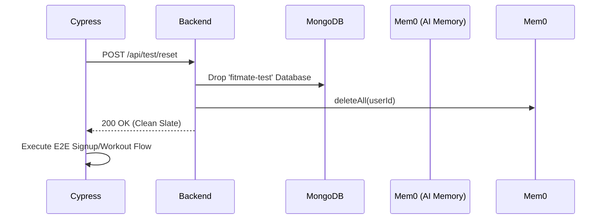

# FitMate System Evolution Report
*Compiled April 21, 2026*

## Overview
This report summarizes the major architectural and UI/UX evolutions implemented to transform FitMate from a prototype into a robust, testable, and intelligence-driven fitness application.

---

## 1. AI Intelligence & Prompt Engineering
**The Problem:** The AI had an "Advanced Bias," prescribing high-volume, complex workouts even to beginners.
**The Solution:** Implemented a **Multi-Dimensional Matrix** that cross-references Experience Level with Training Phase.

### Experience-Phase Matrix
| Level | Phases Allowed | Volume Guardrail | Complexity |
| :--- | :--- | :--- | :--- |
| **Beginner** | Foundation → Hypertrophy Basics | 3-5 Exercises | Straight sets only |
| **Intermediate** | Hypertrophy → Strength | 5-7 Exercises | Basic supersets |
| **Advanced** | Accumulation → Peaking | 6-9 Exercises | Advanced intensifiers |

### Key Improvements
- **Technical Guardrails**: Beginners are strictly forbidden from RPE 10 or complex variations to ensure safety.
- **Phase-Specific Modifiers**: Volume automatically scales down during "Strength" or "Deload" phases and up during "Hypertrophy" phases.
- **Brevity Optimization**: Prompts were condensed to use minimal tokens, preventing JSON truncation errors.

---

## 2. Automated Testing & Sandbox Isolation
We implemented a full Cypress E2E suite that operates in a completely isolated environment.

### The Sandbox Flow

### Technical Specs
- **Database**: Dedicated `fitmate-test` DB selected via `NODE_ENV=test`.
- **Mem0 Cleanup**: AI memories are wiped on reset to ensure the AI doesn't "remember" past test runs, ensuring 100% deterministic results.
- **Selector Mismatches**: Fixed class mismatches (e.g., `.bg-orange-500` vs `.bg-orange-600`) to ensure 100% pass rate.

---

## 3. UI/UX Redesign: Workout Day Cards
**The Problem:** Workout cards were vertically massive, requiring heavy scrolling and breaking the "Weekly Overview" grid.
**The Solution:** A "Ticket-Style" card with fixed height and internal hierarchy.

### Design Features
- **Fixed Height (480px)**: All cards remain uniform. Scrolling is handled internally via a `.slim-scrollbar`.
- **Preparation/Cooldown Pills**: Secondary work is grouped into compact horizontal badges instead of full vertical rows.
- **Visual Hierarchy**: "Today" is highlighted with an orange progress strip and pulse effect.
- **Action-Oriented**: Added a "Start Session" button and exercise count summary.

---

## 4. Backend Hardening
- **Token Management**: Increased `maxTokens` to `3500` to handle large 7-day JSON payloads.
- **Structured Output**: Standardized on Zod schemas for all AI generations to prevent parsing errors.
- **Environment Safety**: The `/api/test/reset` route is hard-blocked if `NODE_ENV` is not `test`.

---
*Report generated by Antigravity AI*
