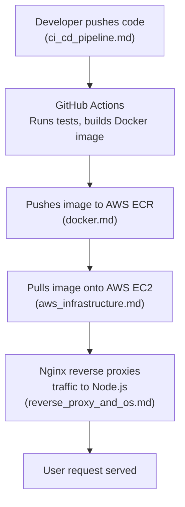

# Fitmate Deployment — Master Index

## Overview

This folder contains all production-grade deployment documentation for the Fitmate platform.
The documentation is organized into focused, deep-dive files rather than one monolithic reference.
Every decision in these docs is specific to Fitmate's stack: a **Node.js/TypeScript Express API**,
**React frontend**, **MongoDB Atlas**, **LangGraph AI pipeline**, and **Mem0 LTM service**.

The chosen deployment stack is:

- **Containerization:** Docker (multi-stage builds)
- **Cloud Provider:** Amazon Web Services (AWS)
- **Reverse Proxy:** Nginx
- **Operating System:** Ubuntu 24.04 LTS on EC2
- **CI/CD:** GitHub Actions

---

## Table of Contents

| File | What It Covers |
|---|---|
| [docker.md](./docker.md) | Multi-stage Dockerfile design, Docker Compose, image hardening, registry strategy (ECR) |
| [aws_infrastructure.md](./aws_infrastructure.md) | EC2 vs ECS vs Lambda comparison, VPC, ALB, Route 53, IAM, auto-scaling, cost analysis |
| [reverse_proxy_and_os.md](./reverse_proxy_and_os.md) | Nginx vs Caddy vs Traefik, Ubuntu vs Amazon Linux, SSL/TLS, WebSocket proxying |
| [ci_cd_pipeline.md](./ci_cd_pipeline.md) | Complete GitHub Actions workflow, environment promotion, secrets management, rollback |

---

## How the Documents Relate

---

## Guiding Principles

Every architectural decision in these docs is evaluated against four axes:

1. **Cost** — what it costs at Fitmate's current scale and projected growth.
2. **Operational Complexity** — how much DevOps knowledge and time it requires.
3. **Scalability** — how gracefully the solution handles a 10x traffic spike.
4. **Security** — how it protects user data, secrets, and AI memory.

None of the strategies in the individual documents are presented as binary choices. Each section
explicitly discusses what components can be layered together for a stronger combined result.
