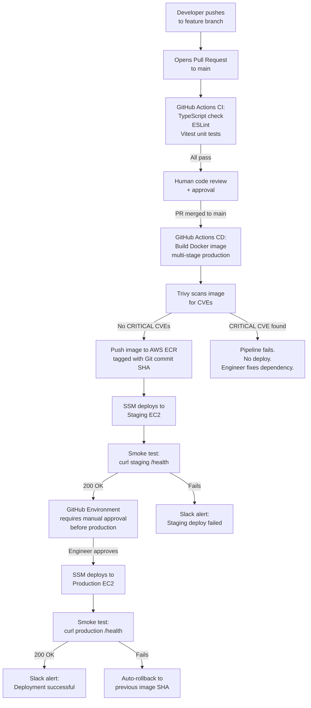
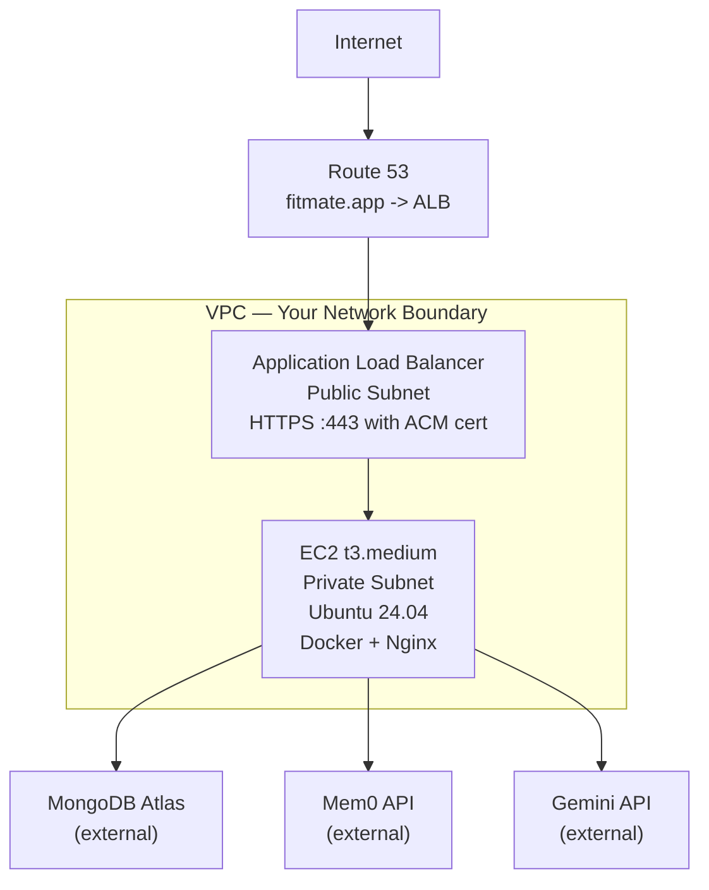
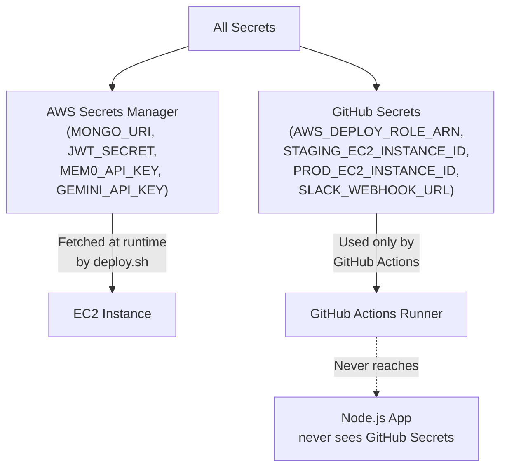

# Fitmate — The Production Deployment Plan

## Overview

This document is the single source of truth for how Fitmate gets from a developer's laptop to
production. It is not a comparison of options. Every technology choice is already made and
justified. Follow this in order.

---

## Table of Contents

1. [The Chosen Stack and Why](#1-the-chosen-stack-and-why)
2. [The Full Pipeline at a Glance](#2-the-full-pipeline-at-a-glance)
3. [Step 1 — AWS Infrastructure Setup](#3-step-1--aws-infrastructure-setup)
4. [Step 2 — The Dockerfile](#4-step-2--the-dockerfile)
5. [Step 3 — Nginx on the Server](#5-step-3--nginx-on-the-server)
6. [Step 4 — The Deployment Script on EC2](#6-step-4--the-deployment-script-on-ec2)
7. [Step 5 — GitHub Actions Workflows](#7-step-5--github-actions-workflows)
8. [Step 6 — Secrets and Environment Variables](#8-step-6--secrets-and-environment-variables)
9. [Step 7 — The Health Check Endpoint](#9-step-7--the-health-check-endpoint)
10. [Rollback](#10-rollback)
11. [Why This Stack is Solid](#11-why-this-stack-is-solid)

---

## 1. The Chosen Stack and Why

| Layer                            | Technology                                | Why This One                                                                                                                                                 |
| -------------------------------- | ----------------------------------------- | ------------------------------------------------------------------------------------------------------------------------------------------------------------ |
| **CI/CD Orchestrator**     | GitHub Actions                            | Config lives in the repo as YAML. No external service. Free for public repos, generous free tier for private. The team already uses GitHub.                  |
| **Container Runtime**      | Docker (multi-stage)                      | The Node.js app runs identically on your laptop and on AWS. No "works on my machine."                                                                        |
| **Image Registry**         | AWS ECR                                   | Same AWS network as EC2. Pulling an image from ECR to EC2 is free and fast. No external registry latency.                                                    |
| **Compute**                | AWS EC2 —`t3.medium`, Ubuntu 24.04 LTS | A single container running the Node.js app fits easily. Full control, easiest to debug. ~$30/month. Ubuntu has the best documentation and tooling ecosystem. |
| **TLS / HTTPS**            | AWS ACM + ALB                             | Free auto-renewing certificates. The ALB handles all TLS — the app only speaks HTTP internally.                                                             |
| **DNS**                    | AWS Route 53                              | Integrates directly with ALB via Alias records. No propagation delays between AWS services.                                                                  |
| **Reverse Proxy**          | Nginx (on EC2)                            | Sits between ALB and the Node.js container. Handles WebSocket upgrades for the AI chat, rate limiting, and request buffering. 15MB RAM footprint.            |
| **Secrets**                | AWS Secrets Manager                       | The app fetches secrets at startup. No`.env` files on the server. No secrets in GitHub.                                                                    |
| **Deployment Trigger**     | AWS SSM Run Command                       | Runs the deploy script on EC2 from GitHub Actions. No SSH key stored anywhere.                                                                               |
| **Vulnerability Scanning** | Trivy                                     | Scans the Docker image for CVEs before it is ever pushed to ECR. Open source, runs in CI for free.                                                           |
| **Additional: Terraform**  | Terraform                                 | All AWS resources (EC2, ALB, Route 53, Security Groups) defined as code. Can rebuild the entire infra in 10 minutes. Prevents configuration drift.           |

---

## 2. The Full Pipeline at a Glance



---

## 3. Step 1 — AWS Infrastructure Setup

This is a one-time setup. Do this before writing any pipeline.

### What to Create in AWS



### The Resources, In Order

**1. VPC** with two public subnets (for the ALB) and two private subnets (for EC2) across two
Availability Zones. Use `10.0.0.0/16` as the CIDR block.

**2. Internet Gateway** attached to the VPC so the ALB can reach the internet.

**3. NAT Gateway** in a public subnet so EC2 (in private subnet) can make outbound API calls
(to Mem0, Gemini, MongoDB Atlas) without having a public IP.

**4. Security Groups:**

```
ALB Security Group:

  Inbound:  HTTPS 443 from 0.0.0.0/0
  
  Inbound:  HTTP  80  from 0.0.0.0/0  (redirect only)
  
  Outbound: TCP  5000 to EC2 Security Group
  

EC2 Security Group:

  Inbound:  TCP 5000 from ALB Security Group ONLY
  
  Outbound: HTTPS 443 to 0.0.0.0/0  (for API calls)
  
  NOTE: Port 22 is NOT open. Use SSM for terminal access.
  

ECR VPC Endpoint (optional but recommended):

  Keeps ECR image pulls inside AWS network.
  
  Eliminates NAT Gateway cost for image pulls.
```

**5. EC2 Instance:**

- AMI: Ubuntu 24.04 LTS (latest)
- Type: `t3.medium`
- Subnet: Private subnet
- IAM Role attached with these permissions:
  - `ecr:GetAuthorizationToken` — pull images from ECR
  - `ecr:BatchGetImage` — pull images from ECR
  - `secretsmanager:GetSecretValue` — fetch app secrets at startup
  - `ssm:*` — allow SSM Session Manager for deployments
- User Data script on first launch installs Docker and Nginx.

**6. Target Group** — HTTP on port 5000, health check at `GET /health`, healthy threshold 2.

**7. ALB** — Public subnet, HTTPS listener on 443 with ACM certificate, forwards to Target Group.
Add a second listener on port 80 that redirects everything to HTTPS.

**8. ACM Certificate** — Request a certificate for `fitmate.app` and `*.fitmate.app`. Validate
via Route 53 (one click in the console, auto-renews forever).

**9. Route 53** — Create an `A` record (Alias) for `api.fitmate.app` pointing to the ALB.

**10. AWS Secrets Manager** — Create one secret named `fitmate/production` as a JSON object:

```json

{

  "MONGO_URI": "mongodb+srv://...",

  "JWT_SECRET": "...",

  "MEM0_API_KEY": "...",

  "GEMINI_API_KEY": "..."

}
```

**11. ECR Repository** — Create a repository named `fitmate-backend`. Enable `Scan on push`.
Add a lifecycle policy to delete untagged images older than 30 days.

**12. GitHub OIDC in AWS IAM** — This replaces long-lived AWS keys in GitHub. Create an IAM
Identity Provider for `token.actions.githubusercontent.com`. Create an IAM Role that trusts this
provider and grants permissions to push to ECR and run SSM commands. Note the Role ARN — it goes
into GitHub Secrets as `AWS_DEPLOY_ROLE_ARN`.

---

## 4. Step 2 — The Dockerfile

One Dockerfile, two stages. Lives at `backend/Dockerfile`.

```dockerfile

# ==============================================================
# Stage 1: Builder — compiles TypeScript, installs all deps
# ==============================================================
FROM node:20-alpine AS builder

WORKDIR /app

COPY package*.json ./

RUN npm ci

COPY tsconfig.json ./

COPY src/ ./src/

RUN npm run build

# ==============================================================
# Stage 2: Production — only the compiled output, no dev tools
# ==============================================================
FROM node:20-alpine AS production

ENV NODE_ENV=production

WORKDIR /app

RUN addgroup --system --gid 1001 fitmate-group

RUN adduser --system --uid 1001 --ingroup fitmate-group fitmate

COPY package*.json ./

RUN npm ci --omit=dev && npm cache clean --force

COPY --from=builder /app/dist ./dist

USER fitmate

EXPOSE 5000

HEALTHCHECK --interval=30s --timeout=10s --start-period=15s --retries=3 \

    CMD wget -qO- http://localhost:5000/health || exit 1

CMD ["node", "dist/server.js"]

```

**The `.dockerignore` file** (`backend/.dockerignore`):

```

node_modules

dist

.env

.env.*

.git

*.md

coverage

tests

```

**Why this Dockerfile is solid:**

The Builder stage compiles TypeScript and installs everything including dev dependencies. The
Production stage starts fresh from a clean base image and copies only the compiled `/dist` folder
and production `node_modules`. Dev tools (TypeScript compiler, ESLint, Vitest) never enter the
production image. The app runs as a non-root user. The final image is approximately 150MB.
Without multi-stage, it would be 700MB+ with full dev toolchain included.

---

## 5. Step 3 — Nginx on the Server

Nginx is installed directly on the Ubuntu EC2 instance (not in a container). It listens on
port 80 (the ALB forwards to it), applies rate limiting to protect the AI endpoints, handles
WebSocket upgrades for the streaming chat, and proxies all traffic to the Node.js container
running on port 5000.

### Installation (one-time, via EC2 User Data or manual)

```bash

sudo apt-get update -y

sudo apt-get install -y nginx

sudo systemctl enable nginx

sudo systemctl start nginx

```

### Configuration at `/etc/nginx/sites-available/fitmate`

```nginx

upstream fitmate_backend {

    server 127.0.0.1:5000;

    keepalive 64;

}

limit_req_zone $binary_remote_addr zone=chat_limit:10m rate=15r/m;

server {

    listen 80;

    server_name _;

    client_max_body_size 10m;

    gzip on;

    gzip_types application/json text/plain;

    location /api/chat {

        limit_req zone=chat_limit burst=3 nodelay;

        proxy_pass http://fitmate_backend;

        proxy_http_version 1.1;

        proxy_set_header Upgrade $http_upgrade;

        proxy_set_header Connection "upgrade";

        proxy_set_header Host $host;

        proxy_set_header X-Real-IP $remote_addr;

        proxy_set_header X-Forwarded-For $proxy_add_x_forwarded_for;

        proxy_set_header X-Forwarded-Proto $http_x_forwarded_proto;

        proxy_read_timeout 300s;

        proxy_send_timeout 300s;

        proxy_buffering off;

    }

    location / {

        proxy_pass http://fitmate_backend;

        proxy_http_version 1.1;

        proxy_set_header Host $host;

        proxy_set_header X-Real-IP $remote_addr;

        proxy_set_header X-Forwarded-For $proxy_add_x_forwarded_for;

        proxy_set_header X-Forwarded-Proto $http_x_forwarded_proto;

        proxy_read_timeout 60s;

    }

}

```

Enable and reload:

```bash

sudo ln -s /etc/nginx/sites-available/fitmate /etc/nginx/sites-enabled/

sudo rm /etc/nginx/sites-enabled/default

sudo nginx -t

sudo systemctl reload nginx

```

**Why these settings matter:**

`proxy_read_timeout 300s` on the `/api/chat` route is critical. The default is 60 seconds. LLM
streaming responses from Gemini can take 10-30 seconds. Without this, Nginx terminates the
connection mid-response. `proxy_buffering off` on the chat route ensures tokens stream to the
client in real time rather than being buffered until the full response is ready. `limit_req` caps
the AI chat endpoint at 15 requests per minute per IP — this directly protects against accidental
or malicious LLM API cost spikes.

---

## 6. Step 4 — The Deployment Script on EC2

This script lives on the EC2 instance at `/home/fitmate/deploy.sh`. It is called by GitHub
Actions via SSM. It fetches the new image, stops the old container, and starts the new one.

```bash

#!/bin/bash

set -e

IMAGE=$1

REGION="us-east-1"

SECRET_NAME="fitmate/production"

echo "[deploy] Starting deployment of $IMAGE"

# Authenticate Docker to ECR
aws ecr get-login-password --region $REGION | \

    docker login --username AWS --password-stdin \

    $(echo $IMAGE | cut -d'/' -f1)

# Pull the new image
echo "[deploy] Pulling image..."

docker pull $IMAGE

# Stop and remove the old container gracefully
echo "[deploy] Stopping old container..."

docker stop fitmate-backend --time 30 || true

docker rm fitmate-backend || true

# Fetch secrets from AWS Secrets Manager and write to a temp env file
echo "[deploy] Fetching secrets..."

aws secretsmanager get-secret-value \

    --secret-id $SECRET_NAME \

    --region $REGION \

    --query SecretString \

    --output text | \

    python3 -c "import sys,json; d=json.load(sys.stdin); [print(f'{k}={v}') for k,v in d.items()]" \

    > /tmp/fitmate.env

chmod 600 /tmp/fitmate.env

# Start the new container
echo "[deploy] Starting new container..."

docker run \

    --detach \

    --restart=unless-stopped \

    --name fitmate-backend \

    --env-file /tmp/fitmate.env \

    -p 5000:5000 \

    $IMAGE

# Clean up temp env file immediately
rm /tmp/fitmate.env

# Clean up old images to save disk space
docker image prune -f

echo "[deploy] Done. New container is running."

```

Make it executable:

```bash

chmod +x /home/fitmate/deploy.sh

```

---

## 7. Step 5 — GitHub Actions Workflows

Two workflow files. Both live in `.github/workflows/`.

### `ci.yml` — Runs on every push to any branch

```yaml

name: CI

on:

  push:

  pull_request:

    branches: [main]

jobs:

  ci:

    name: Type Check, Lint, Tests

    runs-on: ubuntu-latest

    defaults:

      run:

        working-directory: ./backend

    steps:

      - uses: actions/checkout@v4

      - uses: actions/setup-node@v4

        with:

          node-version: "20"

          cache: "npm"

          cache-dependency-path: backend/package-lock.json

      - name: Install dependencies

        run: npm ci

      - name: TypeScript type check

        run: npx tsc --noEmit

      - name: Lint

        run: npm run lint

      - name: Run tests

        run: npm test

```

### `deploy.yml` — Runs only when code lands on `main`

```yaml

name: Build and Deploy

on:

  push:

    branches: [main]

permissions:

  id-token: write

  contents: read

  security-events: write

env:

  AWS_REGION: us-east-1

  ECR_REPOSITORY: fitmate-backend

jobs:

  build:

    name: Build, Scan, Push to ECR

    runs-on: ubuntu-latest

    outputs:

      image: ${{ steps.push.outputs.image }}

    steps:

      - uses: actions/checkout@v4

      - name: Configure AWS credentials (OIDC — no long-lived keys)

        uses: aws-actions/configure-aws-credentials@v4

        with:

          role-to-assume: ${{ secrets.AWS_DEPLOY_ROLE_ARN }}

          aws-region: ${{ env.AWS_REGION }}

      - name: Login to Amazon ECR

        id: ecr-login

        uses: aws-actions/amazon-ecr-login@v2

      - name: Build Docker image

        run: |

          docker build \

            -t ${{ steps.ecr-login.outputs.registry }}/${{ env.ECR_REPOSITORY }}:${{ github.sha }} \

            ./backend

      - name: Scan image with Trivy

        uses: aquasecurity/trivy-action@master

        with:

          image-ref: ${{ steps.ecr-login.outputs.registry }}/${{ env.ECR_REPOSITORY }}:${{ github.sha }}

          format: sarif

          output: trivy-results.sarif

          severity: CRITICAL

          exit-code: "1"

      - name: Upload scan results to GitHub Security tab

        if: always()

        uses: github/codeql-action/upload-sarif@v3

        with:

          sarif_file: trivy-results.sarif

      - name: Push image to ECR

        id: push

        run: |

          docker push ${{ steps.ecr-login.outputs.registry }}/${{ env.ECR_REPOSITORY }}:${{ github.sha }}

          echo "image=${{ steps.ecr-login.outputs.registry }}/${{ env.ECR_REPOSITORY }}:${{ github.sha }}" >> $GITHUB_OUTPUT

  deploy-staging:

    name: Deploy to Staging

    needs: build

    runs-on: ubuntu-latest

    environment: staging

    steps:

      - name: Configure AWS credentials (OIDC)

        uses: aws-actions/configure-aws-credentials@v4

        with:

          role-to-assume: ${{ secrets.AWS_DEPLOY_ROLE_ARN }}

          aws-region: ${{ env.AWS_REGION }}

      - name: Deploy to Staging EC2 via SSM

        run: |

          COMMAND_ID=$(aws ssm send-command \

            --instance-ids "${{ secrets.STAGING_EC2_INSTANCE_ID }}" \

            --document-name "AWS-RunShellScript" \

            --parameters 'commands=["/home/fitmate/deploy.sh ${{ needs.build.outputs.image }}"]' \

            --output text \

            --query "Command.CommandId")

          echo "SSM Command ID: $COMMAND_ID"

          aws ssm wait command-executed \

            --command-id "$COMMAND_ID" \

            --instance-id "${{ secrets.STAGING_EC2_INSTANCE_ID }}"

      - name: Smoke test staging

        run: |

          sleep 20

          curl --fail --retry 3 --retry-delay 5 https://staging.api.fitmate.app/health

  deploy-production:

    name: Deploy to Production

    needs: [build, deploy-staging]

    runs-on: ubuntu-latest

    environment: production

    steps:

      - name: Configure AWS credentials (OIDC)

        uses: aws-actions/configure-aws-credentials@v4

        with:

          role-to-assume: ${{ secrets.AWS_DEPLOY_ROLE_ARN }}

          aws-region: ${{ env.AWS_REGION }}

      - name: Deploy to Production EC2 via SSM

        id: deploy

        run: |

          COMMAND_ID=$(aws ssm send-command \

            --instance-ids "${{ secrets.PROD_EC2_INSTANCE_ID }}" \

            --document-name "AWS-RunShellScript" \

            --parameters 'commands=["/home/fitmate/deploy.sh ${{ needs.build.outputs.image }}"]' \

            --output text \

            --query "Command.CommandId")

          echo "SSM Command ID: $COMMAND_ID"

          aws ssm wait command-executed \

            --command-id "$COMMAND_ID" \

            --instance-id "${{ secrets.PROD_EC2_INSTANCE_ID }}"

      - name: Smoke test production

        id: smoke

        run: |

          sleep 20

          curl --fail --retry 3 --retry-delay 5 https://api.fitmate.app/health

      - name: Auto-rollback on smoke test failure

        if: failure() && steps.smoke.outcome == 'failure'

        run: |

          PREV_IMAGE=$(aws ecr describe-images \

            --repository-name ${{ env.ECR_REPOSITORY }} \

            --query 'sort_by(imageDetails, &imagePushedAt)[-2].imageTags[0]' \

            --output text)

          aws ssm send-command \

            --instance-ids "${{ secrets.PROD_EC2_INSTANCE_ID }}" \

            --document-name "AWS-RunShellScript" \

            --parameters "commands=[\"/home/fitmate/deploy.sh ${PREV_IMAGE}\"]"

          echo "ROLLED BACK to $PREV_IMAGE"

      - name: Notify Slack — Success

        if: success()

        run: |

          curl -X POST ${{ secrets.SLACK_WEBHOOK_URL }} \

            -H 'Content-type: application/json' \

            --data '{"text":"Fitmate deployed to production. Commit: ${{ github.sha }} by ${{ github.actor }}"}'

      - name: Notify Slack — Failure

        if: failure()

        run: |

          curl -X POST ${{ secrets.SLACK_WEBHOOK_URL }} \

            -H 'Content-type: application/json' \

            --data '{"text":"PRODUCTION DEPLOY FAILED. Rollback triggered. Commit: ${{ github.sha }}"}'

```

---

## 8. Step 6 — Secrets and Environment Variables

### What Goes Where



The Node.js application only ever receives secrets from AWS Secrets Manager — fetched by the
`deploy.sh` script at deploy time and passed as environment variables to the container.
GitHub Secrets only contain the infrastructure identifiers needed to run the pipeline.
Application secrets never flow through GitHub.

### GitHub Secrets to Create (Settings -> Secrets -> Actions)

| Secret Name                 | Value                                                 |
| --------------------------- | ----------------------------------------------------- |
| `AWS_DEPLOY_ROLE_ARN`     | ARN of the IAM Role created for OIDC                  |
| `STAGING_EC2_INSTANCE_ID` | The instance ID of the staging EC2 (`i-0abc...`)    |
| `PROD_EC2_INSTANCE_ID`    | The instance ID of the production EC2 (`i-0xyz...`) |
| `SLACK_WEBHOOK_URL`       | Incoming webhook URL from Slack app configuration     |

### GitHub Environment Secrets (Settings -> Environments -> production)

The production environment has a **Required Reviewer** configured — one engineer must manually
approve before the `deploy-production` job runs. This is the only gate between staging and
production going live.

---

## 9. Step 7 — The Health Check Endpoint

The smoke tests and ALB health check both depend on this endpoint. It must exist and must be
honest — it should verify the actual dependencies are reachable.

```typescript

// src/routes/healthRoutes.ts

import { Router, Request, Response } from "express";

import mongoose from "mongoose";

const router = Router();

router.get("/health", async (req: Request, res: Response) => {

  const dbState = mongoose.connection.readyState;

  // 1 = connected, anything else is a problem
  if (dbState !== 1) {

    return res.status(503).json({

      status: "unhealthy",

      reason: "MongoDB not connected",

      dbState,

    });

  }

  return res.status(200).json({

    status: "ok",

    version: process.env.npm_package_version || "unknown",

    uptime: Math.floor(process.uptime()),

  });

});

export default router;

```

Register it in `app.ts` before any auth middleware so ALB can check it without a JWT:

```typescript

app.use("/health", healthRouter);

```

---

## 10. Rollback

Rollback is automatic if the production smoke test fails (handled in the `deploy.yml` workflow
above). If a problem surfaces hours later (not caught by smoke tests), manual rollback is:

```bash

# Find the previous image tag in ECR
aws ecr describe-images \

  --repository-name fitmate-backend \

  --query 'sort_by(imageDetails, &imagePushedAt)[-2].imageTags[0]' \

  --output text

# Then re-run the deploy workflow with that SHA via GitHub Actions workflow_dispatch
# OR SSH into the EC2 via SSM and run deploy.sh manually:

aws ssm start-session --target i-0your-instance-id

# Inside the session:
/home/fitmate/deploy.sh <ECR_URI>/fitmate-backend:<previous-sha>

```

Because every deployed image is tagged with its Git SHA and images are retained in ECR for 30
days, any commit from the last 30 days can be redeployed in under 2 minutes.

---

## 11. Why This Stack is Solid

### It eliminates every major class of deployment risk

**Secret leakage risk:** Eliminated. OIDC means no long-lived AWS keys in GitHub. App secrets
live only in Secrets Manager, fetched at deploy time. They never exist in the repo, in a CI log,
or in a Docker image layer.

**Broken production risk:** Eliminated in two ways. First, the staging environment with a human
approval gate means no code goes to production without passing smoke tests in a real environment.
Second, automatic rollback triggers if the production smoke test fails, restoring the previous
version in under 3 minutes.

**Dependency vulnerability risk:** Eliminated. Trivy scans every image for known CVEs before it
is ever pushed to ECR. A critical vulnerability blocks the pipeline. The results are visible in
the GitHub Security tab as a permanent audit trail.

**Non-reproducible builds:** Eliminated. Every deployed container is built from the exact source
code at a specific Git SHA. The same SHA can be rebuilt and redeployed at any time, identically.
`npm ci` (not `npm install`) locks the dependency versions exactly.

**Manual error risk:** Eliminated. Deployment is zero human steps — a merge to `main` triggers the
entire pipeline automatically. The only human decision is clicking "Approve" in the GitHub
Environment gate before production.

### It is the right size for Fitmate's current scale

This is not over-engineered. There is no Kubernetes, no ECS, no service mesh. A single `t3.medium`
EC2 instance can comfortably handle hundreds of concurrent users running a Node.js API with
LangGraph and Mem0. The infrastructure cost is approximately $50/month all-in. When Fitmate
needs to scale horizontally, the transition to ECS is straightforward — the Dockerfile and
GitHub Actions pipeline do not change, only the deploy target changes.

### It is the right size for Fitmate's current team

Every piece of this pipeline is debuggable by a single engineer. EC2 is accessible via SSM Session
Manager. Nginx logs are at `/var/log/nginx/`. Docker logs are `docker logs fitmate-backend`.
GitHub Actions provides a full step-by-step log for every run. There are no black boxes.
