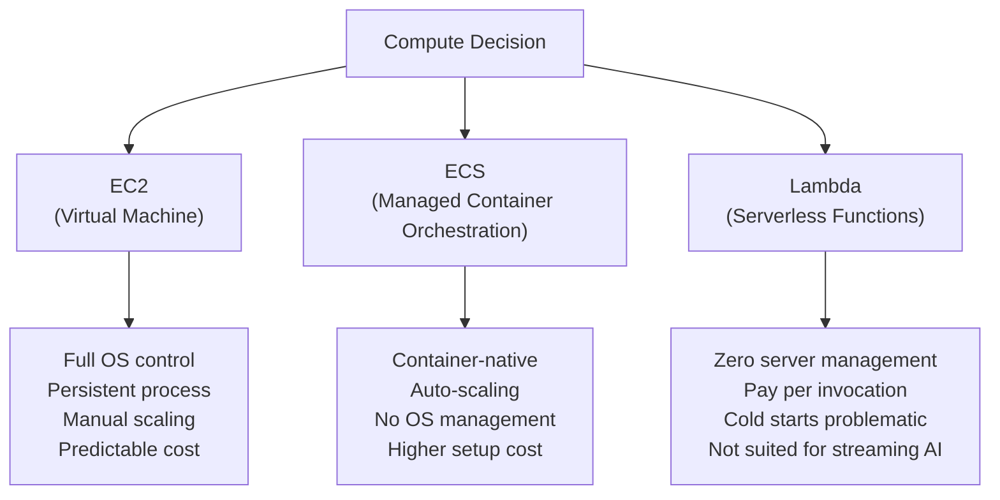
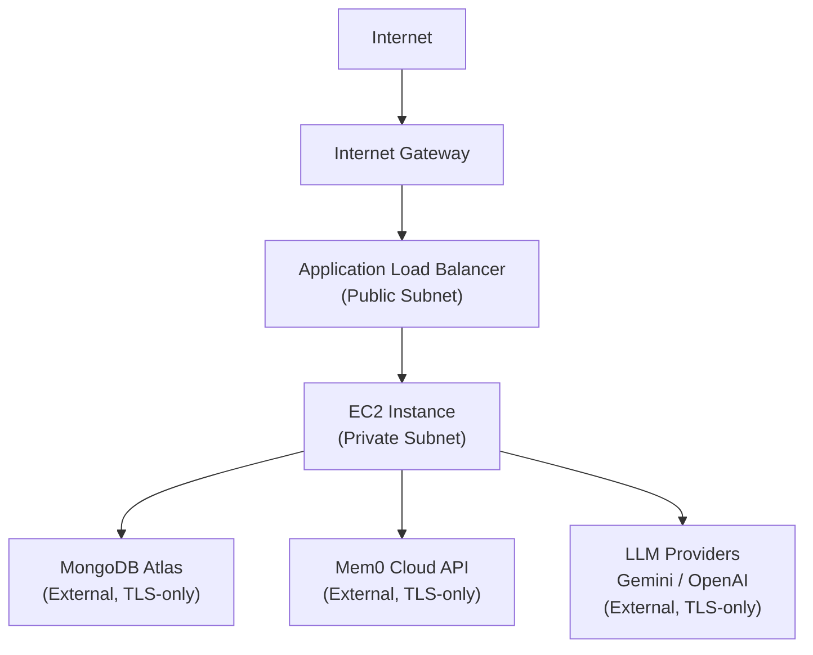
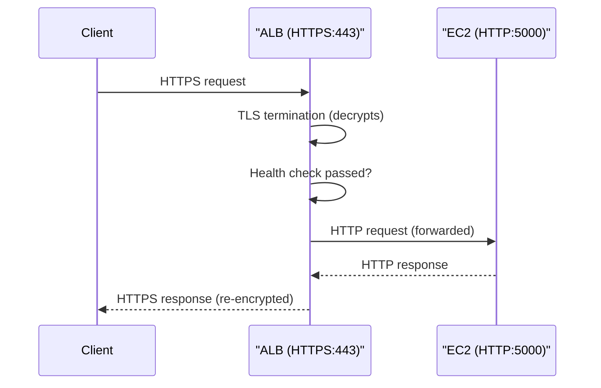
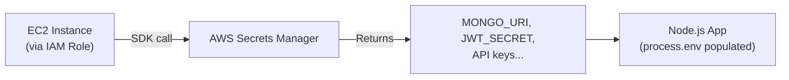
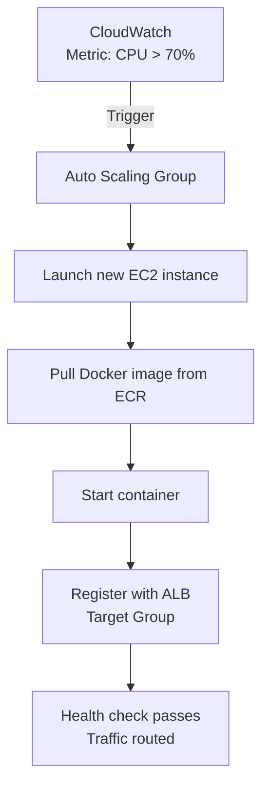

# AWS Infrastructure — Architecture, Services & Trade-offs for Fitmate

## Overview

This document covers the complete AWS infrastructure design for Fitmate. It explains every
relevant AWS service, why it was chosen, the architectural trade-offs involved, and how different
services can be layered together for a stronger result. The goal is not to be prescriptive about
a single "correct" path but to give enough depth that infrastructure decisions can evolve
intelligently as the product scales.

The fundamental architecture deploys the Fitmate backend as a Docker container on EC2, fronted
by an Application Load Balancer, with Route 53 for DNS and AWS Certificate Manager for TLS.

---

## Table of Contents

1. [Compute — EC2 vs ECS vs Lambda](#1-compute--ec2-vs-ecs-vs-lambda)
2. [Networking — VPC, Subnets, Security Groups](#2-networking--vpc-subnets-security-groups)
3. [Load Balancing — ALB](#3-load-balancing--alb)
4. [DNS & TLS — Route 53 and ACM](#4-dns--tls--route-53-and-acm)
5. [Storage — EBS vs EFS vs S3](#5-storage--ebs-vs-efs-vs-s3)
6. [Secrets Management — AWS Secrets Manager vs Parameter Store](#6-secrets-management--aws-secrets-manager-vs-parameter-store)
7. [Auto-Scaling Strategy](#7-auto-scaling-strategy)
8. [Monitoring & Observability — CloudWatch](#8-monitoring--observability--cloudwatch)
9. [Cost Analysis](#9-cost-analysis)
10. [Trade-offs & What to Mix](#10-trade-offs--what-to-mix)

---

## 1. Compute — EC2 vs ECS vs Lambda

This is the most impactful infrastructure decision. Each compute model has a fundamentally
different operational model, cost profile, and scalability story.



### EC2 (Chosen for Fitmate)

EC2 gives you a virtual machine on which you SSH in, install Docker, pull the image from ECR,
and run the container. It is the most operationally transparent option — you can see exactly what
is running, SSH in to debug, and tail logs directly.

**Why it works for Fitmate right now:**
- The LangGraph AI pipeline maintains WebSocket connections and long-running streaming responses.
  Lambda's 15-minute maximum execution limit and cold start latency are incompatible with
  interactive AI chat.
- A single `t3.medium` instance (2 vCPU, 4GB RAM) is sufficient for Fitmate's current user base
  and costs approximately $30/month.
- Operational simplicity — the entire deployment can be managed with a small set of shell scripts
  and a straightforward GitHub Actions workflow.

**Where EC2 becomes limiting:** When traffic spikes require spinning up additional instances faster
than manual or scripted processes allow, and when you want canary deployments or blue/green without
managing it yourself.

### ECS (Recommended Next Step)

ECS (Elastic Container Service) is AWS's native container orchestration layer. Instead of manually
managing Docker on an EC2 instance, you declare a Task Definition (the container spec) and a
Service (the desired replica count), and ECS handles placement, health checks, and rolling
deployments automatically.

**ECS with EC2 Launch Type:** You still provision EC2 instances (the ECS cluster), but the
container lifecycle is managed by ECS. This preserves cost predictability.

**ECS with Fargate Launch Type:** AWS manages the underlying compute entirely. You specify CPU and
memory requirements and pay per second of container runtime. No SSH access, no AMI updates, zero
OS management.

| Dimension | EC2 (raw) | ECS + EC2 | ECS + Fargate |
|---|---|---|---|
| OS patching | Manual | Manual (on cluster instances) | AWS-managed |
| Container placement | Manual | Automated | Automated |
| Rolling deployments | Manual / scripted | Native (maxPercent/minHealthy) | Native |
| SSH access | Yes | Yes (to cluster instances) | No |
| Cost (predictability) | Highest | High | Pay-per-second |
| Complexity | Low | Medium | Medium-Low |

### Lambda (Not Recommended for Fitmate Core)

Lambda is best for short, stateless, event-driven workloads — image processing, webhook
receivers, scheduled cron jobs. It is explicitly not suitable for the Fitmate chat API because:
- The LangGraph stream emits tokens incrementally over several seconds — Lambda's synchronous
  request/response model does not handle this without complex workarounds.
- Cold starts can add 300-800ms to the first request after inactivity. For an AI chat response,
  this is noticeable.

**Where Lambda does fit for Fitmate:** A scheduled Lambda function could run the nightly memory
cleanup job (pruning stale Mem0 memories older than 90 days) cheaply without keeping an EC2
instance running for that workload.

---

## 2. Networking — VPC, Subnets, Security Groups

All Fitmate infrastructure should live inside a dedicated **Virtual Private Cloud (VPC)** to
create a network boundary around all resources.



### Subnet Design

| Subnet Type | What Lives Here | Internet Access |
|---|---|---|
| Public Subnet | Application Load Balancer, NAT Gateway | Direct via Internet Gateway |
| Private Subnet | EC2 instances, RDS if applicable | Outbound only via NAT Gateway |

Placing EC2 instances in a **private subnet** means they have no public IP address and cannot be
reached directly from the internet. All inbound traffic is routed through the ALB, and all
outbound traffic (to Mem0 API, Gemini API, MongoDB Atlas) goes through a NAT Gateway. This is a
significant security improvement over placing EC2 directly in a public subnet.

### Security Groups

Security Groups act as stateful firewalls at the instance level.

```
ALB Security Group:
  Inbound:  443 from 0.0.0.0/0 (HTTPS from the internet)
  Inbound:  80 from 0.0.0.0/0 (HTTP, redirect to HTTPS only)
  Outbound: 5000 to EC2 Security Group

EC2 Security Group:
  Inbound:  5000 from ALB Security Group ONLY
  Outbound: 443 to 0.0.0.0/0 (for external API calls)
```

No SSH port (22) should be open in the EC2 Security Group for production. Use **AWS Systems
Manager Session Manager** for secure terminal access without exposing port 22 to the internet.

---

## 3. Load Balancing — ALB

The Application Load Balancer (ALB) is the entry point for all HTTP/HTTPS traffic. It handles
TLS termination (decrypting HTTPS traffic before forwarding to EC2 as HTTP), health checks,
and path-based routing.



### WebSocket Support for Fitmate

Fitmate uses WebSockets for real-time AI chat streaming. ALBs natively support WebSocket
connections with the `upgrade` header, but they require the listener rule to be explicitly
configured to allow long-lived connections (default idle timeout is 60 seconds — increase to
3600 seconds for AI chat sessions).

### ALB Routing Rules

For the future when the frontend is also served from AWS (rather than Vercel):

```
/api/*     -> Backend Target Group (EC2 running Node.js)
/*         -> Frontend Target Group (EC2/S3 serving static files)
```

---

## 4. DNS & TLS — Route 53 and ACM

### Route 53

Route 53 is AWS's managed DNS service. The domain (e.g., `fitmate.app`) should have its name
servers pointed to Route 53, after which all DNS records are managed as code.

| Record | Type | Value |
|---|---|---|
| `fitmate.app` | A (Alias) | ALB DNS name |
| `api.fitmate.app` | A (Alias) | ALB DNS name |
| `www.fitmate.app` | CNAME | `fitmate.app` |

### AWS Certificate Manager (ACM)

ACM provides free, auto-renewing TLS certificates for any domain validated via Route 53. The
certificate is attached to the ALB listener, which handles all TLS handshakes without any
configuration on the EC2 instance.

**Critical:** ACM certificates attached to ALBs are **free**. There is no cost for the certificate
itself, only for the ALB infrastructure.

---

## 5. Storage — EBS vs EFS vs S3

| Service | Type | Use Case for Fitmate |
|---|---|---|
| EBS (Elastic Block Store) | Block storage, attached to one EC2 | OS volume for the EC2 instance |
| EFS (Elastic File System) | Shared filesystem, multiple EC2 | Shared logs if running multiple instances |
| S3 | Object storage | User-uploaded files, profile images, static frontend assets |

For Fitmate's current scale, the EC2 instance's EBS volume is sufficient. S3 becomes relevant
when users upload files (meal photos, progress images) that need to be stored durably and served
globally via CloudFront.

---

## 6. Secrets Management — AWS Secrets Manager vs Parameter Store

Fitmate has many secrets: `MONGO_URI`, `JWT_SECRET`, `MEM0_API_KEY`, Gemini API key, etc.
These must never be stored in environment files on the server or baked into Docker images.

### AWS Secrets Manager

Best for secrets that need automatic rotation (database passwords, API keys that expire).



**How it works in practice:** At startup, the Node.js application (or a startup script) calls the
AWS SDK to fetch secrets and populate environment variables. The instance never stores secrets on
disk. The IAM role attached to the EC2 instance grants permission to read only the secrets it needs.

### AWS Systems Manager Parameter Store

Simpler, cheaper alternative. Free for standard parameters, $0.05/10,000 API calls for advanced
parameters. Good for non-sensitive configuration (feature flags, API URLs).

**Mix:** Store truly sensitive secrets (database passwords, private keys) in Secrets Manager.
Store non-sensitive config (API endpoint URLs, feature flags) in Parameter Store. This balances
cost and security appropriately.

---

## 7. Auto-Scaling Strategy

Fitmate's traffic is likely to spike around morning (6-9 AM) and evening (5-8 PM) workout
planning times. Auto-scaling ensures the application scales out during peaks and in during quiet
periods.



### Scaling Policies

| Policy Type | Trigger | Best For |
|---|---|---|
| Target Tracking | Keep CPU at 60% | General purpose, simple |
| Step Scaling | CPU 70-80% = +1, >80% = +2 | More aggressive response |
| Scheduled Scaling | Add instances at 6 AM, remove at 10 PM | Predictable traffic patterns |

**Mix Scheduled + Target Tracking:** Use scheduled scaling to pre-warm instances before peak
hours, and target tracking as a safety net for unexpected spikes. This avoids the cold-start
delay of spinning up new instances under load.

---

## 8. Monitoring & Observability — CloudWatch

### Metrics to Track

| Metric | Alarm Threshold | Action |
|---|---|---|
| EC2 CPU Utilization | > 75% for 5 min | Scale out |
| ALB 5xx Error Rate | > 1% for 2 min | PagerDuty / Slack alert |
| ALB Response Time (P99) | > 3 seconds | Investigate AI pipeline latency |
| Memory Usage | > 80% | Scale out or upgrade instance type |
| ECR Image Scan Findings | Any Critical CVE | Block deployment in CI |

### Structured Logging

The Node.js backend should emit **structured JSON logs** so CloudWatch Logs Insights can query
them efficiently.

```typescript

// Recommended logger setup using pino

import pino from "pino";

export const logger = pino({

  level: process.env.LOG_LEVEL || "info",

  formatters: {

    level: (label) => ({ level: label }),

  },

});

// Usage
logger.info({ userId, route: "/api/chat", latencyMs: 450 }, "Chat request completed");

```

**Mix with AWS X-Ray:** For tracing individual AI requests through the LangGraph pipeline, X-Ray
distributed tracing can be added. It reveals exactly which node (chatNode, summarizer, Mem0 call)
is contributing to latency, which is invaluable for optimizing the AI hot path.

---

## 9. Cost Analysis

Estimated monthly cost for Fitmate at early-production scale (< 500 daily active users):

| Service | Configuration | Estimated Monthly Cost |
|---|---|---|
| EC2 (Backend) | t3.medium, 1 instance, reserved 1yr | ~$18 |
| ALB | ~1M requests/month | ~$18 |
| Route 53 | 1 hosted zone + queries | ~$1 |
| ECR | ~5GB storage | ~$0.50 |
| CloudWatch | Basic metrics + 5GB logs | ~$5 |
| NAT Gateway | ~10GB data processed | ~$5 |
| **Total** | | **~$47/month** |

Note: MongoDB Atlas (M10 cluster) adds ~$57/month. Mem0 Cloud costs depend on usage tier.

---

## 10. Trade-offs & What to Mix

### EC2 + ECS Hybrid Path

Start with raw EC2 (lower setup complexity, easier debugging). When scaling demands arise,
migrate to ECS on the same EC2 instances (ECS + EC2 launch type). This avoids a complete
infrastructure rewrite while gaining ECS's rolling deployment and health check capabilities.
The migration is largely a matter of creating an ECS cluster pointing to existing instances.

### Multi-AZ for Reliability

A single EC2 instance is a single point of failure. When uptime becomes critical, the Auto Scaling
Group should span at least two Availability Zones (e.g., `us-east-1a` and `us-east-1b`). The ALB
automatically distributes traffic across both. This costs approximately double the compute but
provides resilience against an entire data center failure.

### Spot Instances for Cost Reduction

For non-critical workloads (batch memory cleanup jobs, background AI processing), EC2 Spot
Instances offer up to 90% savings over On-Demand pricing at the cost of potential interruption.
Never run the primary production backend on Spot. A good hybrid is On-Demand for 1 baseline
instance + Spot for auto-scaled additional instances.

### Infrastructure as Code (Terraform)

As the AWS infrastructure grows, managing it through the AWS Console becomes error-prone and
non-reproducible. **Terraform** (or AWS CDK) should be introduced to define all resources as
code. This allows the entire infrastructure to be reproduced in a new AWS account (e.g., for a
disaster recovery region) in minutes. This does not change what is deployed — only how it is
managed.
