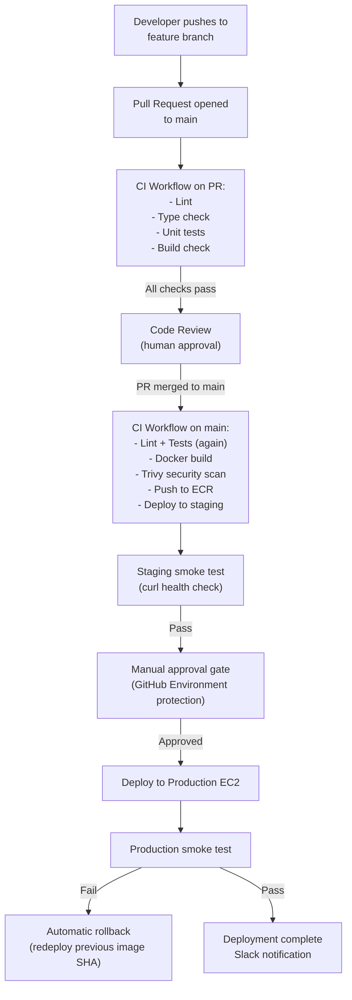
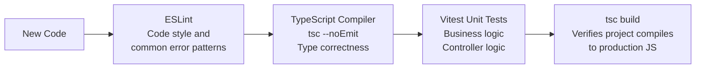
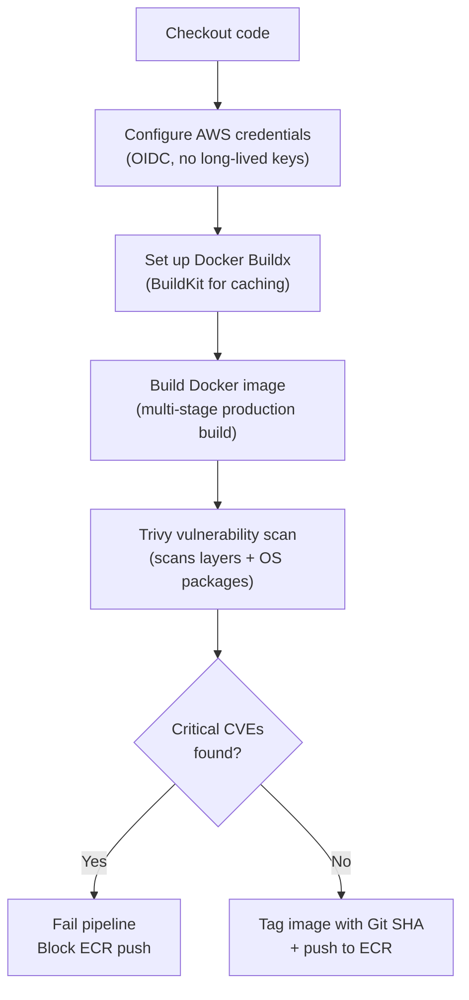
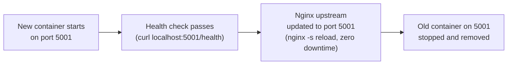
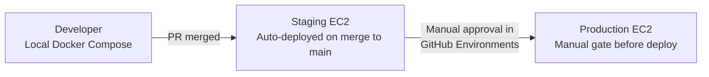
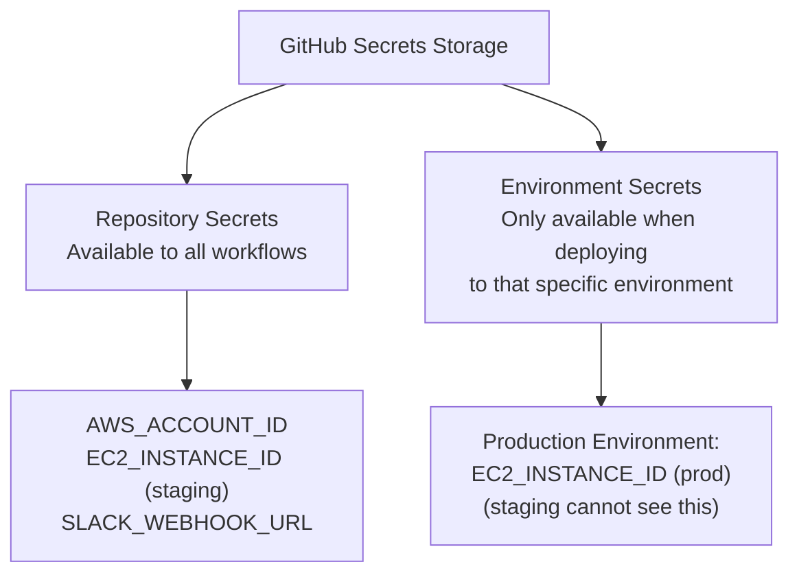
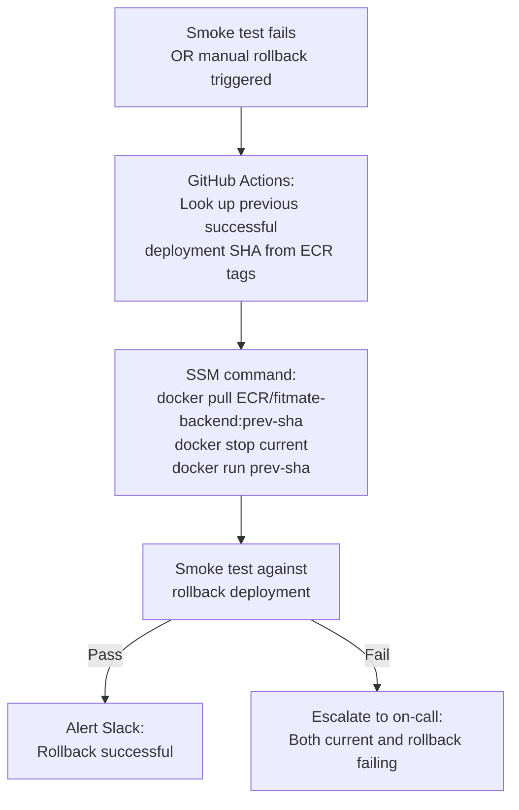

# CI/CD Pipeline — Complete GitHub Actions Workflow for Fitmate

## Overview

This document defines the complete Continuous Integration and Continuous Deployment (CI/CD)
pipeline for Fitmate using GitHub Actions. It covers every stage of the pipeline: code quality
checks, testing, Docker image building, security scanning, pushing to Amazon ECR, and deploying
to EC2 via SSH or SSM. It also discusses environment promotion (dev -> staging -> production),
secrets management in GitHub Actions, rollback strategies, and what each design decision costs
in terms of speed, safety, and complexity.

The pipeline is not a rigid specification — this document explains the rationale behind each step
so that the pipeline can be evolved intelligently as Fitmate scales.

---

## Table of Contents

1. [Pipeline Philosophy](#1-pipeline-philosophy)
2. [Complete Pipeline Architecture](#2-complete-pipeline-architecture)
3. [Stage 1 — Continuous Integration (CI)](#3-stage-1--continuous-integration-ci)
4. [Stage 2 — Docker Build & Security Scan](#4-stage-2--docker-build--security-scan)
5. [Stage 3 — Push to Amazon ECR](#5-stage-3--push-to-amazon-ecr)
6. [Stage 4 — Deploy to EC2](#6-stage-4--deploy-to-ec2)
7. [Environment Promotion Strategy](#7-environment-promotion-strategy)
8. [Secrets Management in GitHub Actions](#8-secrets-management-in-github-actions)
9. [Rollback Strategy](#9-rollback-strategy)
10. [Notifications & Observability](#10-notifications--observability)
11. [Complete Workflow Files](#11-complete-workflow-files)
12. [Trade-offs & What to Mix](#12-trade-offs--what-to-mix)

---

## 1. Pipeline Philosophy

A CI/CD pipeline is a **trust enforcement mechanism**. Its job is to ensure that code merged into
the main branch and deployed to production has passed a minimum quality threshold — it compiles,
passes tests, has no critical security vulnerabilities in its dependencies, and has been reviewed
by at least one other engineer.

For Fitmate, the pipeline must additionally account for the fact that a broken AI pipeline
deployment could silently degrade user experience (the chat still loads but responses are
incorrect or memory is not retrieved). This makes **smoke testing after deployment** non-optional.

The pipeline follows these principles:

- **Fail fast and fail loudly.** Tests run first. If tests fail, no Docker image is built.
- **Never deploy untested images.** The exact same image hash built and scanned in CI is what
  gets deployed to production. No rebuilds on the server.
- **Immutable deployments.** Images are tagged with the Git commit SHA, never with `latest`.
  This means every deployment is traceable to an exact commit.
- **Secrets never touch the codebase.** Not in `.env` files, not in Dockerfiles, not in logs.

---

## 2. Complete Pipeline Architecture



---

## 3. Stage 1 — Continuous Integration (CI)

The CI stage runs on every push to any branch and on every pull request. Its job is to be a
fast feedback loop — catching errors within 2-3 minutes of a push.

### What CI Checks



### CI Job Configuration

```yaml

name: CI

on:

  push:

    branches: ["*"]

  pull_request:

    branches: [main]

jobs:

  ci:

    runs-on: ubuntu-latest

    defaults:

      run:

        working-directory: ./backend

    steps:

      - name: Checkout code

        uses: actions/checkout@v4

      - name: Setup Node.js

        uses: actions/setup-node@v4

        with:

          node-version: "20"

          cache: "npm"

          cache-dependency-path: backend/package-lock.json

      - name: Install dependencies

        run: npm ci

      - name: TypeScript type check

        run: npx tsc --noEmit

      - name: Lint

        run: npm run lint

      - name: Run tests

        run: npm test

      - name: Build check

        run: npm run build

```

**Key decisions:**
- `actions/setup-node` with `cache: "npm"` caches the `node_modules` folder between runs. This
  alone reduces CI time from ~90 seconds to ~15 seconds on cache hits.
- `npm ci` (not `npm install`) is used. `ci` is deterministic — it installs exactly what is in
  `package-lock.json` and fails if the lockfile is inconsistent.
- `defaults.working-directory` sets the working directory for all steps, avoiding the need to
  `cd backend` in every step.

---

## 4. Stage 2 — Docker Build & Security Scan

This stage runs only when code is merged to `main`. It builds the production Docker image and
scans it for known vulnerabilities before allowing it to be pushed to ECR.



### Trivy Security Scanning

Trivy is an open-source vulnerability scanner by Aqua Security. It scans Docker image layers for:

- OS package vulnerabilities (from the Alpine apk database).
- Language-specific package vulnerabilities (npm package CVEs).
- Misconfigurations in Dockerfile best practices.

```yaml

      - name: Run Trivy vulnerability scanner

        uses: aquasecurity/trivy-action@master

        with:

          image-ref: fitmate-backend:${{ github.sha }}

          format: sarif

          output: trivy-results.sarif

          severity: CRITICAL,HIGH

          exit-code: "1"

      - name: Upload Trivy results to GitHub Security tab

        uses: github/codeql-action/upload-sarif@v3

        if: always()

        with:

          sarif_file: trivy-results.sarif

```

**What to mix:** Upload the SARIF results to GitHub Security tab. This creates a persistent record
of security findings in the repository's Security tab, visible to all engineers, not just in CI
logs that expire.

---

## 5. Stage 3 — Push to Amazon ECR

After a successful scan, the image is tagged with the exact Git commit SHA and pushed to ECR.
Using `latest` as the tag is an explicit anti-pattern — it makes deployments non-reproducible
and rollbacks ambiguous.

### OIDC Authentication (No Long-Lived AWS Keys)

The most secure way to authenticate GitHub Actions to AWS is via **OpenID Connect (OIDC)**. This
eliminates the need to store `AWS_ACCESS_KEY_ID` and `AWS_SECRET_ACCESS_KEY` as GitHub secrets
(which are long-lived and must be rotated manually). Instead, GitHub generates a short-lived token
for each workflow run, and AWS verifies it against a trusted OIDC provider configuration.

```yaml

      - name: Configure AWS credentials via OIDC

        uses: aws-actions/configure-aws-credentials@v4

        with:

          role-to-assume: arn:aws:iam::123456789:role/GithubActionsRole

          aws-region: us-east-1

      - name: Login to Amazon ECR

        id: login-ecr

        uses: aws-actions/amazon-ecr-login@v2

      - name: Push image to ECR

        env:

          ECR_REGISTRY: ${{ steps.login-ecr.outputs.registry }}

          IMAGE_TAG: ${{ github.sha }}

        run: |

          docker tag fitmate-backend:$IMAGE_TAG $ECR_REGISTRY/fitmate-backend:$IMAGE_TAG

          docker push $ECR_REGISTRY/fitmate-backend:$IMAGE_TAG

          echo "image=$ECR_REGISTRY/fitmate-backend:$IMAGE_TAG" >> $GITHUB_OUTPUT

```

---

## 6. Stage 4 — Deploy to EC2

Deploying to EC2 means instructing the server to pull the newly pushed image from ECR and
replace the running container.

### Deployment via AWS SSM (Recommended — No SSH Keys Needed)

AWS Systems Manager (SSM) Session Manager allows running commands on EC2 instances via the AWS
API without opening port 22 or storing SSH private keys anywhere. GitHub Actions uses OIDC to
authenticate to AWS, then SSM to run the deployment commands.

```yaml

      - name: Deploy to EC2 via SSM

        env:

          IMAGE: ${{ needs.build.outputs.image }}

          INSTANCE_ID: ${{ secrets.EC2_INSTANCE_ID }}

        run: |

          aws ssm send-command \

            --instance-ids "$INSTANCE_ID" \

            --document-name "AWS-RunShellScript" \

            --parameters commands='[

              "aws ecr get-login-password --region us-east-1 | docker login --username AWS --password-stdin <ECR_URI>",

              "docker pull '"$IMAGE"'",

              "docker stop fitmate-backend || true",

              "docker rm fitmate-backend || true",

              "docker run -d --restart=unless-stopped --name fitmate-backend -p 5000:5000 --env-file /etc/fitmate/env '"$IMAGE"'",

              "docker system prune -f"

            ]' \

            --output text \

            --query Command.CommandId

```

### Zero-Downtime Deployment Considerations

The simple `docker stop` + `docker run` sequence above causes a brief downtime (typically 2-5
seconds). For a production system with users actively using the AI chat, this is noticeable.

True zero-downtime options:



This technique runs both the old and new containers simultaneously for a few seconds during the
health check window, then atomically swaps the Nginx upstream. `nginx -s reload` (graceful reload)
does not drop existing connections — it lets them finish while new requests go to the new upstream.

---

## 7. Environment Promotion Strategy

Fitmate should have three environments, each representing a gate of confidence:

| Environment | Branch | Purpose | Who Deploys |
|---|---|---|---|
| Development | Any feature branch | Local developer testing | Developer (Docker Compose) |
| Staging | `main` | Integration testing, QA, stakeholder demos | Automated CI |
| Production | `main` (after approval) | Live user traffic | Automated CD (after approval gate) |



### GitHub Environments with Protection Rules

GitHub Environments allow defining protection rules on specific deployment targets. The
`production` environment can require:

- **Required reviewers:** 1 engineer must approve before the deployment job runs.
- **Wait timer:** A mandatory 5-minute wait after staging deployment before production can begin
  (giving time to notice staging issues).
- **Environment-specific secrets:** Production database credentials and API keys are only
  accessible to jobs deploying to the `production` environment, not staging.

---

## 8. Secrets Management in GitHub Actions

### Secret Hierarchy



### What Should Never Be in GitHub Secrets

AWS credentials (access key + secret key) should not be in GitHub Secrets at all. Use OIDC as
described in Stage 3. This means there are no AWS credential secrets to rotate, audit, or leak.

Application secrets (MONGO_URI, JWT_SECRET, MEM0_API_KEY) should not flow through GitHub Actions
at all. They live in AWS Secrets Manager and are fetched by the application at startup on the EC2
instance. The deployment command only passes the Docker image URI — no application secrets are
transmitted during deployment.

---

## 9. Rollback Strategy

Rollback is the ability to quickly return to the previous good state after a bad deployment.
Because every deployment is tagged with a Git commit SHA, rollback is simply redeploying the
previous SHA.



### Automated vs Manual Rollback

- **Automated rollback:** Triggered by a failed post-deployment smoke test. The pipeline
  automatically re-runs the deploy job with the previous image SHA. This is the fastest possible
  recovery for simple failures.
- **Manual rollback:** A developer runs a GitHub Actions workflow manually (`workflow_dispatch`)
  and inputs the SHA to roll back to. This is used when the failure is subtle (not caught by
  smoke tests) and requires human judgment.

---

## 10. Notifications & Observability

The pipeline must communicate its outcomes to the team, not just silently succeed or fail.

```yaml

      - name: Notify Slack on success

        if: success()

        uses: slackapi/slack-github-action@v1

        with:

          channel-id: "#deployments"

          payload: |

            {

              "text": "Deployment to production succeeded",

              "attachments": [{

                "color": "good",

                "fields": [

                  { "title": "Commit", "value": "${{ github.sha }}", "short": true },

                  { "title": "Author", "value": "${{ github.actor }}", "short": true }

                ]

              }]

            }

        env:

          SLACK_BOT_TOKEN: ${{ secrets.SLACK_BOT_TOKEN }}

      - name: Notify Slack on failure

        if: failure()

        uses: slackapi/slack-github-action@v1

        with:

          channel-id: "#deployments"

          payload: |

            {

              "text": "Deployment FAILED — rollback initiated",

              "attachments": [{ "color": "danger" }]

            }

        env:

          SLACK_BOT_TOKEN: ${{ secrets.SLACK_BOT_TOKEN }}

```

---

## 11. Complete Workflow Files

### `.github/workflows/ci.yml` — Runs on every push

```yaml

name: Continuous Integration

on:

  push:

  pull_request:

    branches: [main]

jobs:

  ci:

    name: Lint, Type Check, Test

    runs-on: ubuntu-latest

    defaults:

      run:

        working-directory: ./backend

    steps:

      - uses: actions/checkout@v4

      - uses: actions/setup-node@v4

        with:

          node-version: "20"

          cache: "npm"

          cache-dependency-path: backend/package-lock.json

      - run: npm ci

      - run: npx tsc --noEmit

      - run: npm run lint

      - run: npm test

```

### `.github/workflows/deploy.yml` — Runs on push to main

```yaml

name: Build, Scan, and Deploy

on:

  push:

    branches: [main]

permissions:

  id-token: write

  contents: read

  security-events: write

jobs:

  build-and-push:

    name: Build Docker Image and Push to ECR

    runs-on: ubuntu-latest

    outputs:

      image: ${{ steps.push.outputs.image }}

    steps:

      - uses: actions/checkout@v4

      - name: Configure AWS credentials (OIDC)

        uses: aws-actions/configure-aws-credentials@v4

        with:

          role-to-assume: ${{ secrets.AWS_DEPLOY_ROLE_ARN }}

          aws-region: us-east-1

      - name: Login to ECR

        id: ecr-login

        uses: aws-actions/amazon-ecr-login@v2

      - name: Build Docker image

        run: docker build -t fitmate-backend:${{ github.sha }} ./backend

      - name: Trivy vulnerability scan

        uses: aquasecurity/trivy-action@master

        with:

          image-ref: fitmate-backend:${{ github.sha }}

          severity: CRITICAL

          exit-code: "1"

      - name: Push to ECR

        id: push

        env:

          REGISTRY: ${{ steps.ecr-login.outputs.registry }}

        run: |

          docker tag fitmate-backend:${{ github.sha }} $REGISTRY/fitmate-backend:${{ github.sha }}

          docker push $REGISTRY/fitmate-backend:${{ github.sha }}

          echo "image=$REGISTRY/fitmate-backend:${{ github.sha }}" >> $GITHUB_OUTPUT

  deploy-staging:

    name: Deploy to Staging

    needs: build-and-push

    runs-on: ubuntu-latest

    environment: staging

    steps:

      - name: Configure AWS credentials (OIDC)

        uses: aws-actions/configure-aws-credentials@v4

        with:

          role-to-assume: ${{ secrets.AWS_DEPLOY_ROLE_ARN }}

          aws-region: us-east-1

      - name: Deploy to staging via SSM

        run: |

          aws ssm send-command \

            --instance-ids ${{ secrets.STAGING_INSTANCE_ID }} \

            --document-name "AWS-RunShellScript" \

            --parameters commands='["./deploy.sh ${{ needs.build-and-push.outputs.image }}"]'

      - name: Smoke test staging

        run: |

          sleep 15

          curl --fail https://staging.api.fitmate.app/health

  deploy-production:

    name: Deploy to Production

    needs: [build-and-push, deploy-staging]

    runs-on: ubuntu-latest

    environment: production

    steps:

      - name: Configure AWS credentials (OIDC)

        uses: aws-actions/configure-aws-credentials@v4

        with:

          role-to-assume: ${{ secrets.AWS_DEPLOY_ROLE_ARN }}

          aws-region: us-east-1

      - name: Deploy to production via SSM

        run: |

          aws ssm send-command \

            --instance-ids ${{ secrets.PROD_INSTANCE_ID }} \

            --document-name "AWS-RunShellScript" \

            --parameters commands='["./deploy.sh ${{ needs.build-and-push.outputs.image }}"]'

      - name: Smoke test production

        run: |

          sleep 20

          curl --fail https://api.fitmate.app/health

```

---

## 12. Trade-offs & What to Mix

### Speed vs Safety

The pipeline above takes approximately 5-8 minutes from push to production. Removing the staging
gate reduces this to 2-3 minutes but sacrifices the safety buffer. The right balance depends on
the deployment frequency and team maturity. For a team doing multiple deploys per day, a fast
pipeline with good smoke tests is more productive than a slow pipeline with many manual gates.

### GitHub Actions vs AWS CodePipeline

AWS CodePipeline is AWS's native CI/CD service. It integrates deeply with ECR, ECS, and CodeDeploy
for blue/green deployments. The trade-off is a steeper learning curve, AWS Console-based
configuration (rather than YAML files in the repository), and higher cost at low build volumes.

**Mix:** GitHub Actions for CI (testing, linting — fastest feedback, free, config lives in the
repo). AWS CodeDeploy for the production deployment step (handles in-place and blue/green
deployments natively, with automatic rollback triggers). This combines the developer experience
of GitHub Actions with the deployment sophistication of AWS-native tooling.

### Docker Layer Caching in CI

Without caching, every CI run rebuilds all Docker layers from scratch. The `npm ci` step alone
downloads hundreds of megabytes. GitHub Actions supports two cache backends for BuildKit:

- **GitHub Cache backend:** Free, integrated, max 10GB per repository.
- **ECR as cache registry:** Push cache layers to ECR alongside the image. Faster (same network
  as the runner on AWS-hosted runners), no size limit.

**Mix:** Use GitHub Cache for PRs and feature branches (free, fast). Use ECR cache for main branch
builds (consistent, no size limit, same infrastructure).

### Monorepo Pipeline Optimization

As Fitmate grows, the frontend and backend will each have their own Dockerfiles and deployment
targets. In a monorepo, running the full pipeline on every push regardless of what changed is
wasteful. GitHub Actions supports **path filters** to conditionally run jobs:

```yaml

on:

  push:

    paths:

      - "backend/**"

```

This means a frontend-only change does not trigger a backend Docker build and deployment.
