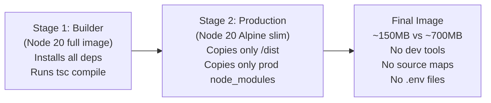
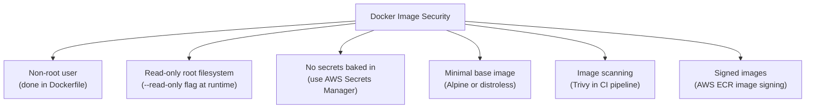
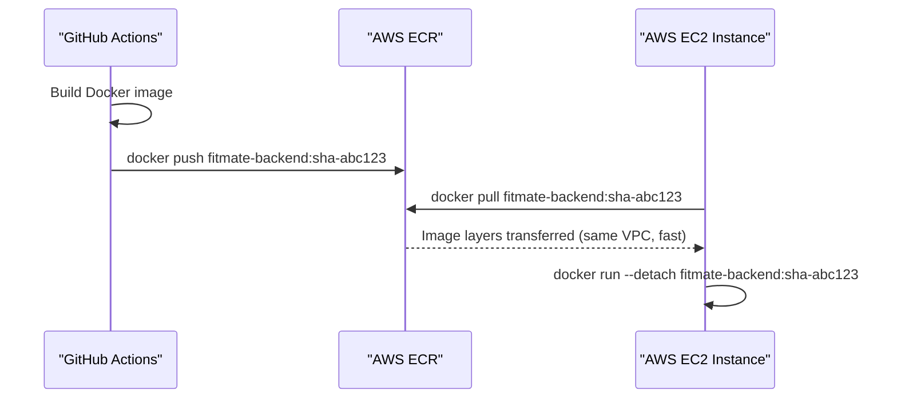

# Docker — Containerization Strategy for Fitmate

## Overview

Containerization is the foundational layer of the entire Fitmate deployment pipeline. This document
covers how to structure Docker images for both the backend and frontend, why multi-stage builds are
essential, how to harden images for production, and how Amazon ECR fits as the image registry. It
also discusses how Docker Compose serves local development without friction, and how it can be
augmented for staging environments.

---

## Table of Contents

1. [Why Docker for Fitmate](#1-why-docker-for-fitmate)
2. [Multi-Stage Dockerfile Design](#2-multi-stage-dockerfile-design)
3. [Backend Dockerfile — In Depth](#3-backend-dockerfile--in-depth)
4. [Frontend Dockerfile — In Depth](#4-frontend-dockerfile--in-depth)
5. [Image Hardening & Security](#5-image-hardening--security)
6. [Docker Compose for Local Dev](#6-docker-compose-for-local-dev)
7. [Amazon ECR — Image Registry](#7-amazon-ecr--image-registry)
8. [Trade-offs & What to Mix](#8-trade-offs--what-to-mix)

---

## 1. Why Docker for Fitmate

The core promise of Docker is **environment parity** — the container that runs on your MacBook is
identical to the one running on an AWS EC2 instance. This eliminates "works on my machine" bugs
that are especially dangerous when Fitmate's AI pipeline involves LangGraph state graphs and
version-sensitive LLM SDK dependencies.

Beyond parity, Docker gives Fitmate:

- **Reproducible builds** via locked dependency layers.
- **Fast deployments** — only changed layers are transferred, not the full image.
- **Security isolation** — the Node.js process runs inside a container with a minimal attack
  surface, separated from the host OS.
- **Horizontal scaling** — EC2 instances can pull the same image and spin up multiple replicas
  behind an Application Load Balancer.

---

## 2. Multi-Stage Dockerfile Design

A single-stage Dockerfile that installs all dev dependencies and ships them to production is a
critical mistake. It bloats the image size with tools never used at runtime (TypeScript compiler,
test frameworks, etc.) and expands the attack surface.

**Multi-stage builds** solve this by separating build-time and runtime concerns:



The key insight: the Builder stage is **discarded entirely** after compilation. The production
image has no compiler, no test runner, and no TypeScript source. This is not just a size
optimization — it is a meaningful security improvement.

---

## 3. Backend Dockerfile — In Depth

```dockerfile

# ================================================================
# Stage 1: Builder
# ================================================================
FROM node:20-alpine AS builder

WORKDIR /app

COPY package*.json ./

RUN npm ci

COPY tsconfig.json ./

COPY src/ ./src/

RUN npm run build

# ================================================================
# Stage 2: Production Runner
# ================================================================
FROM node:20-alpine AS production

ENV NODE_ENV=production

WORKDIR /app

RUN addgroup --system --gid 1001 nodejs

RUN adduser --system --uid 1001 fitmate

COPY package*.json ./

RUN npm ci --omit=dev

COPY --from=builder /app/dist ./dist

USER fitmate

EXPOSE 5000

CMD ["node", "dist/server.js"]

```

**Key decisions explained:**

- `node:20-alpine` is used over `node:20` because the Alpine Linux base image is ~5MB vs ~200MB.
  The trade-off is that Alpine uses `musl libc` instead of `glibc`, which can cause compatibility
  issues with some native Node.js addons. For Fitmate's stack (pure JS/TS packages), this is safe.
- `npm ci --omit=dev` in the production stage installs only what is listed in `dependencies`, not
  `devDependencies`. This alone eliminates TypeScript, ESLint, Vitest, and dozens of other packages.
- `addgroup` / `adduser` creates a non-root user. Running the Node.js process as root is a
  security vulnerability — if the process is exploited, the attacker gets root inside the container.
- `COPY --from=builder` pulls only the compiled `/dist` folder from the Builder stage, never the
  TypeScript source.

---

## 4. Frontend Dockerfile — In Depth

```dockerfile

# ================================================================
# Stage 1: Builder
# ================================================================
FROM node:20-alpine AS builder

WORKDIR /app

COPY package*.json ./

RUN npm ci

COPY . .

ARG VITE_API_URL

ENV VITE_API_URL=$VITE_API_URL

RUN npm run build

# ================================================================
# Stage 2: Static File Server (Nginx)
# ================================================================
FROM nginx:1.27-alpine AS production

COPY --from=builder /app/dist /usr/share/nginx/html

COPY nginx.frontend.conf /etc/nginx/conf.d/default.conf

EXPOSE 80

CMD ["nginx", "-g", "daemon off;"]

```

**Key decisions explained:**

- The frontend build output (`/app/dist`) is a folder of static HTML, CSS, and JS files. There is
  no reason to serve them with Node.js — Nginx serving static files is significantly faster.
- `ARG VITE_API_URL` allows the API URL to be injected at build time by GitHub Actions, meaning
  the same Dockerfile works for staging and production simply by passing a different build arg.
- The final image contains only Nginx and the static files — no Node.js, no npm, no source code.

---

## 5. Image Hardening & Security

Beyond multi-stage and non-root users, the following hardening measures should be applied:



| Hardening Measure | Risk Mitigated | Implementation |
|---|---|---|
| Non-root user | Privilege escalation if container is breached | `USER fitmate` in Dockerfile |
| No secrets in image | Secrets leaked via `docker inspect` or registry | AWS Secrets Manager + ECS Task Definition env vars |
| Read-only filesystem | Malware writing to disk inside container | `--read-only` + tmpfs for writable paths |
| Image scanning | Known CVEs in base image or packages | Trivy scan step in GitHub Actions |
| Pinned base image digests | Supply-chain attacks via mutable `latest` tags | Use `node:20-alpine@sha256:...` |

**On `.dockerignore`:** This file is as important as `.gitignore`. Without it, the Docker build
context includes `node_modules`, `.env`, `.git`, and all other local files, slowing builds and
risking secrets leakage.

```
node_modules
dist
.env
.env.*
.git
*.md
coverage
```

---

## 6. Docker Compose for Local Development

Docker Compose orchestrates the backend, a local MongoDB instance, and optionally the frontend
together with a single command, eliminating the need for every developer to manually manage
multiple processes.

```yaml

version: "3.9"

services:

  backend:

    build:

      context: ./backend

      target: builder

    ports:

      - "5000:5000"

    volumes:

      - ./backend/src:/app/src

    environment:

      - NODE_ENV=development

      - MONGO_URI=mongodb://mongo:27017/fitmate

    depends_on:

      - mongo

    command: npm run dev

  mongo:

    image: mongo:7

    ports:

      - "27017:27017"

    volumes:

      - mongo_data:/data/db

volumes:

  mongo_data:

```

**What to notice:**
- The `target: builder` means Compose uses Stage 1 of the Dockerfile, which has the full dev
  toolchain. Production deployments use the default `target: production`.
- Volume mounting `./backend/src:/app/src` enables hot-reload — the source files on the host are
  reflected inside the container in real time without rebuilding.
- In production, MongoDB is on Atlas, not a Docker container. The compose file is purely for local
  development parity.

**What to mix with Compose:** Tools like `make` or `just` can wrap common Compose commands into
readable targets (`make dev`, `make test`, `make logs`), reducing the learning curve for new
developers.

---

## 7. Amazon ECR — Image Registry

Amazon Elastic Container Registry (ECR) is the natural choice when running on AWS. The alternative
is Docker Hub, but ECR has meaningful advantages for a production system:

| Capability | ECR | Docker Hub |
|---|---|---|
| Authentication | AWS IAM (no separate credentials) | Docker Hub account credentials |
| Scan on push | Native Trivy/Clair scanning built-in | Only on paid plans |
| Network latency | Near-zero from EC2 (same region) | External network hop |
| Cost | $0.10/GB storage, free egress to EC2 | Free tier, then per-pull charges |
| Image signing | Supported via AWS Signer | Supported via Docker Content Trust |



**ECR Lifecycle Policies** should be configured to automatically delete untagged images older than
30 days, preventing unbounded storage cost growth as the CI pipeline pushes new images on every
commit.

---

## 8. Trade-offs & What to Mix

### Alpine vs Distroless

Alpine is excellent but Distroless (Google's minimal images) goes even further — they contain no
shell at all, making interactive exploitation nearly impossible. The trade-off is debugging: you
cannot `docker exec` into a distroless container and run commands. For Fitmate's current stage,
Alpine with non-root user is the right balance. Distroless can be adopted later.

**Mix:** Use distroless in production, keep Alpine in development. Docker's multi-stage makes this
trivial — swap only the final `FROM` line between environments.

### Layer Caching in CI

Docker layer caching dramatically speeds up builds. If `package.json` has not changed, Docker
reuses the cached `npm ci` layer rather than re-downloading all packages. In GitHub Actions, the
`docker/build-push-action` supports cache backends (GitHub Cache or ECR cache) that persist
between runs.

**Mix:** Combine ECR as a cache registry with BuildKit's `--cache-from` to achieve sub-90-second
build times even on cold CI runners.

### Compose in Staging

Docker Compose is not just for local dev. With a separate `docker-compose.staging.yml` override
file, the staging environment can be orchestrated on a single EC2 instance using Compose, while
production uses ECS. This avoids the operational overhead of ECS for a low-traffic staging
environment while keeping the container workflow identical.
