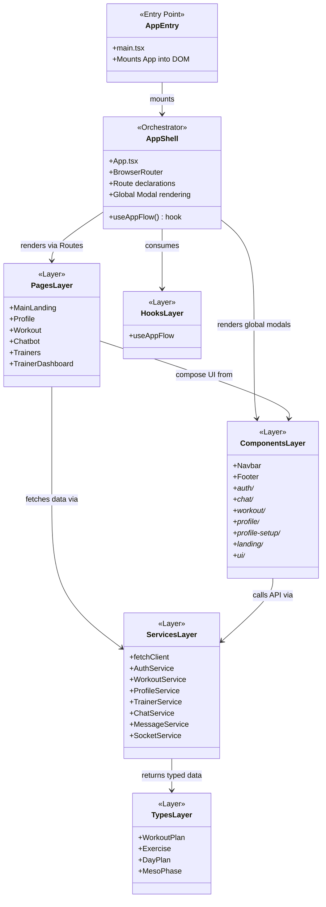
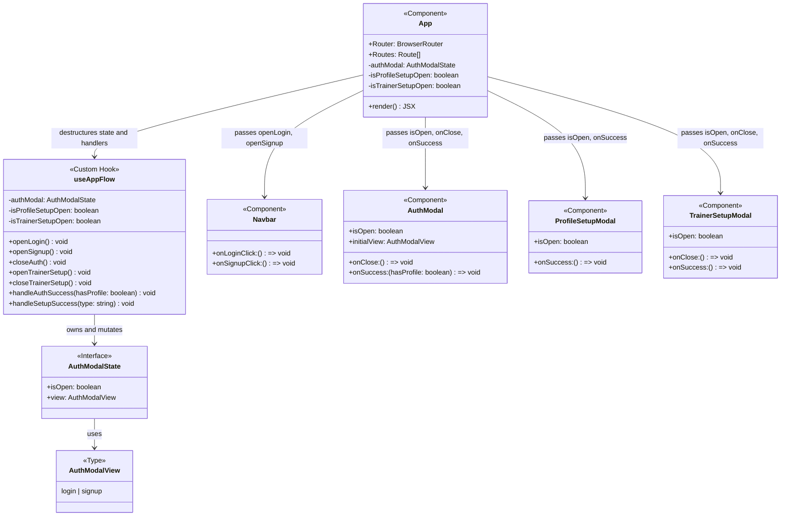
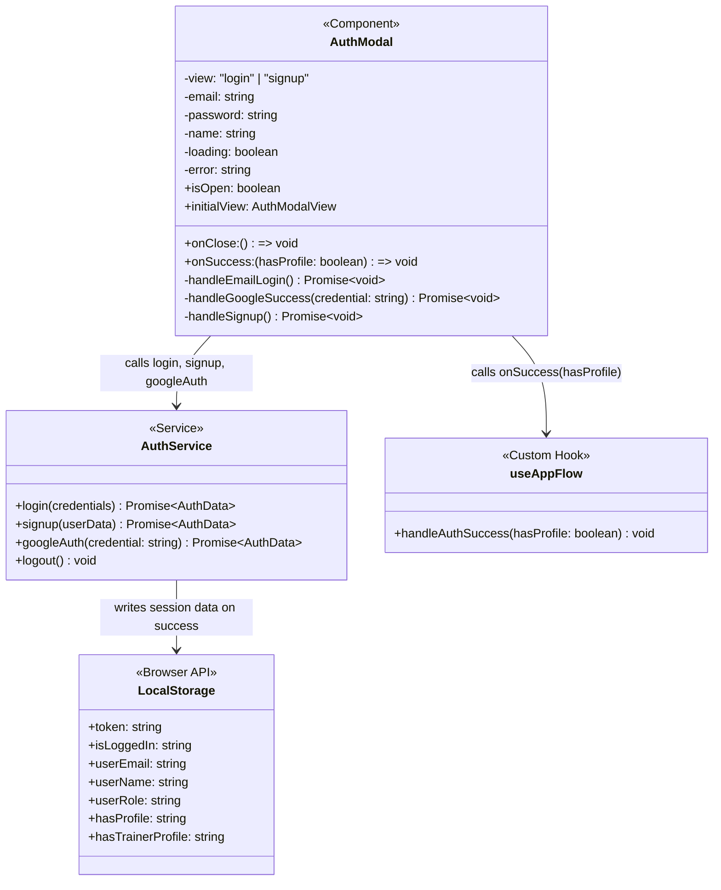
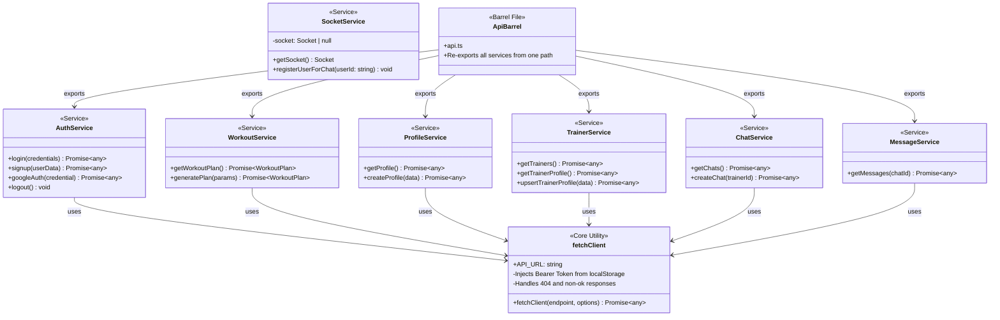
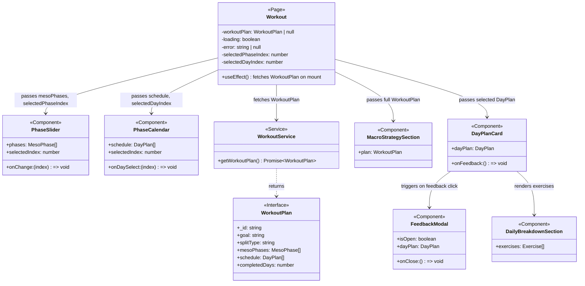
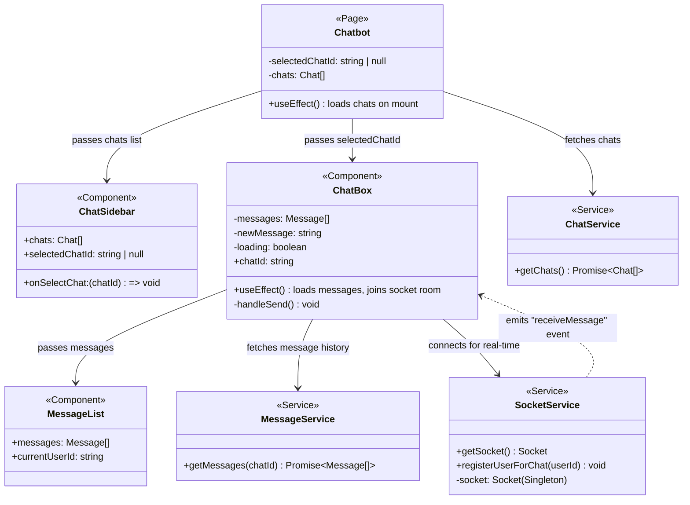
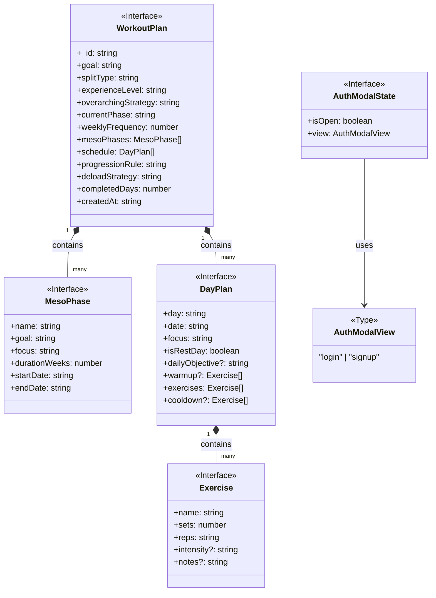
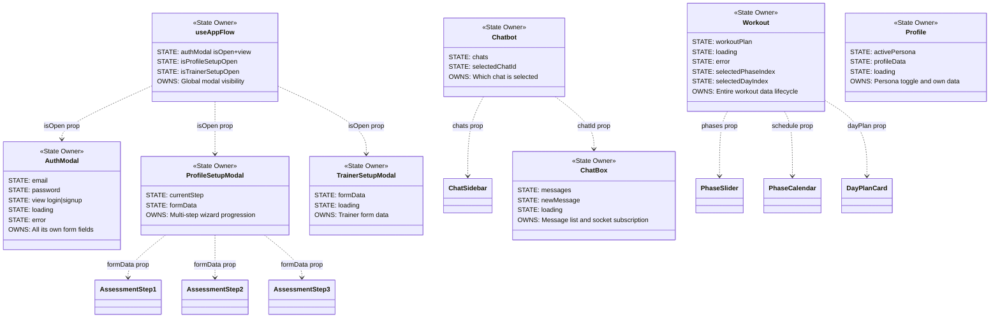

# Frontend Architecture — Class Diagrams

---

## Table of Contents

1. [Diagram 1: High-Level System Overview](#diagram-1-high-level-system-overview)
2. [Diagram 2: Application Shell and Routing](#diagram-2-application-shell-and-routing)
3. [Diagram 3: Authentication Flow Components](#diagram-3-authentication-flow-components)
4. [Diagram 4: Services Layer Architecture](#diagram-4-services-layer-architecture)
5. [Diagram 5: Workout Domain Components](#diagram-5-workout-domain-components)
6. [Diagram 6: Chat Domain Components](#diagram-6-chat-domain-components)
7. [Diagram 7: Profile and Setup Domain Components](#diagram-7-profile-and-setup-domain-components)
8. [Diagram 8: Data Types and Interfaces](#diagram-8-data-types-and-interfaces)
9. [Diagram 9: Component State Ownership](#diagram-9-component-state-ownership)

---

## Diagram 1: High-Level System Overview

This is the bird's-eye view of the entire frontend. It shows the major layers and how they relate to each other without getting into specifics.

**Explanation:**
- `AppEntry` (main.tsx) is the single entry point that bootstraps React and mounts `App` into the HTML.
- `AppShell` (App.tsx) is the Orchestrator. It owns routing, decides which page to render, and controls global modal visibility via the `useAppFlow` hook.
- `PagesLayer` contains the full-page views. Each page is a composition of smaller reusable `ComponentsLayer` pieces.
- `ServicesLayer` is a standalone layer that all pages and components talk to for API communication. It sits between the UI and the backend.
- `TypesLayer` is purely structural — it defines TypeScript interfaces that keep the entire codebase type-safe.

---

## Diagram 2: Application Shell and Routing

This diagram zooms into how `App.tsx` and `useAppFlow` work together to manage the entire navigation and global modal system.

**Explanation:**
- `App` does not manage any state itself. It delegates completely to `useAppFlow`.
- `useAppFlow` is the single source of truth for all global flow state. It knows which modals are open and what should happen after each user action (post-login redirect, post-setup redirect).
- `App` passes event handler functions (like `openLogin`) down to `Navbar` as props, allowing the Navbar's button to trigger a modal that lives at the top-level `App` component.
- `AuthModal`, `ProfileSetupModal`, and `TrainerSetupModal` are "dumb" in terms of flow — they receive `isOpen` and `onSuccess` callbacks from `App` and execute them.

---

## Diagram 3: Authentication Flow Components

This diagram focuses exclusively on the auth components and their interactions with the `AuthService`.

**Explanation:**
- `AuthModal` owns ALL its form state locally (`email`, `password`, `view`, `loading`, `error`). It is self-contained.
- When the user submits, `AuthModal` calls `AuthService` which sends the HTTP request via `fetchClient`.
- On success, `AuthService` is responsible for writing ALL session flags into `localStorage` (`token`, `userRole`, `hasProfile`, etc.).
- `AuthModal` then calls its `onSuccess` prop (which is `useAppFlow.handleAuthSuccess`) passing the `hasProfile` flag so the hook can decide the next navigation step.

---

## Diagram 4: Services Layer Architecture

This diagram details the full internal structure of the services layer and the relationship between all service files.

**Explanation:**
- `fetchClient` is the single core utility that all domain services depend on. It is the only place that touches the JWT token and the base URL.
- `SocketService` is intentionally independent and does NOT use `fetchClient`. It uses the `socket.io-client` library instead because WebSockets are not HTTP requests.
- `ApiBarrel` (api.ts) is a barrel file — its sole purpose is to aggregate and re-export everything so pages can write `import { AuthService } from '../services/api'` instead of needing to know each file's path.

---

## Diagram 5: Workout Domain Components

This shows how the Workout page and all its child components are related.

**Explanation:**
- `Workout` (the page) is the top-level owner of all workout state. It fetches the `WorkoutPlan` from the `WorkoutService` and holds it.
- It passes slices of data down to child components as props. `PhaseSlider` only gets the `mesoPhases` array, `PhaseCalendar` only gets the `schedule`, etc.
- `DayPlanCard` is a mid-level component that manages its own sub-state (whether `FeedbackModal` is open) and passes it down to `DailyBreakdownSection`.
- The `WorkoutPlan` interface from `types/workout.ts` is the shared contract that connects `WorkoutService` to every component in this diagram.

---

## Diagram 6: Chat Domain Components

This shows how the Chat page, its components, and the real-time Socket service all interrelate.

**Explanation:**
- `Chatbot` (the page) manages which conversation is selected and owns the list of all chats.
- `ChatBox` is the most complex component — it independently fetches its own message history via `MessageService` (HTTP) and also opens a Socket.io connection for real-time new messages. It is effectively operating on two data channels simultaneously.
- `SocketService` uses a Singleton pattern (one shared `socket` instance). The `..>` (dashed dependency) arrow from `SocketService` to `ChatBox` represents an event-driven relationship: `SocketService` emits `receiveMessage` events *back* to `ChatBox` which updates its local state.
- `MessageList` is a pure, dumb display component. It receives messages as props and simply renders them.

---

## Diagram 7: Profile and Setup Domain Components

This shows how the Profile page, the dual-role persona system, and the setup wizard modals are structured.

```mermaid
classDiagram
    class Profile {
        <<Page>>
        -activePersona: "learner" | "trainer"
        -userRole: string
        -profileData: any
        -loading: boolean
        +useEffect() loads profile from localStorage and API
        -handlePersonaSwitch(persona) void
    }

    class AthleteProfileCard {
        <<Component>>
        +profile: ProfileData
    }

    class AIMemoryCard {
        <<Component>>
        +memories: string[]
    }

    class PhaseAccordion {
        <<Component>>
        +mesoPhases: MesoPhase[]
    }

    class StrategySection {
        <<Component>>
        +plan: WorkoutPlan
    }

    class ProfileSetupModal {
        <<Component>>
        -currentStep: 1 | 2 | 3
        -formData: AssessmentData
        +isOpen: boolean
        +onSuccess: () => void
    }

    class AssessmentStep1 {
        <<Component>>
        +data: AssessmentData
        +onChange: (data) => void
    }

    class AssessmentStep2 {
        <<Component>>
        +data: AssessmentData
        +onChange: (data) => void
    }

    class AssessmentStep3 {
        <<Component>>
        +data: AssessmentData
        +onSubmit: () => void
    }

    class TrainerSetupModal {
        <<Component>>
        -formData: TrainerData
        -loading: boolean
        +isOpen: boolean
        +onClose: () => void
        +onSuccess: () => void
        -handleSubmit() void
    }

    class ProfileService {
        <<Service>>
        +getProfile() Promise~any~
        +createProfile(data) Promise~any~
    }

    class TrainerService {
        <<Service>>
        +upsertTrainerProfile(data) Promise~any~
    }

    Profile --> AthleteProfileCard : renders when learner
    Profile --> AIMemoryCard : renders when learner
    Profile --> PhaseAccordion : renders when learner
    Profile --> StrategySection : renders when learner
    Profile --> ProfileService : fetches profile data
    ProfileSetupModal --> AssessmentStep1 : renders step 1
    ProfileSetupModal --> AssessmentStep2 : renders step 2
    ProfileSetupModal --> AssessmentStep3 : renders step 3
    ProfileSetupModal --> ProfileService : submits on final step
    TrainerSetupModal --> TrainerService : submits form data
```

**Explanation:**
- `Profile` is the most dynamic page in the app. It reads `activePersona` from `localStorage` and conditionally renders completely different UI — an Athlete dashboard vs. a Trainer dashboard — based on that value.
- `ProfileSetupModal` is a multi-step wizard. It internally tracks `currentStep` (1, 2, or 3) and renders the appropriate `AssessmentStep` component. Each step mutates a shared `formData` object until the final step submits everything to the API.
- `TrainerSetupModal` is simpler — a single-step form that collects professional trainer details and calls `TrainerService` directly.

---

## Diagram 8: Data Types and Interfaces

This shows the full type system used across the frontend, demonstrating how data structures compose together.

**Explanation:**
- This diagram shows the **composition relationships** (`*--`) — meaning `WorkoutPlan` is composed *of* `MesoPhase` objects. If the `WorkoutPlan` is deleted, its `MesoPhase` objects have no independent meaning either.
- `Exercise` is the leaf node — the most atomic data type. It belongs inside `DayPlan`.
- `AuthModalState` and `AuthModalView` represent the type system for the app flow module. They are completely separate from the workout domain.

---

## Diagram 9: Component State Ownership

This is the most important architectural diagram. It shows which component **owns** each piece of state and how state flows down via props.

**Explanation:**
- This diagram is the most critical for understanding Fitmate's state architecture. The key rule: **State is always owned at the highest component that needs it, and flows downward only as props.**
- `useAppFlow` is the highest-level state owner in the entire app — it governs which global modals are visible.
- `AuthModal` owns its own form fields locally. When it succeeds, it only tells `useAppFlow` one fact: `hasProfile: boolean`. It does NOT expose its raw `email` or `password` state upward.
- `ChatBox` is notable — it is a mid-level component that owns a significant amount of state independently (messages, socket connection) rather than receiving it from the `Chatbot` page. This is a deliberate design to keep `Chatbot` focused on conversation-level concerns.
- The `..>` (dashed) arrows show **props flowing downward** from the state owner to the consumer component.
