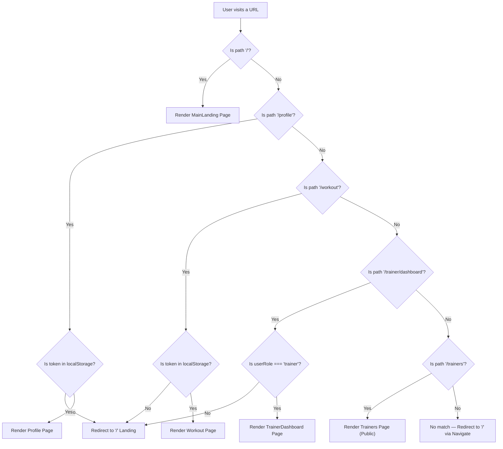
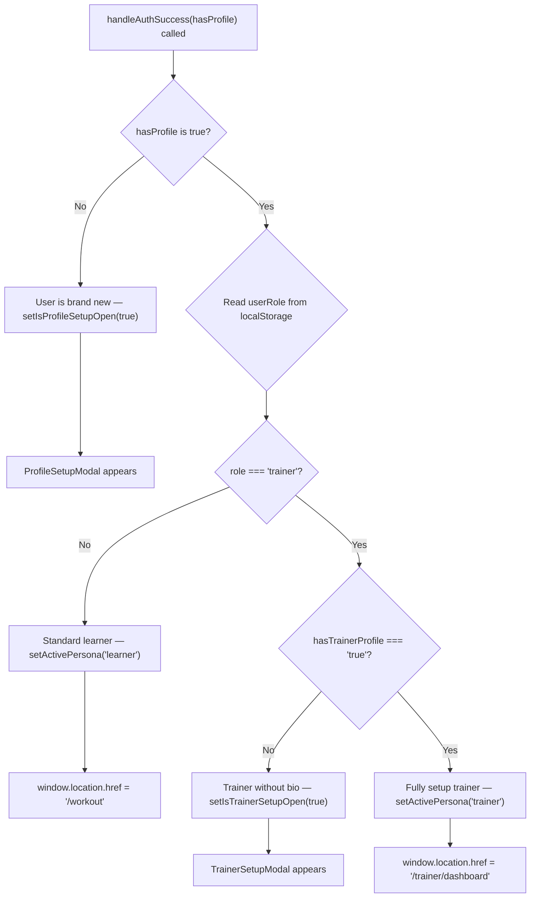

# Frontend Architecture — Flowcharts

---

## Table of Contents

1. [Flowchart 1: App Routing and Navigation Guard](#flowchart-1-app-routing-and-navigation-guard)
2. [Flowchart 2: Post-Login Decision Tree](#flowchart-2-post-login-decision-tree)

---

## Flowchart 1: App Routing and Navigation Guard

This flowchart shows how the app decides what to render for any given URL.

**Explanation:**
- `/trainers` is a public page — any visitor can browse trainers even while logged out.
- `/profile`, `/workout`, and `/chat` are soft-protected — they check for a token in `localStorage`. Currently this is a frontend-only guard. The backend always enforces the real security via JWT middleware.
- `/trainer/dashboard` has an additional role check — only users with `userRole === 'trainer'` in `localStorage` should reach it.

---

## Flowchart 2: Post-Login Decision Tree

This is the exact decision tree inside `useAppFlow.handleAuthSuccess` that determines where to send a user after they log in.

**Explanation:**
- This flowchart exposes the 4 distinct scenarios `handleAuthSuccess` handles, making it clear why the hook is complex.
- A Trainer user who hasn't completed their professional profile yet is caught here and redirected to `TrainerSetupModal` before they can access the dashboard.
- The `activePersona` flag is set into `localStorage` here to preserve the user's role context across page reloads.
