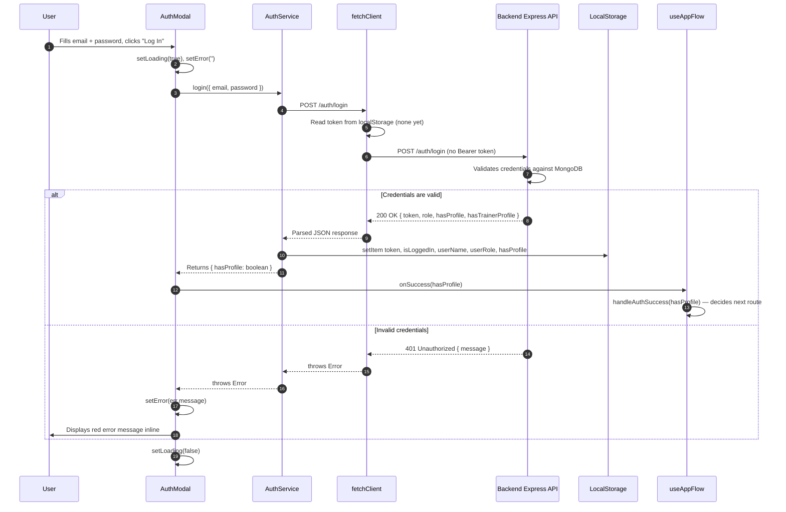
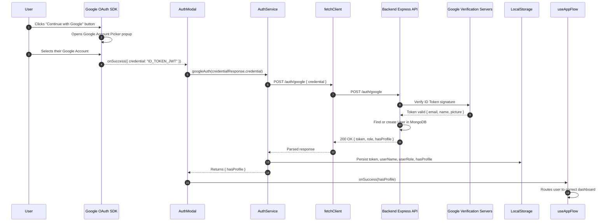
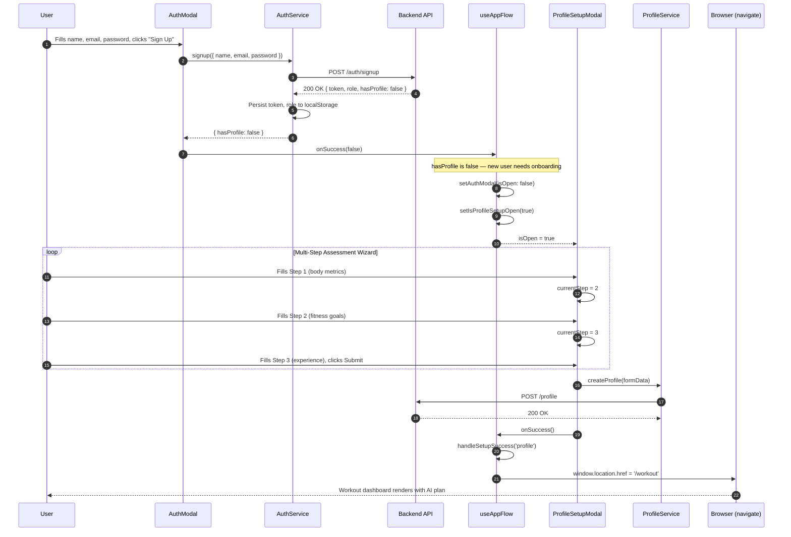
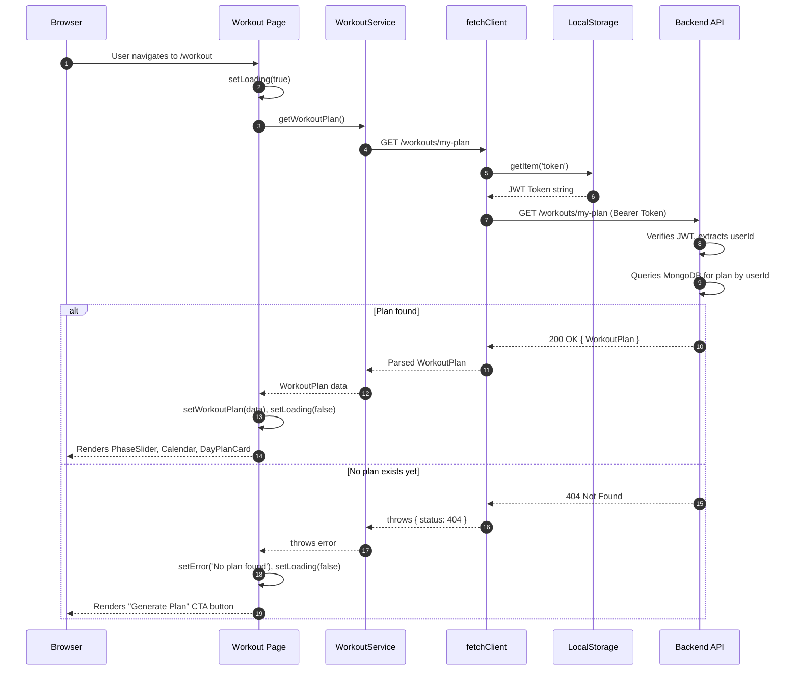
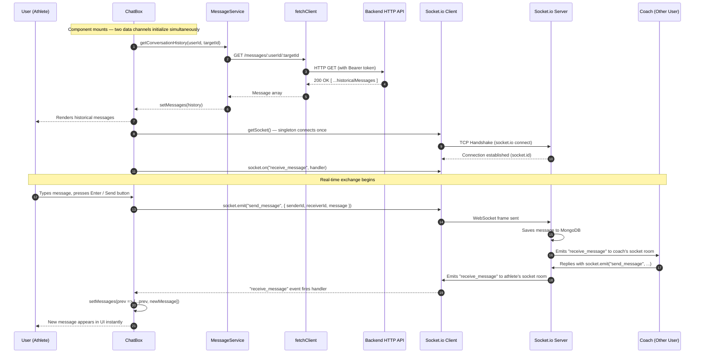
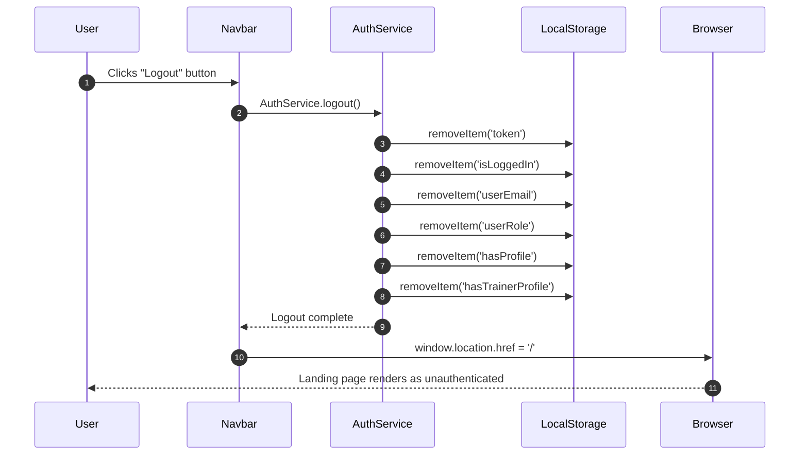

# Frontend Architecture — Sequence Diagrams

---

## Table of Contents

1. [Sequence Diagram 1: Email Login Flow](#sequence-diagram-1-email-login-flow)
2. [Sequence Diagram 2: Google OAuth Login Flow](#sequence-diagram-2-google-oauth-login-flow)
3. [Sequence Diagram 3: New User Signup + Profile Setup Flow](#sequence-diagram-3-new-user-signup--profile-setup-flow)
4. [Sequence Diagram 4: Workout Plan Fetch Flow](#sequence-diagram-4-workout-plan-fetch-flow)
5. [Sequence Diagram 5: Real-Time Chat Message Flow](#sequence-diagram-5-real-time-chat-message-flow)
6. [Sequence Diagram 6: Logout Flow](#sequence-diagram-6-logout-flow)

---

## Sequence Diagram 1: Email Login Flow

This diagram traces the exact lifecycle of a user clicking "Log In" with their email and password, from UI interaction all the way to localStorage persistence.

**Explanation:**
- `AuthModal` owns the UX state (`loading`, `error`) and never touches `localStorage` itself.
- `AuthService` is exclusively responsible for writing the session to `localStorage`. This is a critical separation of concerns — the component should never know about token storage details.
- The `onSuccess(hasProfile)` callback passes only a single boolean upward to `useAppFlow`, keeping the modal's concerns isolated from navigation logic.

---

## Sequence Diagram 2: Google OAuth Login Flow

This shows how the Google ID Token flows through the system — from the Google SDK in the browser to backend verification and session creation.

**Explanation:**
- The Google OAuth flow is specifically designed so that **Fitmate's backend never receives the user's Google password**. It only receives a short-lived, signed ID Token.
- The backend forwards that token to Google's own verification servers to confirm its authenticity before creating a session. This is the standard OAuth2/OIDC pattern.
- After verification the flow is identical to email login — `AuthService` persists the session and `useAppFlow` handles navigation.

---

## Sequence Diagram 3: New User Signup + Profile Setup Flow

This traces the full multi-step onboarding journey of a brand-new user from registration to their first workout dashboard.

**Explanation:**
- The entire onboarding is orchestrated by `useAppFlow` reacting to the `hasProfile: false` flag returned from the backend after signup.
- `ProfileSetupModal` manages `currentStep` and accumulated `formData` internally. The parent (`App.tsx`) only knows whether the modal is open or closed.
- `window.location.href` is used intentionally (instead of React Router's `navigate`) to force a hard page reload, which resets all component state and ensures the new session data from `localStorage` is freshly read by every component.

---

## Sequence Diagram 4: Workout Plan Fetch Flow

This shows what happens when the `Workout` page loads and needs to display the user's AI-generated plan.

**Explanation:**
- `fetchClient` is the only component that reads from `localStorage`. The `Workout` page and `WorkoutService` never directly touch the JWT.
- The `404` response is handled as a **business logic branch**, not a hard error — it means the user simply doesn't have a plan yet and is shown a "Generate Plan" button instead of an error screen.

---

## Sequence Diagram 5: Real-Time Chat Message Flow

This is the most complex sequence in the app, showing both the initial HTTP history load and the ongoing Socket.io real-time message exchange.

**Explanation:**
- `ChatBox` runs two data channels in parallel from the same `useEffect`: an HTTP call via `MessageService` for historical messages and a WebSocket subscription via `SocketClient` for new real-time messages.
- `getSocket()` implements the Singleton pattern — calling it multiple times returns the exact same connection instance, preventing duplicate socket connections.
- Messages sent via `socket.emit` are NOT added to local state by the sender directly. Instead, the server broadcasts the message back, and the sender's own `receive_message` handler picks it up. This ensures both users always see the same data.

---

## Sequence Diagram 6: Logout Flow

This shows the complete teardown of a user's session.

**Explanation:**
- Logout is entirely client-side. The backend JWT is stateless — once `localStorage` is cleared, the token is effectively invalidated from the frontend's perspective.
- The hard redirect to `/` forces all components to re-initialize and discover there is no token in `localStorage`, ensuring no stale authenticated state lingers in React memory.
