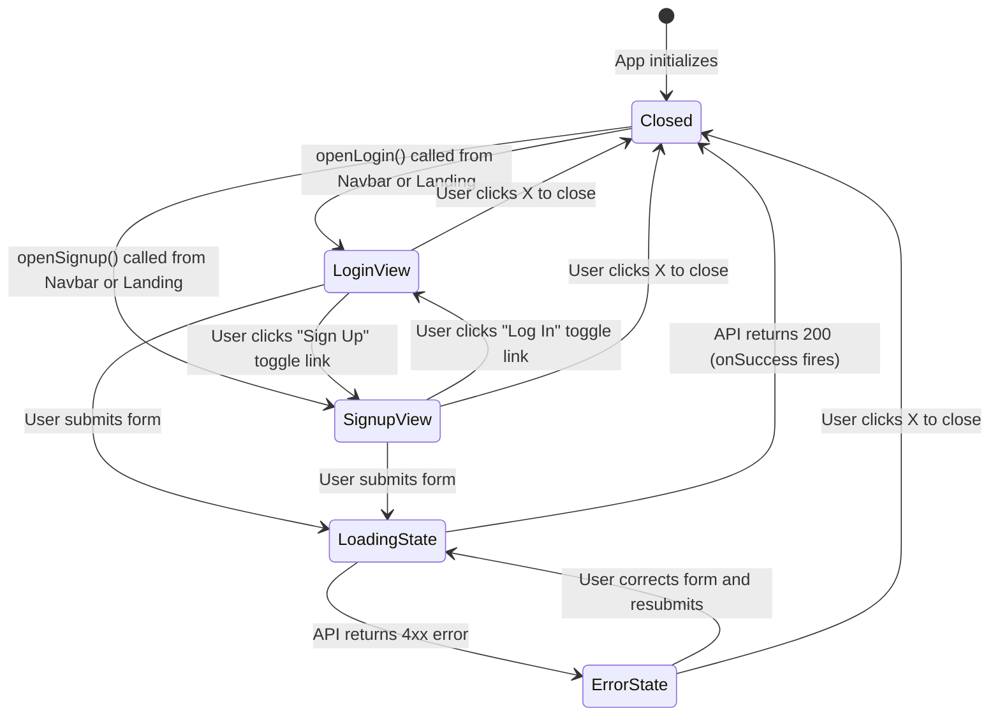
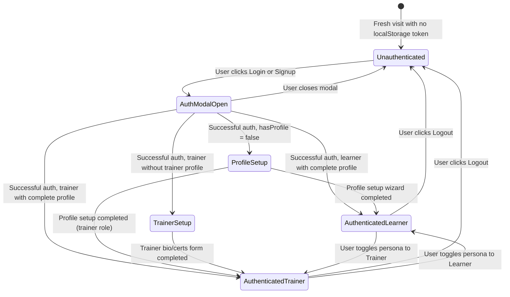
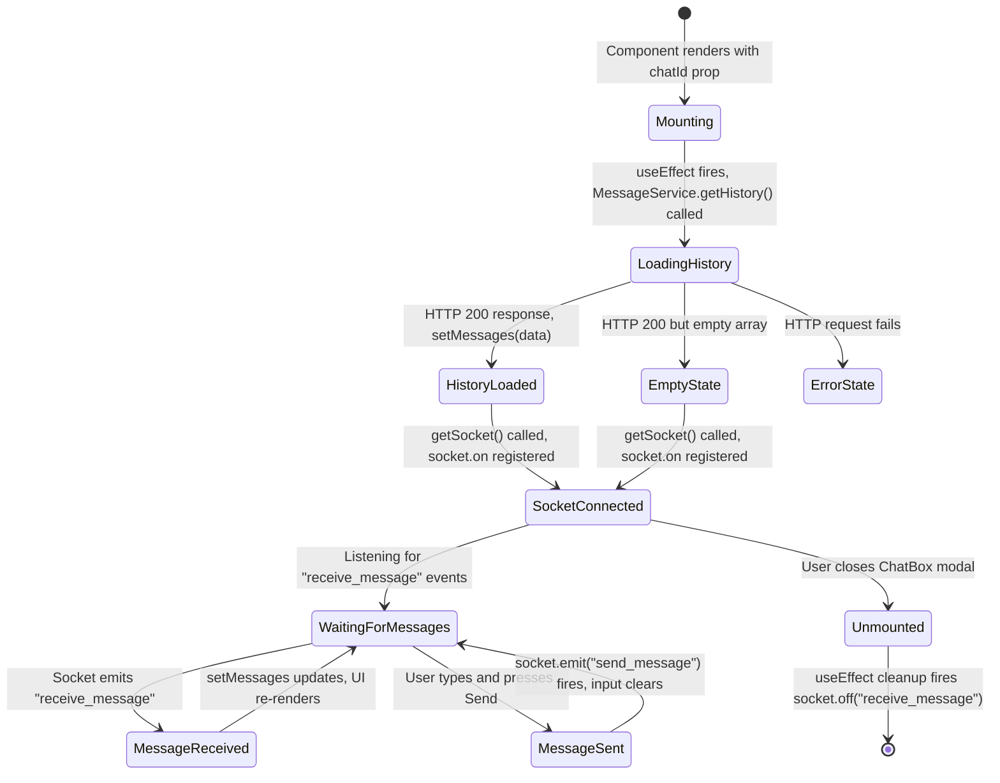

# Frontend Architecture — State Diagrams

---

## Table of Contents

1. [State Diagram 1: AuthModal View States](#state-diagram-1-authmodal-view-states)
2. [State Diagram 2: Global App Flow States](#state-diagram-2-global-app-flow-states)
3. [State Diagram 3: ChatBox Lifecycle](#state-diagram-3-chatbox-lifecycle)

---

## State Diagram 1: AuthModal View States

This shows all the states the `AuthModal` can be in, and what triggers transitions between them.

**Explanation:**
- The modal can only ever be in one of these discrete states at a time.
- `LoadingState` is not a separate component — it is the same JSX but with the button showing a spinner and `disabled={true}`.
- The `ErrorState` does not lock the user out — they can correct their input and submit again, which transitions directly back to `LoadingState`.

---

## State Diagram 2: Global App Flow States

This shows the high-level states the entire application can be in from a flow perspective, managed by `useAppFlow`.

**Explanation:**
- The dual-persona toggle (`AuthenticatedLearner` ↔ `AuthenticatedTrainer`) is a frontend-only state change. The user's actual role in the database does not change — only the `activePersona` flag in `localStorage` changes, which causes the `Profile` page to re-render with a different UI.
- `TrainerSetup` can only be reached after auth. A fresh visitor can never reach this state without logging in first.

---

## State Diagram 3: ChatBox Lifecycle

This shows all the states the `ChatBox` component goes through from mounting to teardown.

**Explanation:**
- The most critical transition is `Unmounted → [*]`. The `useEffect` cleanup function calls `socket.off("receive_message")` which unsubscribes the event handler. Without this, the handler would persist in memory even after the component is destroyed, causing a memory leak where new messages continue firing a handler that tries to `setState` on a dead component.
- `HistoryLoaded` and `EmptyState` both transition to `SocketConnected` — the socket connection is opened regardless of whether there is message history or not.
