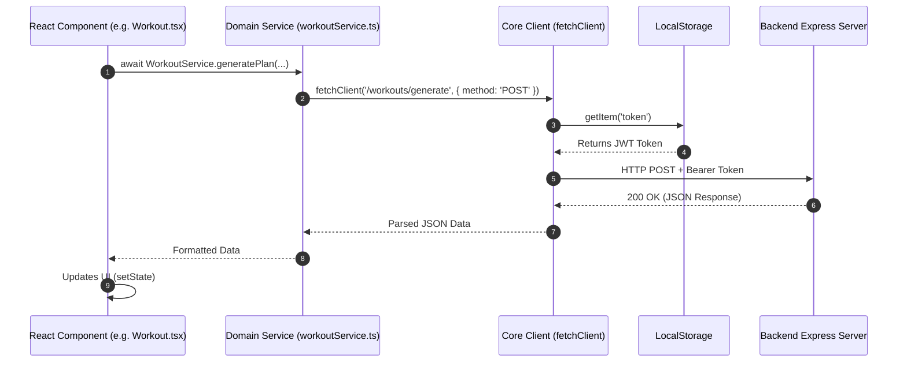

# Frontend Services Architecture Overview

---

## Table of Contents

1. [Introduction to Services](#1-introduction-to-services)
2. [The Core API Client (`client.ts`)](#2-the-core-api-client-clientts)
3. [Authentication Service (`authService.ts`)](#3-authentication-service-authservicets)
4. [Real-time Communication (`socket.ts`)](#4-real-time-communication-socketts)
5. [Domain-Specific Services](#5-domain-specific-services)
6. [Services Data Flow](#6-services-data-flow)

---

## 1. Introduction to Services

In the Fitmate frontend architecture, the **Services Layer** is responsible for all external communications. Instead of writing raw `fetch` calls directly inside React components, all API requests are abstracted into dedicated "service" files.

This approach provides several massive benefits:
- **Separation of Concerns:** React components only care about UI state, while services handle data fetching.
- **Reusability:** If multiple components need to fetch a user's profile, they call the same service method.
- **Centralized Error Handling:** Network errors and token injections happen in one place, not scattered across dozens of components.

---

## 2. The Core API Client (`client.ts`)

At the heart of the services layer is `client.ts`. It acts as a wrapper around the native browser `fetch` API. Every other service uses this client instead of calling `fetch` directly.

### What it does:
1.  **Token Injection:** Automatically pulls the JWT token from `localStorage` and injects it into the `Authorization: Bearer <token>` header for every request.
2.  **Base URL Management:** Appends the endpoint to the base `API_URL` (handling local development vs production environments).
3.  **Error Formatting:** Intercepts failed requests (like `404 Not Found` or `500 Server Error`) and throws standardized JavaScript `Error` objects so the React components can easily catch them.

### Code Structure:

```typescript

export async function fetchClient(endpoint: string, options: RequestInit = {}) {

  const token = localStorage.getItem('token');

  const headers = {

    'Content-Type': 'application/json',

    ...(token ? { Authorization: `Bearer ${token}` } : {}),

    ...options.headers,

  };

  const response = await fetch(`${API_URL}${endpoint}`, {

    ...options,

    headers,

  });

  if (!response.ok) {

    throw new Error('An unexpected API error occurred');

  }

  return await response.json();

}

```

---

## 3. Authentication Service (`authService.ts`)

The `AuthService` specifically handles the user identity lifecycle.

### What it does:
1.  **Local Login & Signup:** Sends user credentials to the backend.
2.  **Google OAuth:** Forwards the Google ID token to the backend for verification.
3.  **Session Management:** Once the backend returns a successful response, `AuthService` parses the response and immediately saves all necessary flags to `localStorage` (e.g., `token`, `userRole`, `hasProfile`).
4.  **Logout:** Contains a utility to completely wipe all Fitmate-related variables from `localStorage` to end the session securely.

---

## 4. Real-time Communication (`socket.ts`)

Unlike standard REST API calls, chat functionalities require persistent, bi-directional connections. This is handled by `socket.ts`.

### What it does:
1.  **Singleton Pattern:** Ensures that only **one** WebSocket connection is ever opened per client by exporting a `getSocket()` function.
2.  **Room Registration:** Contains helper functions like `registerUserForChat` which emits the user's ID to the backend so they can join a secure, private Socket.io room.

---

## 5. Domain-Specific Services

The rest of the services act as simple dictionaries of API calls organized by domain. They all utilize `fetchClient`.

*   **`workoutService.ts`**: Handles fetching, generating, and updating AI workout plans.
*   **`profileService.ts`**: Handles onboarding profile creation and fetching user fitness goals.
*   **`trainerService.ts`**: Handles fetching lists of trainers, assigning a trainer, and loading the trainer dashboard.
*   **`chatService.ts` & `messageService.ts`**: Handles fetching historical chat logs before the real-time Socket connection takes over.
*   **`api.ts`**: A barrel file that exports all services so components can import them cleanly from a single path (`import { AuthService, WorkoutService } from '../services/api'`).

---

## 6. Services Data Flow

The following diagram illustrates how a React component interacts with the backend using the services layer.


