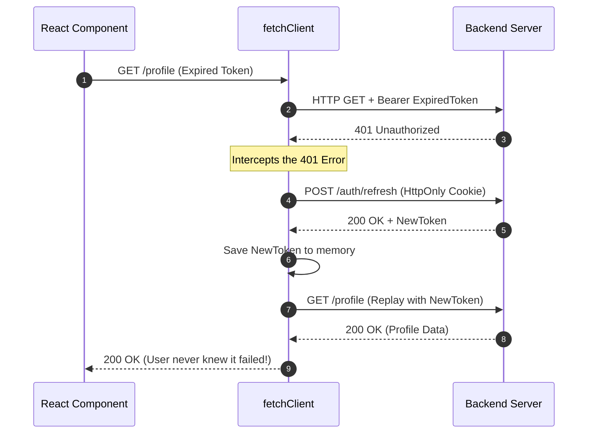
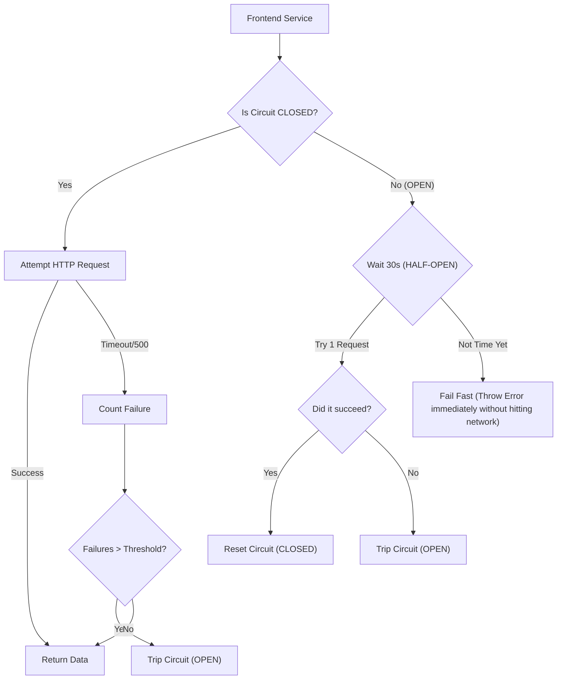

# Industry-Grade Services Architecture

---

## Table of Contents

1. [Introduction](#1-introduction)
2. [Idempotency and Automatic Retries](#2-idempotency-and-automatic-retries)
3. [Token Refresh & Interceptors](#3-token-refresh--interceptors)
4. [Request Cancellation (AbortControllers)](#4-request-cancellation-abortcontrollers)
5. [Telemetry and Request Tracing](#5-telemetry-and-request-tracing)
6. [Type-Safe API Contracts (OpenAPI)](#6-type-safe-api-contracts-openapi)
7. [Circuit Breaking](#7-circuit-breaking)

---

## 1. Introduction

Making a frontend services layer "production-ready" means moving beyond simply calling `fetch()`. A professional services architecture is highly resilient, handles network flakiness automatically, prevents memory leaks, and tightly integrates with backend telemetry.

---

## 2. Idempotency and Automatic Retries

Networks are inherently flaky (mobile drops, spotty Wi-Fi). A professional service layer never assumes a request will succeed on the first try. 

### Strategy
Implement **Exponential Backoff with Jitter**. If a `GET` request fails with a `5xx` error, the client should automatically retry it. (Never retry `POST` requests blindly unless they are idempotent, or you risk duplicating data).

### Implementation

```typescript

// Example of a retry wrapper

export async function fetchWithRetry(url: string, options: any, retries = 3) {

  try {

    return await fetchClient(url, options);

  } catch (error) {

    if (retries > 0 && error.status >= 500) {

      // Wait 1s, then 2s, then 4s...

      const delay = Math.pow(2, 3 - retries) * 1000;

      await new Promise(resolve => setTimeout(resolve, delay));

      return fetchWithRetry(url, options, retries - 1);

    }

    throw error;

  }

}

```

---

## 3. Token Refresh & Interceptors

In Fitmate, the JWT is stored in `localStorage`. If it expires, the user gets a `401 Unauthorized` error and is logged out. This is a poor user experience.

### Strategy (Silent Refresh)
Enterprise apps issue a short-lived **Access Token** (e.g., 15 mins) and a long-lived **Refresh Token** (HTTP-only cookie, 7 days).
When the Access Token expires, the services layer catches the `401`, automatically calls a `/refresh` endpoint, gets a new token, and replays the original failed request—completely transparent to the user.



---

## 4. Request Cancellation (AbortControllers)

If a user navigates to the "Workouts" page, triggering a heavy API call, but instantly clicks "Profile" before the call finishes, the "Workouts" call is still running in the background. When it finishes, it will try to `setState` on an unmounted component, causing memory leaks.

### Strategy
Use the native `AbortController` API to cancel outgoing HTTP requests when a component unmounts.

### Implementation

```typescript

// Inside a React useEffect

useEffect(() => {

  const controller = new AbortController();

  const loadData = async () => {

    try {

      // Pass the signal to our service

      await WorkoutService.getWorkouts({ signal: controller.signal });

    } catch (err) {

      if (err.name === 'AbortError') {

        console.log('Request was intentionally cancelled');

      }

    }

  };

  loadData();

  return () => {

    // Cancels the fetch if the user leaves the page early

    controller.abort();

  };

}, []);

```

---

## 5. Telemetry and Request Tracing

When a user submits a bug report saying "the app crashed," finding the corresponding backend log out of millions of logs is impossible.

### Strategy
The frontend service layer generates a unique `x-request-id` (or Correlation ID) for every single outgoing request. It passes this in the HTTP headers. 
If an error occurs, the frontend displays this Trace ID to the user (e.g., "Error Code: XYZ-123"). The engineering team searches Datadog/Sentry for "XYZ-123" and instantly sees the exact database query that failed.

---

## 6. Type-Safe API Contracts (OpenAPI)

Right now, if the backend changes a field from `user.firstName` to `user.name`, the frontend won't know until the app crashes at runtime.

### Strategy
Industry-grade teams use **OpenAPI/Swagger**. 
The backend generates a `swagger.json` file. The frontend runs a script (like `openapi-typescript-codegen`) that reads that JSON and automatically writes the exact TypeScript interfaces and service functions for every API route. 
If the backend breaks a contract, the frontend refuses to compile.

---

## 7. Circuit Breaking

If the backend database goes down, 10,000 users refreshing the frontend will spam the backend with 10,000 API calls, completely DDOSing the server and preventing it from recovering.

### Strategy
Implement a **Circuit Breaker** pattern in the frontend.


