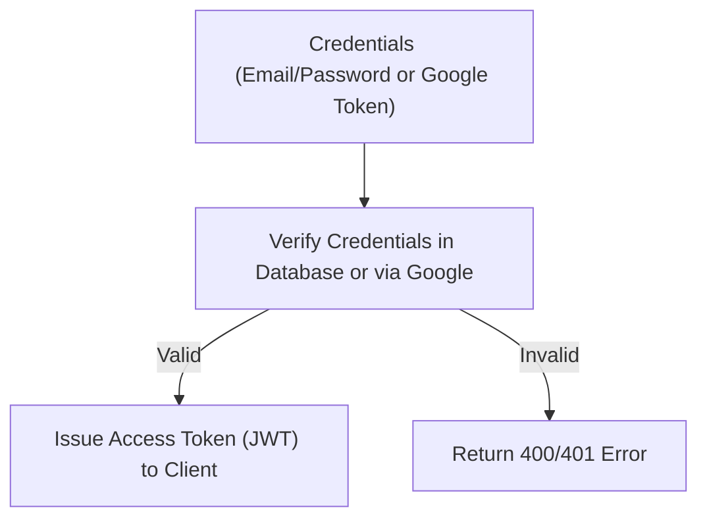
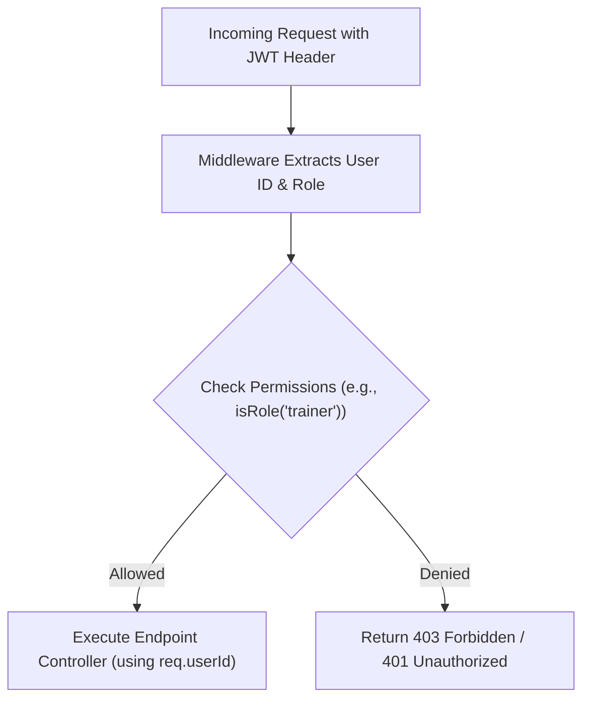
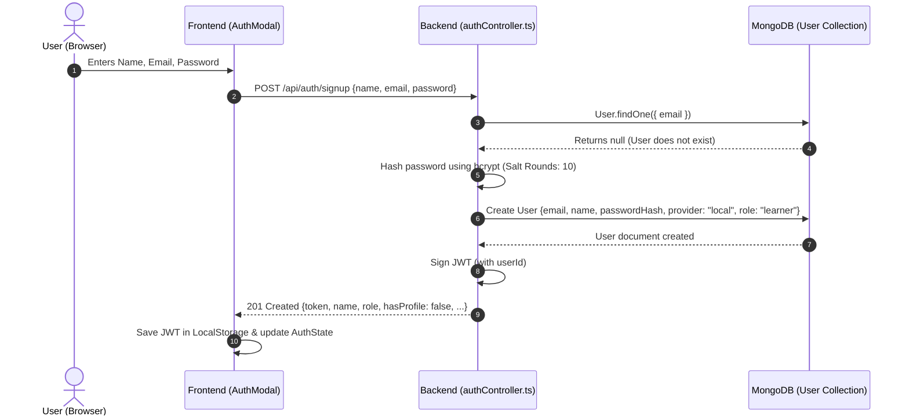
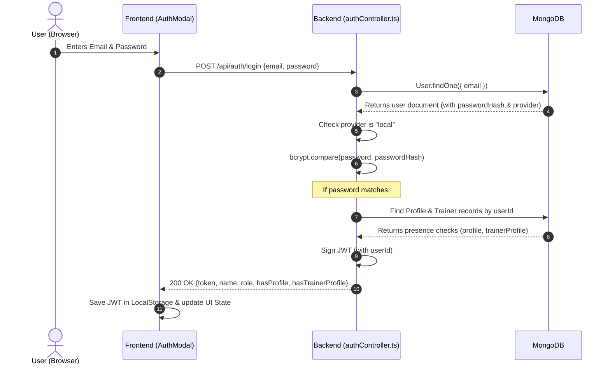
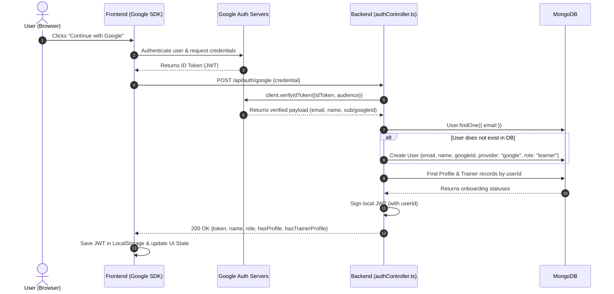
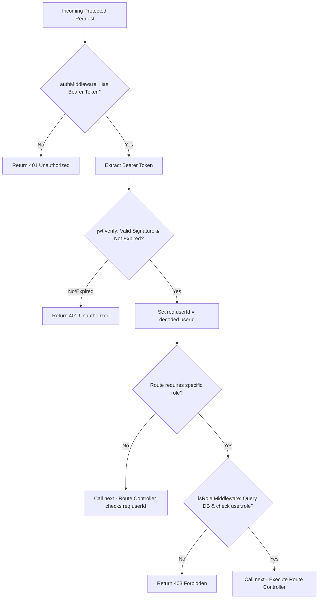
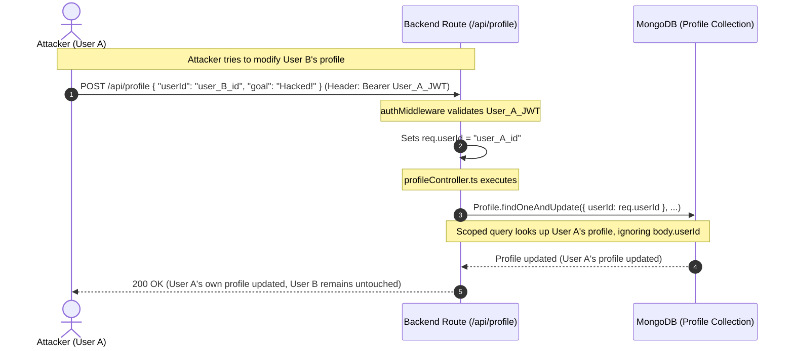
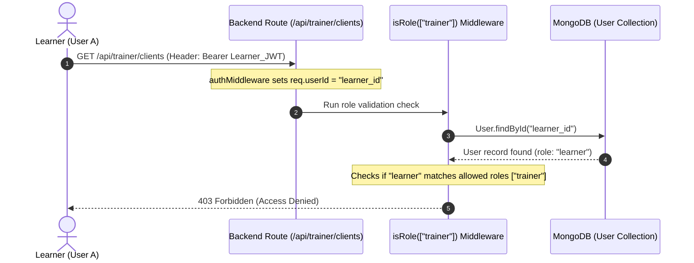
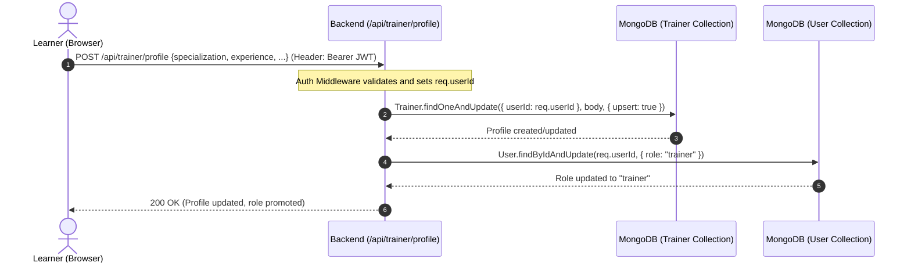

# Theory & Implementation Notes: Authentication & Authorization

This document covers the theoretical principles of authentication, authorization, access control, and security design, mapping each concept directly to the actual implementations in the Fitmate codebase using detailed flowcharts and diagrams.

---

## 1. Authentication (AuthN) vs. Authorization (AuthZ)

*   **Authentication (AuthN):** Verifies **who** a user is. Common mechanisms: passwords, federated logins (OAuth2/Google).
*   **Authorization (AuthZ):** Verifies **what** a user is allowed to do. Common mechanisms: Role-Based Access Control (RBAC).

### Authentication (AuthN) Workflow

### Authorization (AuthZ) Workflow

---

## 2. Authentication Types & Flows

### A. Local Signup Flow
Local signup creates a new user, hashes the password using `bcrypt` (salting and hashing), and saves the user record defaulting to a `"learner"` role.

---

### B. Local Login Flow
Local login validates the credentials against the hashed password and queries for onboarding profiles to send flags to the frontend.

---

### C. Google OAuth 2.0 Authentication Flow
Federated login allows authentication through Google. The backend verifies the Google ID token and returns a local JWT.

---

## 3. Stateless JWT Authorization Lifecycle
Fitmate uses a stateless token approach where the token signature verifies authentication without querying the database every time.

---

## 4. Access Control Models & Security Mitigation

### A. Horizontal Privilege Escalation Prevention
Horizontal privilege escalation occurs when User A attempts to access or modify User B's resources. Fitmate prevents this by deriving identity exclusively from the JWT context rather than body parameters.

---

### B. Vertical Privilege Escalation Prevention
Vertical privilege escalation occurs when a user with low privileges (e.g. a `"learner"`) attempts to access trainer-only administrative APIs.

---

## 5. Trainer Promotion Flow
Users register as learners first. Transitioning to a trainer happens when they onboarding via the trainer profile endpoint, which updates their roles.

