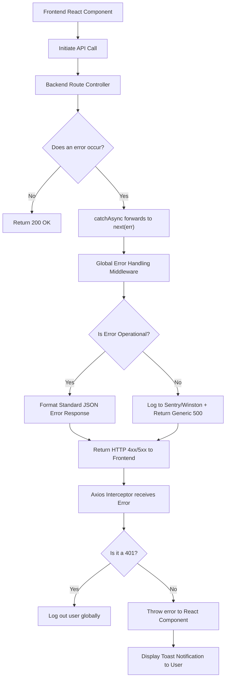

# The Complete Guide to Professional Error Handling

---

## Table of Contents

1. [Operational vs. Programmer Errors](#1-operational-vs-programmer-errors)
2. [Centralized Error Handling (Backend)](#2-centralized-error-handling-backend)
3. [Handling Asynchronous Errors](#3-handling-asynchronous-errors)
4. [Standardized API Error Responses](#4-standardized-api-error-responses)
5. [Frontend Error Handling (React)](#5-frontend-error-handling-react)
6. [Logging and Monitoring](#6-logging-and-monitoring)
7. [Error Handling Flow Architecture](#7-error-handling-flow-architecture)

---

## 1. Operational vs. Programmer Errors

Before writing any error handling code, a professional backend developer must distinguish between the two fundamental types of errors.

### Operational Errors
These represent run-time problems experienced by correctly written programs. They are expected to happen occasionally and must be handled gracefully.
- **Examples:** User input is invalid (400), failed to connect to database (503), requested resource not found (404), unauthorized access (401).
- **How to handle:** Report to the user, log the context, and continue running the application.

### Programmer Errors
These are actual bugs in the code. The application has entered an unknown state.
- **Examples:** Reading a property of `undefined`, syntax errors, passing an object instead of a string.
- **How to handle:** Crash the application gracefully, restart it using a process manager (like PM2 or Docker), and send an alert to the engineering team.

---

## 2. Centralized Error Handling (Backend)

In professional Node.js / Express applications, you should NEVER handle the HTTP response inside individual controllers if an error occurs. Instead, errors are forwarded to a **centralized global error handling middleware**.

### A. The Custom Error Class

First, extend the native `Error` class to create a custom `AppError` that includes an HTTP status code and a flag indicating if it is an operational error.

```typescript

class AppError extends Error {

  public statusCode: number;

  public isOperational: boolean;

  constructor(message: string, statusCode: number) {

    super(message);

    this.statusCode = statusCode;

    this.isOperational = true; // By default, all generated AppErrors are operational

    // Capture the stack trace, excluding the constructor call from it

    Error.captureStackTrace(this, this.constructor);

  }

}

export default AppError;

```

### B. Global Error Handling Middleware

Instead of writing `res.status(500).json(...)` everywhere, Express uses a specialized middleware that takes 4 arguments.

```typescript

import { Request, Response, NextFunction } from 'express';

import AppError from '../utils/AppError';

// The global error handler

export const globalErrorHandler = (

  err: any,

  req: Request,

  res: Response,

  next: NextFunction

) => {

  const statusCode = err.statusCode || 500;

  const message = err.message || 'Internal Server Error';

  // If in development mode, send the full stack trace.

  // If in production, only send the stack trace for operational errors to avoid leaking secrets.

  if (process.env.NODE_ENV === 'development') {

    res.status(statusCode).json({

      status: 'error',

      message: message,

      stack: err.stack

    });

  } else {

    // Production Mode

    if (err.isOperational) {

      res.status(statusCode).json({ status: 'error', message });

    } else {

      // Programmer error: Don't leak details

      console.error('CRITICAL ERROR 💥', err);

      res.status(500).json({ status: 'error', message: 'Something went very wrong!' });

    }

  }

};

```

---

## 3. Handling Asynchronous Errors

A massive pitfall in Express is that if an asynchronous function (`async/await`) throws an error, Express won't catch it automatically (unless using Express v5+). This causes unhandled promise rejections and crashes.

**The Professional Solution:** Use a wrapper function (often called `catchAsync`) so you don't have to write `try/catch` blocks in every single controller.

```typescript

import { Request, Response, NextFunction } from 'express';

// Wrapper that passes any caught errors to the 'next' function

export const catchAsync = (fn: Function) => {

  return (req: Request, res: Response, next: NextFunction) => {

    fn(req, res, next).catch(next); // Forwards to globalErrorHandler

  };

};

```

**Usage in a Controller:**

```typescript

import { catchAsync } from '../utils/catchAsync';

import AppError from '../utils/AppError';

// No try/catch needed!

export const getUserProfile = catchAsync(async (req: Request, res: Response, next: NextFunction) => {

  const user = await User.findById(req.userId);

  if (!user) {

    // Pass the error to the next() function. The global handler will catch it and return a 404.

    return next(new AppError('User not found', 404));

  }

  res.status(200).json({ status: 'success', data: { user } });

});

```

---

## 4. Standardized API Error Responses

A professional API always returns errors in an exact, predictable JSON structure. This allows the frontend to write a single generic function to parse errors.

**Standard Format:**
```json

{

  "status": "error",

  "message": "Invalid email or password",

  "code": "AUTH_FAILED"

}

```

---

## 5. Frontend Error Handling (React)

Professional React error handling operates on three levels:

### A. HTTP Level (Axios Interceptors)
Instead of handling token expiration or 500 errors in every component, configure an Axios Interceptor. If the API returns a `401 Unauthorized`, the interceptor catches it globally, clears `localStorage`, and redirects to `/login`.

### B. UI Component Level (Error Boundaries)
If a React component throws a JavaScript error (a programmer error, e.g., accessing `undefined.map`), it will crash the entire screen (the "White Screen of Death"). 
**Error Boundaries** catch these JS errors and render a fallback UI (like "Oops, something went wrong in this section") while the rest of the application stays functional.

### C. User Feedback (Toast Notifications)
When an API request fails (e.g., failed to submit a form), the error must be displayed cleanly to the user. Do not use `alert()`. Use Toast notifications (like `react-toastify` or `sonner`).

---

## 6. Logging and Monitoring

`console.log` is not enough for production. Professional teams use:
1. **Winston / Pino:** Structured JSON logging libraries for Node.js. They write errors to log files with timestamps, request IDs, and severity levels.
2. **Sentry / Datadog / New Relic:** Error tracking software. When an error occurs on the backend or the frontend, the exact stack trace, the user's OS, and the steps leading up to the error are immediately sent to a dashboard, triggering an alert (e.g., PagerDuty or Slack) for the engineering team.

---

## 7. Error Handling Flow Architecture


