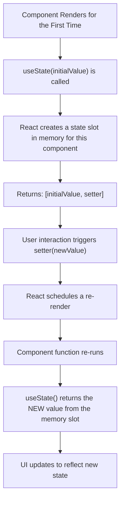
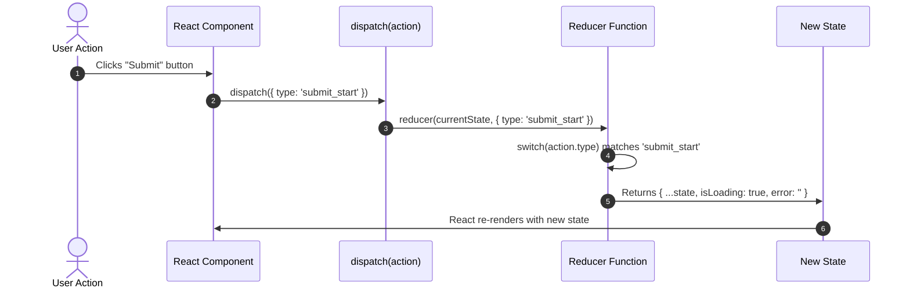
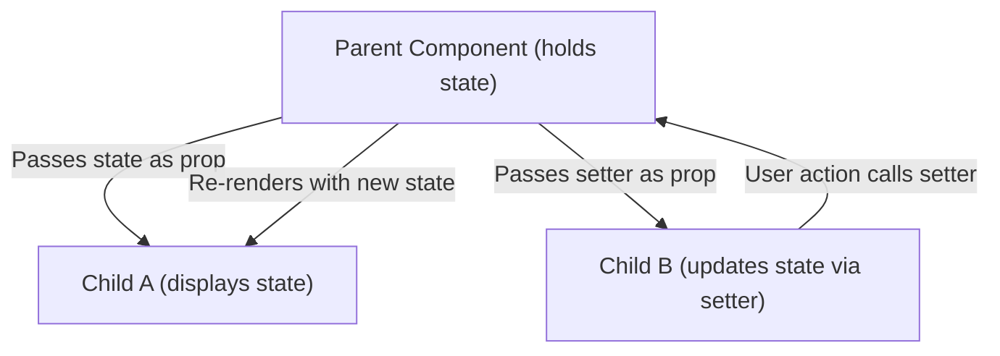
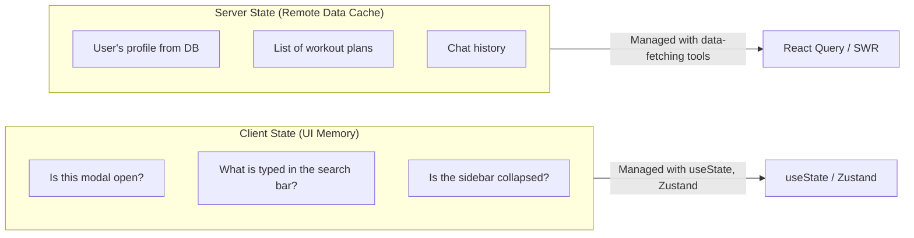

# The Complete Guide to State Management in React

---

## Table of Contents

1. [What is State?](#1-what-is-state)
2. [Local State — `useState`](#2-local-state--usestate)
3. [Local State — `useReducer`](#3-local-state--usereducer)
4. [`useState` vs `useReducer` — When to Use Which?](#4-usestate-vs-usereducer--when-to-use-which)
5. [Lifting State Up and Prop Drilling](#5-lifting-state-up-and-prop-drilling)
6. [Global State — The Context API](#6-global-state--the-context-api)
7. [Server State vs. Client State](#7-server-state-vs-client-state)
8. [Third-Party Global State Libraries](#8-third-party-global-state-libraries)
9. [URL State — The Overlooked Champion](#9-url-state--the-overlooked-champion)
10. [Golden Rules &amp; Best Practices](#10-golden-rules--best-practices)

---

## 1. What is State?

In React, **State** is a plain JavaScript value (a number, string, boolean, object, or array) managed inside a component. It represents the component's "memory" — data that can change over time in response to user actions, timers, or API responses. When state changes, React automatically re-renders the UI to reflect the new value.

**Key distinction:**

|                               | Props                                 | State                                     |
| :---------------------------- | :------------------------------------ | :---------------------------------------- |
| **Origin**              | Passed down from a parent component   | Defined and owned by the component itself |
| **Mutable?**            | Read-only inside the component        | Mutable via setter functions              |
| **Triggers re-render?** | Yes, when the parent passes new props | Yes, whenever the setter is called        |

---

## 2. Local State — `useState`

`useState` is the fundamental and most common state hook in React. It is designed for managing a **single, simple value** — a boolean flag, a string (like form input), a number (like a counter), or even a small flat object.

### Signature

```typescript

const [stateValue, setterFunction] = useState(initialValue);
```

### Example 1: A Toggle (boolean)

A common use case is toggling a modal open/closed:

```tsx

import { useState } from 'react';

const ModalToggle = () => {

  const [isOpen, setIsOpen] = useState(false);

  return (

    <div>

      <button onClick={() => setIsOpen(true)}>Open Modal</button>

      {isOpen && (

        <div className="modal">

          <p>I am a modal!</p>

          <button onClick={() => setIsOpen(false)}>Close</button>

        </div>

      )}

    </div>

  );

};
```

### Example 2: Form Input (string)

Managing what a user types into a text field:

```tsx

import { useState } from 'react';

const EmailInput = () => {

  const [email, setEmail] = useState('');

  return (

    <input

      type="email"

      value={email}

      onChange={(e) => setEmail(e.target.value)}

      placeholder="Enter your email"

    />

  );

};
```

### Example 3: Updating State Based on Previous Value

When the new state depends on the previous state, always use the **functional form** of the setter to avoid stale closure bugs:

```tsx

// WRONG - may produce stale results with async updates

setCount(count + 1);

// CORRECT - always receives the latest state value

setCount(prev => prev + 1);
```

### How `useState` works internally



---

## 3. Local State — `useReducer`

`useReducer` is a more powerful alternative to `useState`. It follows the same pattern as Redux — you define a **Reducer function** that specifies how state transitions happen in response to **Actions**. It is best used when:

- State has **multiple sub-values** that change together.
- The next state depends on **complex logic** involving the previous state.
- Multiple different events can cause different parts of state to update.

### Signature

```typescript

const [state, dispatch] = useReducer(reducerFunction, initialState);
```

- **`state`** — The current state object.
- **`dispatch`** — A function you call to trigger a state change. You pass it an "action" (an object with a `type` field).
- **`reducerFunction`** — A pure function `(currentState, action) => newState` that contains all the logic for how state changes.
- **`initialState`** — The starting value of state.

### Example 1: A Counter with Multiple Actions

```tsx

import { useReducer } from 'react';

// Define all possible actions as a type for type safety.

type Action = 
  | { type: 'increment' }
  | { type: 'decrement' }
  | { type: 'reset' };

// The reducer is the single source of truth for how state changes.

const counterReducer = (state: { count: number }, action: Action) => {

  switch (action.type) {

    case 'increment':

      return { count: state.count + 1 };

    case 'decrement':

      return { count: state.count - 1 };

    case 'reset':

      return { count: 0 };

    default:

      return state;

  }

};

const Counter = () => {

  const [state, dispatch] = useReducer(counterReducer, { count: 0 });

  return (

    <div>

      <p>Count: {state.count}</p>

      <button onClick={() => dispatch({ type: 'increment' })}>+</button>

      <button onClick={() => dispatch({ type: 'decrement' })}>-</button>

      <button onClick={() => dispatch({ type: 'reset' })}>Reset</button>

    </div>

  );

};
```

### Example 2: Managing Complex Form State

This is the ideal use case. Instead of 5 separate `useState` calls, a single reducer manages a whole form:

```tsx

import { useReducer } from 'react';

type FormState = {

  name: string;

  email: string;

  password: string;

  isLoading: boolean;

  error: string;

};

type FormAction =

  | { type: 'set_field'; field: keyof FormState; value: string }

  | { type: 'submit_start' }

  | { type: 'submit_success' }

  | { type: 'submit_error'; message: string };

const initialState: FormState = {

  name: '',

  email: '',

  password: '',

  isLoading: false,

  error: '',

};

const formReducer = (state: FormState, action: FormAction): FormState => {

  switch (action.type) {

    case 'set_field':

      return { ...state, [action.field]: action.value };

    case 'submit_start':

      return { ...state, isLoading: true, error: '' };

    case 'submit_success':

      return { ...initialState };

    case 'submit_error':

      return { ...state, isLoading: false, error: action.message };

    default:

      return state;

  }

};

const SignupForm = () => {

  const [state, dispatch] = useReducer(formReducer, initialState);

  const handleSubmit = async (e: React.FormEvent) => {

    e.preventDefault();

    dispatch({ type: 'submit_start' });

    try {

      // await api.signup(state);

      dispatch({ type: 'submit_success' });

    } catch (err: any) {

      dispatch({ type: 'submit_error', message: err.message });

    }

  };

  return (

    <form onSubmit={handleSubmit}>

      <input

        value={state.name}

        onChange={e => dispatch({ type: 'set_field', field: 'name', value: e.target.value })}

        placeholder="Name"

      />

      <input

        value={state.email}

        onChange={e => dispatch({ type: 'set_field', field: 'email', value: e.target.value })}

        placeholder="Email"

      />

      {state.error && <p>{state.error}</p>}

      <button type="submit" disabled={state.isLoading}>

        {state.isLoading ? 'Signing up...' : 'Sign Up'}

      </button>

    </form>

  );

};
```

### How `useReducer` works internally



---

## 4. `useState` vs `useReducer` — When to Use Which?

| Criteria                   | `useState` ✅                                                  | `useReducer` ✅                                                       |
| :------------------------- | :--------------------------------------------------------------- | :---------------------------------------------------------------------- |
| **Number of values** | 1-2 independent values                                           | 3+ inter-related values                                                 |
| **Update logic**     | Simple (just set a new value)                                    | Complex (depends on previous state, involves conditions)                |
| **Number of events** | 1-2 events that can change state                                 | 3+ different event types causing different updates                      |
| **Debugging**        | Harder to trace updates at scale                                 | Easier — every change is an explicit named action                      |
| **Testability**      | Test the component                                               | Test the reducer function in pure isolation                             |
| **Fitmate Example**  | `const [isOpen, setIsOpen] = useState(false)` in `AuthModal` | Managing`{ name, email, password, loading, error }` for a signup form |

---

## 5. Lifting State Up and Prop Drilling

When two sibling components need to share the same state, the standard React pattern is to **"lift the state up"** to their closest common parent.



**The Problem: Prop Drilling**

If the state needs to be used by a component 4-5 levels deep, every intermediate component becomes a "middleman" that passes props it doesn't even use. This is called **prop drilling** and makes code brittle.

---

## 6. Global State — The Context API

Context provides a way to broadcast state across the entire component tree without prop drilling.

```tsx

import { createContext, useContext, useState } from 'react';

// Create the context with a default value.

const AuthContext = createContext<{ userId: string | null }>({ userId: null });

// The Provider wraps the part of the tree that needs the state.

const App = () => {

  const [userId, setUserId] = useState<string | null>(null);

  return (

    <AuthContext.Provider value={{ userId }}>

      <Navbar />

      <Dashboard />

    </AuthContext.Provider>

  );

};

// Any component can consume it without prop drilling.

const Navbar = () => {

  const { userId } = useContext(AuthContext);

  return <p>Logged in as: {userId}</p>;

};
```

**Caveat:** Every time the Context value changes, **every** component consuming it re-renders. Use it for low-frequency updates only (theme, auth status, language).

---

## 7. Server State vs. Client State



Historically developers stored API responses in Redux. The modern approach separates them: **React Query** handles all the complexity of caching, de-duping, refetching, and loading/error states automatically.

---

## 8. Third-Party Global State Libraries

### A. Centralized (Redux Toolkit / Zustand)

A single global store holds all state. Components subscribe to slices of it.

- **Redux Toolkit (RTK):** Enterprise standard. Strict unidirectional data flow with Actions, Reducers, and a global Store.
- **Zustand:** Lightweight modern alternative. Custom hooks with no Provider, no boilerplate. Highly recommended.

### B. Atomic (Jotai / Recoil)

State is broken into independent **Atoms**. A component only re-renders when the exact Atom it uses changes.

### C. Observable / Mutable (MobX / Valtio)

Uses JavaScript Proxies so you can mutate state directly (`state.count++`). The library detects the mutation and triggers targeted re-renders.

---

## 9. URL State — The Overlooked Champion

State that should survive a page refresh or be shareable via a link must live in the URL — not in React memory.

- **Examples:** Search queries (`?q=react`), active tabs (`?tab=profile`), pagination (`?page=2`).
- **Tool:** React Router's `useSearchParams`.

---

## 10. How Fitmate Manages State

Fitmate utilizes a clean, modern three-tier architecture for its client-side state management, utilizing native React hooks and direct API calls rather than a heavy global store (like Redux).

### 1. Server State
Data that lives on the backend but needs to be displayed and cached in the frontend component's memory.
- **How it's handled:** Direct `fetch` calls via service classes (e.g., `AuthService`, `fetchClient`).
- **Examples in Fitmate:** The user's Profile, generated Workout Plans, and fetched Trainer data.

### 2. App-Level UI State
Global frontend state that dictates the overall user experience and application flow across multiple screens.
- **How it's handled:** The `useAppFlow` custom hook (typically initiated at a high level like `App.tsx`) and `localStorage` for persona toggling.
- **Examples in Fitmate:** Tracking which global modals are open (`AuthModal`, `ProfileSetupModal`, `TrainerSetupModal`), and whether the user is actively toggled into their `'learner'` or `'trainer'` persona.

### 3. Component-Local State
Ephemeral state that is only relevant to a single component or page at a given time.
- **How it's handled:** Using standard `useState` hooks directly inside the specific page or component.
- **Examples in Fitmate:** Form field values in the AuthModal, local `loading` flags while waiting for a fetch to complete, and local `error` messages.

---

## 11. Golden Rules & Best Practices

1. **Keep State Local First.** Don't put a modal's `isOpen` into a global store. Only lift state up if you genuinely need it in multiple places.

2. **Derive, Don't Sync.** If you have `firstName` and `lastName`, do NOT create a third `fullName` state. Derive it: `const fullName = firstName + " " + lastName`. Syncing multiple pieces of state is a leading source of bugs.

3. **Treat State as Immutable.** Never mutate objects or arrays directly (`state.items.push(...)` is wrong). Always return a fresh copy (`[...state.items, newItem]`).

4. **Use `useReducer` for complex forms.** Any form with more than 2 fields and a loading/error state is a `useReducer` scenario.

5. **Use React Query for server data.** Stop using `useEffect` to fetch data and stuff it into `useState`. React Query handles caching, background refetching, and stale data automatically.
