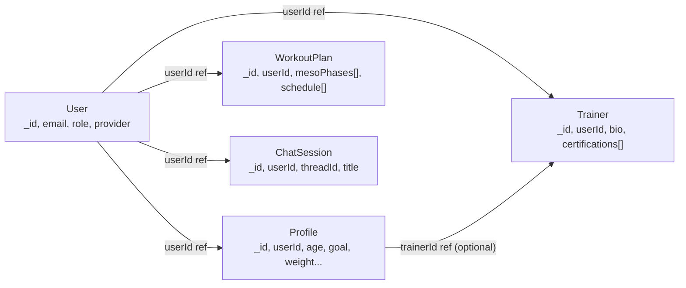
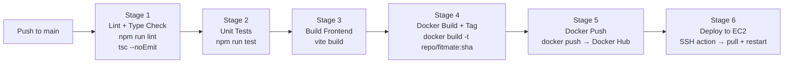

# Fitmate — Interview Q&A Prep

> These are the six questions from the Splixon interview session, answered concretely using the actual Fitmate codebase. Every answer references the real implementation.

---

## Q1: REST API Design — Endpoint Structure, Authentication, Multi-Tenant Security, JWT Lifecycle, and Performance

### Endpoint Structure

Fitmate's backend is an Express.js REST API with resource-oriented routes mounted in `app.ts`. Here is the full map:

| Method   | Route                                      | Access                               | Description                                      |
| :------- | :----------------------------------------- | :----------------------------------- | :----------------------------------------------- |
| `POST` | `/api/auth/signup`                       | Public                               | Register with email + password                   |
| `POST` | `/api/auth/login`                        | Public                               | Login, returns JWT                               |
| `POST` | `/api/auth/google`                       | Public                               | Google OAuth via ID Token                        |
| `GET`  | `/api/auth/me`                           | Private                              | Verify token, return userId                      |
| `POST` | `/api/profile`                           | Private                              | Create or update learner health profile (upsert) |
| `GET`  | `/api/profile`                           | Private                              | Get the authenticated user's profile             |
| `GET`  | `/api/profile/memories`                  | Private                              | Fetch Mem0 AI memory for the user                |
| `POST` | `/api/profile/select-trainer/:trainerId` | Private                              | Connect learner to a trainer                     |
| `GET`  | `/api/workout`                           | Private                              | Fetch current workout plan                       |
| `POST` | `/api/workout/generate`                  | Private                              | Generate or evolve a workout plan via AI         |
| `POST` | `/api/chat`                              | Private                              | Send a message to the AI coach (SSE stream)      |
| `GET`  | `/api/chat/sessions`                     | Private                              | List all chat sessions for the user              |
| `GET`  | `/api/chat/:threadId/history`            | Private                              | Fetch message history for a thread               |
| `GET`  | `/api/trainer/discovery`                 | Public                               | List all trainer profiles                        |
| `POST` | `/api/trainer/profile`                   | Private (`learner` or `trainer`) | Submit trainer onboarding profile                |
| `GET`  | `/api/trainer/profile`                   | Private (`trainer` only)           | Get own trainer profile                          |
| `GET`  | `/api/trainer/clients`                   | Private (`trainer` only)           | Get list of assigned clients                     |

### Authentication Flow (JWT Lifecycle)

1. **Registration / Login:** The client sends credentials to `/api/auth/signup` or `/api/auth/login`. The backend verifies using `bcrypt.compare()`, then calls `generateToken(user._id)` which signs a JWT with our `JWT_SECRET`. The token is returned to the frontend.
2. **Storage:** The frontend (`authService.ts`) writes the token to `localStorage.setItem('token', data.token)`.
3. **Request Injection:** On every subsequent API call, `client.ts` reads the token from `localStorage` and injects it as `Authorization: Bearer <token>`.
4. **Verification:** `authMiddleware.ts` intercepts all protected routes. It calls `jwt.verify(token, process.env.JWT_SECRET)`, extracts `decoded.userId`, and attaches it to `req.userId`. If the token is missing, expired, or tampered with, it returns a `401`.
5. **No server-side session:** JWTs are stateless — the server holds no session. Logout is achieved client-side by wiping `localStorage` via `AuthService.logout()`.

### Multi-Tenant Security (Horizontal Privilege Escalation Prevention)

The critical pattern is: **the client never provides the user identity — the server derives it from the JWT**.

All protected controllers extract identity exclusively from `req.userId` (set by `authMiddleware`), never from `req.body` or `req.params`. This means:

```typescript
// profileController.ts
const userId = req.userId; // ← from JWT, not from client
const profile = await Profile.findOne({ userId: userObjectId }); // ← always scoped to JWT identity
```

Even if a client sends `{ userId: "someone_elses_id" }` in the body, it is completely ignored. This makes horizontal privilege escalation structurally impossible.

### Role-Based Access Control (RBAC)

The `isRole()` middleware in `authMiddleware.ts` enforces vertical access control:

```typescript
// Only trainers can view their clients
router.get("/clients", authMiddleware, isRole(["trainer"]), getClients);

// A learner can call this to become a trainer
router.post("/profile", authMiddleware, isRole(["learner", "trainer"]), upsertTrainerProfile);
```

`isRole()` hits the database, finds the user by `req.userId`, and checks their `role` field. This prevents a learner from accessing trainer-only endpoints.

### Performance Considerations

- **AI generation is the expensive operation:** `POST /api/workout/generate` calls multiple LangChain/Python agents. It is not paginated or cached currently — the biggest production concern.
- **SSE for chat streaming:** `POST /api/chat` uses Server-Sent Events (`res.write()`) so the AI response streams token-by-token, preventing request timeout and giving the user instant feedback instead of waiting for the full generation.
- **MongoDB `findOne({ userId })` queries:** All user-scoped queries filter by `userId` (an indexed ObjectId reference). There is no compound index yet — adding `{ userId: 1, createdAt: -1 }` on `WorkoutPlan` and `ChatSession` would accelerate history queries.

---

## Q2: State Management for Profile + Workout Plans, Reusable Component Structure, Preventing Re-renders with Context ?(React with TypeScript)

### State Architecture

Fitmate avoids a global state library (Redux, Zustand). Instead, state is split across three layers:

| Layer                           | Mechanism                                                  | What It Holds                                                                              |
| :------------------------------ | :--------------------------------------------------------- | :----------------------------------------------------------------------------------------- |
| **Server State**          | Direct`fetch` calls via `AuthService`, `fetchClient` | Profile, workout plan, trainer data (lives on the backend, cached in component state)      |
| **App-Level UI State**    | `useAppFlow` custom hook in `App.tsx`                  | Which global modals are open (`AuthModal`, `ProfileSetupModal`, `TrainerSetupModal`) |
| **Component-Local State** | `useState` inside each page/component                    | Form field values, loading flags, error messages                                           |

### `useAppFlow` — The "Brain" Custom Hook

Rather than using React Context for modal state, Fitmate uses a single custom hook `useAppFlow.ts` that lives at the `App.tsx` level. It manages:

```typescript
const [authModal, setAuthModal] = useState<{ isOpen: boolean; view: AuthModalView }>({ isOpen: false, view: 'login' });
const [isProfileSetupOpen, setIsProfileSetupOpen] = useState(false);
const [isTrainerSetupOpen, setIsTrainerSetupOpen] = useState(false);
```

This hook is not a Context provider — it returns an object of state and handler functions. `App.tsx` destructures what it needs and passes specific callbacks (like `openLogin`) down as props. This means:

- No Context wrapping, no Provider tree
- No unnecessary re-renders (only `App.tsx` re-renders when modal state changes)
- Child components receive only the specific callbacks they need

### Component Structure

The design separates concerns into:

- **`AuthModal.tsx`** — handles all auth UI (login/signup/Google). Receives `onSuccess` callback, knows nothing about routing.
- **`ProfileSetupModal.tsx`** / **`TrainerSetupModal.tsx`** — onboarding wizards, each with a single `onSuccess` prop.
- **Page components** (`Workout`, `Chatbot`, etc.) — fetch their own data on mount, manage local loading/error state.
- **`Navbar.tsx`** — receives `openLogin` and `openSignup` as props, never manages modal state itself.

### Preventing Unnecessary Re-renders

The current approach avoids re-render problems by not using a single large context:

- **Props are specific callbacks, not objects.** `<Trainers onLoginClick={openLogin} />` — passing a stable function reference, not a changing object.
- **Modals return `null` when closed.** `AuthModal` has `if (!isOpen) return null;` — it has zero DOM presence when closed, so no reconciliation overhead.
- **Local state resets on modal open.** A `useEffect` fires when `isOpen` becomes `true`, resetting `authData`, `error`, and `view` — preventing stale re-renders from old state.
- **Ideal next step:** If we were to use Context (e.g., for user session data used across 10+ components), we would split contexts (an `AuthContext` and a `WorkoutContext` separately), memoize provider values with `useMemo`, and use `useCallback` for handler functions to ensure stable references.

---

## Q3: MongoDB Schema Design — Collections, References, Indexing, Embedded vs. Referenced

> **Note:** Fitmate uses **MongoDB** (not PostgreSQL). This changes the modeling philosophy from relational normalization to document-oriented design decisions.

### Collections and Their Relationships



### Embedded vs. Referenced — Key Decisions

**Embedded (WorkoutPlan):** The full workout plan — `mesoPhases[]` (strategic 4–12 week roadmap) and `schedule[]` (7-day tactical plan with exercises) — is embedded directly inside the `WorkoutPlan` document. This is correct because:

- The plan is always fetched as a whole (not individual days or phases in isolation)
- It is owned entirely by one user (no sharing)
- Embedding avoids a join query at read time

**Referenced (Profile → Trainer):** The `Profile.trainerId` is a reference (ObjectId) to the `Trainer` collection, not embedded. This is correct because:

- Trainer data is shared across many learner profiles
- Trainer profile can change independently without rewriting every learner's document

**Referenced (User → Profile, Trainer, WorkoutPlan):** All child documents reference the `User._id`. They are NOT embedded in the `User` document because they are large and often queried independently.

### Why We Don't Store JWTs in the Database

JWTs are stateless. The token carries its own expiry (`exp` claim) and is verified server-side by the secret key alone. Storing tokens in MongoDB would:

1. Add a database hit to every request (defeating the stateless benefit)
2. Require a token blacklist table to handle logout — adding complexity

The current approach is that logout is client-side only (clearing `localStorage`). The ideal upgrade for sensitive applications would be short-lived JWTs + a Redis-based refresh token blacklist.

### Indexing Strategy

Fitmate currently uses MongoDB's default `_id` index on every collection. The next indexing improvements should be:

| Collection      | Index to Add                     | Query it Serves                                                       |
| :-------------- | :------------------------------- | :-------------------------------------------------------------------- |
| `WorkoutPlan` | `{ userId: 1, createdAt: -1 }` | `findOne({ userId }).sort({ createdAt: -1 })` in `getWorkoutPlan` |
| `ChatSession` | `{ userId: 1, updatedAt: -1 }` | `find({ userId }).sort({ updatedAt: -1 })` in `getSessions`       |
| `Profile`     | `{ userId: 1 }` (unique)       | `findOne({ userId })` on every authenticated request                |
| `Trainer`     | `{ userId: 1 }`                | `findOne({ userId })` in login and trainer endpoints                |

---

## Q4: API Integration — LLM (LangGraph/Python) Integration, Failure Handling, Rate Limits, Retries, Fallback, Logging

### Integration Architecture

Fitmate's AI layer is a Python/LangGraph service running as a separate process. The Node.js backend communicates with it by calling LangChain/LangGraph agents directly via a Node.js LangChain client (not a separate HTTP service — it is imported and called in-process).

Key AI endpoints:

- **Chat:** `chatController.ts` calls `streamAgent(message, profile, threadId)` from `chatGraph.ts`. This streams an async generator of SSE events.
- **Workout generation:** `workoutController.ts` calls `runStrategyAgent(profile, userId)` and `runEvolutionAgent(...)` from dedicated graph files.
- **Memory:** After every chat turn, `addInteraction()` is called (fire-and-forget) to sync the conversation to Mem0.

### Streaming for Chat

The chat endpoint uses Server-Sent Events, not a standard JSON response:

```typescript
res.setHeader('Content-Type', 'text/event-stream');
for await (const event of eventStream) {
  if (event.event === "on_chat_model_stream") {
    res.write(`data: ${JSON.stringify({ chunk: event.data.chunk.content })}\n\n`);
  }
}
res.write(`data: ${JSON.stringify({ done: true, threadId })}\n\n`);
res.end();
```

This avoids request timeout on long AI generations and gives users instant token-by-token feedback.

### Failure Handling

Currently, failures are caught at the controller level with a try/catch that:

- Returns `res.status(500).json({ message: "..." })` if headers haven't been sent yet
- Writes an SSE error event and calls `res.end()` if streaming has already started

**What the ideal production upgrade looks like:**

- **Retry with backoff** for transient LLM API errors (429 rate limits, 5xx): use a library like `p-retry` or `tenacity` (Python-side) with exponential backoff + jitter.
- **Structured output validation:** The AI agents use Zod schemas to validate LLM output. If the schema fails, the node should re-prompt once before returning an error — not silently produce a malformed plan.
- **Fallback plan:** If the Evolution Agent fails, fall back to returning the last successfully generated plan rather than a 500.
- **Rate limiting:** Workout generation is expensive. Adding a per-user rate limit (e.g., max 3 generations per day) on `POST /api/workout/generate` would prevent abuse and uncontrolled cost spikes.
- **Observability:** LangSmith is the ideal tracing tool for LangChain/LangGraph pipelines — it captures every node's input/output, latency, and token cost, making debugging AI failures tractable.

---

## Q5: CI/CD Pipeline — GitHub Actions Stages, Docker Build/Push, EC2 Deployment, Secret Handling

### Current State

Fitmate does not currently have a CI/CD pipeline set up. But the correct answer for a React + Node.js + AI service on EC2 is as follows.

### Ideal Pipeline Design

**On every push to `main`:**



### GitHub Actions Secret Handling

Secrets (`JWT_SECRET`, `OPENAI_API_KEY`, `MONGO_URI`, `GOOGLE_CLIENT_ID`) are stored in GitHub Secrets (encrypted at rest). They are never written to the repository. In the Actions workflow:

```yaml
env:
  JWT_SECRET: ${{ secrets.JWT_SECRET }}
  MONGO_URI: ${{ secrets.MONGO_URI }}
```

For Docker, the image is built with a build-arg or, more securely, secrets are passed at container runtime via EC2 environment variables (stored in a `.env` file on the instance, not baked into the image).

### EC2 Deployment Commands

The deploy step SSH-es into the EC2 instance and runs:

```bash
docker pull repo/fitmate:latest
docker stop fitmate-app || true
docker rm fitmate-app || true
docker run -d \
  --name fitmate-app \
  --env-file /home/ec2-user/.env \  # server-side secrets file
  -p 8001:8001 \
  repo/fitmate:latest

# Health check
curl -f http://localhost:8001/health || (docker stop fitmate-app && exit 1)
```

If the health check fails, the old container is stopped and the deployment is considered failed — preventing a broken image from serving traffic.

### Environment Separation

- **Development:** local `.env` file, `localhost:8001`
- **Staging/Production:** separate EC2 instances, separate GitHub Secrets environments, separate MongoDB Atlas clusters. The Docker image is the same artifact — only the runtime environment variables differ.

---

## Q6: Frontend Performance Optimization — Techniques for Slow Dashboards with Large Workout History (Rendering, Load Time, UX)

### The Problem in Fitmate's Context

The `Workout` page renders the full `WorkoutPlan` document — which includes `mesoPhases[]` (multi-phase strategic roadmap) and `schedule[]` (a 7-day plan with every exercise, set, and rep). For long-term users with many plan iterations, this can become a heavy render.

### Rendering Optimizations

**1. Virtualization for long lists**
The workout schedule renders a list of 7 `DayCard` components, each containing an `exercises[]` array. If we were to show exercise history across multiple plans, a virtualized list (e.g., `react-window`) would render only the items visible in the viewport, dramatically reducing DOM nodes.

**2. `React.memo` for stable sub-components**
`WorkoutCard`, `ExerciseList`, and `DayPlan` components should be wrapped in `React.memo`. Since the workout plan data only changes when the user explicitly generates a new plan, these components rarely need to re-render. Without `memo`, every parent state change (e.g., a loading flag toggling) would re-render the entire plan tree unnecessarily.

**3. Stable references for callbacks**
Any `onComplete` or `onFeedback` callbacks passed into child plan components should use `useCallback` to prevent them from being recreated on every render — which would invalidate `React.memo` even if the actual logic is unchanged.

### Load Time Optimizations

**1. Split server state from UI state**
Currently, plan data is fetched in the page component and stored in local `useState`. The ideal upgrade is React Query or SWR — which adds:

- **Caching:** The plan doesn't re-fetch on every navigation back to the workout page; it uses the cached version until stale.
- **Background refetching:** Data stays fresh without blocking the render.
- **Loading/error states:** Built-in, no boilerplate.

**2. Code splitting by route**
Since Fitmate uses Vite, each route should be lazily imported:

```typescript
const Workout = lazy(() => import('./pages/Workout'));
```

This means the AI coaching page's JS bundle is not downloaded until the user navigates there — reducing the initial bundle size.

**3. Fetch priority**
The workout plan `GET /api/workout` request should be initiated as early as possible (in a layout-level `useEffect` or via a preload query in React Query), not waiting for the page component to mount.

### UX Optimizations

**Skeleton loading screens:** Instead of a blank page while the plan loads, show a shimmer placeholder that mirrors the plan layout. This gives users confidence that content is coming and reduces perceived load time.

**Optimistic updates for day completion:** If a user marks a day as complete, update the UI immediately and sync to the backend in the background. If the sync fails, revert with an error toast — not a full page re-render.

**Progressive disclosure:** Rather than rendering all 7 days and all their exercises on first paint, collapse days into expandable cards. This reduces the initial render cost and makes the UX feel lighter.
