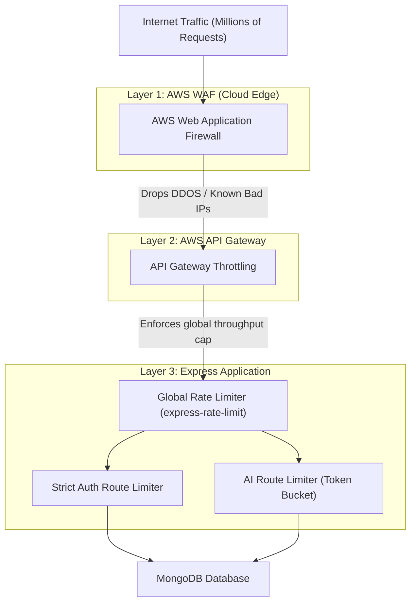
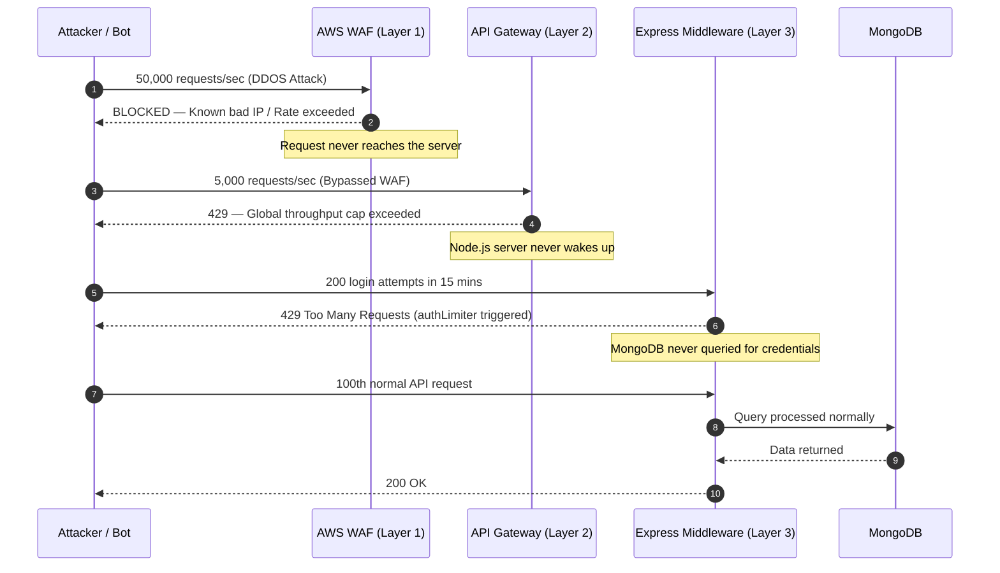

# Rate Limiting — Professional Strategy and Implementation

---

## Table of Contents

1. [What is Rate Limiting?](#1-what-is-rate-limiting)
2. [Professional Rate Limiting Strategies](#2-professional-rate-limiting-strategies)
3. [What Gets Rate Limited in Fitmate](#3-what-gets-rate-limited-in-fitmate)
4. [Three-Layer Architecture (Where We Implement It)](#4-three-layer-architecture-where-we-implement-it)
5. [Application-Level Implementation (Express)](#5-application-level-implementation-express)
6. [Infrastructure-Level Implementation (AWS)](#6-infrastructure-level-implementation-aws)
7. [The Full Rate Limiting Flow](#7-the-full-rate-limiting-flow)

---

## 1. What is Rate Limiting?

**Rate Limiting** is a mechanism that caps the maximum number of requests a client (user, IP address, or API key) can make to a server within a defined time window.

If a user exceeds their cap, the server rejects the request with an HTTP `429 Too Many Requests` response. The server also typically returns a `Retry-After` header telling the client exactly when they can try again.

Rate Limiting exists to protect against:
- **DDOS Attacks:** A bot sending millions of requests to crash the server.
- **Brute Force Attacks:** An attacker trying thousands of password combinations on the `/login` endpoint.
- **API Scraping:** Competitors bulk-downloading all your data via the API.
- **Runaway Clients:** A bug in a frontend app accidentally spamming requests in an infinite loop.
- **AI Cost Overruns:** Unlimited calls to expensive AI endpoints like workout generation that incur real money per request.

---

## 2. Professional Rate Limiting Strategies

There are four main algorithms professionals use. Each has different trade-offs.

| Algorithm | How it Works | Best For |
|---|---|---|
| **Fixed Window** | Count resets every X minutes. Simple but allows burst traffic at window edges. | General API protection |
| **Sliding Window** | Counts requests in a rolling time window. Smooths out edge bursts. | Login and auth endpoints |
| **Token Bucket** | Each user gets a "bucket" of tokens. Each request costs 1 token. Tokens refill at a steady rate. Allows short bursts. | AI/expensive operations |
| **Leaky Bucket** | Requests enter a queue and are processed at a fixed rate. Excess requests overflow and are dropped. | Highly consistent throughput |

### Which Strategy for Fitmate?

- **Auth routes** (`/login`, `/signup`): **Sliding Window** — No tolerance for brute-force bursting at reset boundaries.
- **AI routes** (`/workouts/generate`): **Token Bucket** — Allows an occasional burst (e.g., a user generates 2 plans back to back) but prevents sustained abuse.
- **General API**: **Fixed Window** — Simple and cheap for standard data fetching routes.

---

## 3. What Gets Rate Limited in Fitmate

Not all routes are equally sensitive. A professional architecture applies limits strategically based on the risk and cost of each endpoint.

| Route | Limit | Strategy | Reason |
|---|---|---|---|
| `POST /auth/login` | 10 requests / 15 min per IP | Sliding Window | Prevents brute-force password attacks |
| `POST /auth/signup` | 5 requests / hour per IP | Sliding Window | Prevents bot account creation |
| `POST /auth/google` | 10 requests / 15 min per IP | Sliding Window | Prevent OAuth flooding |
| `POST /workouts/generate` | 5 requests / day per user | Token Bucket | Each generation calls paid AI API (e.g., Gemini/GPT) |
| `POST /chat/message` | 30 messages / min per user | Fixed Window | Prevents chat spam and LLM cost overrun |
| `GET /api/*` (General) | 100 requests / 15 min per IP | Fixed Window | General protection for all data routes |

---

## 4. Three-Layer Architecture (Where We Implement It)

Professional production deployments use a **three-layer** approach. Each layer has a different scope and purpose.



### Layer 1: AWS WAF (Cloud Edge)
**Purpose:** Block massive-scale attacks before they even reach the server.
- Drops requests from known bad IP ranges.
- Stops volumetric DDOS attacks (e.g., 100,000 requests/second).
- Managed rules are updated automatically by AWS security teams.

### Layer 2: AWS API Gateway
**Purpose:** Global throughput cap for the entire API.
- Configured in the AWS console, not in code.
- Sets a hard limit on requests per second across all users combined (e.g., 1,000 req/sec steady, 2,000 req/sec burst).

### Layer 3: Express Application
**Purpose:** Granular, business-logic-aware limits.
- Configured in code using `express-rate-limit`.
- Can differentiate between authenticated users vs. anonymous IP addresses.
- Can apply different limits to different routes (e.g., stricter for `/auth`, looser for `/profile`).

---

## 5. Application-Level Implementation (Express)

This is what gets written directly into the Fitmate codebase.

### Step 1: Install the package

```bash

npm install express-rate-limit

```

### Step 2: Create a rate limiter utility file

```typescript

// backend/src/middleware/rateLimiter.ts

import rateLimit from 'express-rate-limit';

// General limiter for all public API routes

export const generalLimiter = rateLimit({

  windowMs: 15 * 60 * 1000, // 15 minutes

  max: 100, // 100 requests per 15 minutes per IP

  standardHeaders: true, // Returns RateLimit-Remaining, RateLimit-Reset headers

  legacyHeaders: false,

  message: { status: 'error', message: 'Too many requests, please try again later.' },

});

// Strict limiter for authentication routes

export const authLimiter = rateLimit({

  windowMs: 15 * 60 * 1000, // 15 minutes sliding window

  max: 10, // 10 attempts per 15 minutes per IP

  standardHeaders: true,

  legacyHeaders: false,

  message: { status: 'error', message: 'Too many login attempts, please try again in 15 minutes.' },

});

// Strict limiter for AI-powered, expensive operations

export const aiLimiter = rateLimit({

  windowMs: 24 * 60 * 60 * 1000, // 24 hours

  max: 5, // 5 AI generations per day per IP

  standardHeaders: true,

  legacyHeaders: false,

  message: { status: 'error', message: 'Daily AI generation limit reached. Please try again tomorrow.' },

});

```

### Step 3: Apply limiters in the router

```typescript

// backend/src/routes/authRoutes.ts

import { authLimiter } from '../middleware/rateLimiter';

// Apply strict limiter only to sensitive auth endpoints

router.post('/login', authLimiter, loginController);

router.post('/signup', authLimiter, signupController);

router.post('/google', authLimiter, googleAuthController);

```

```typescript

// backend/src/routes/workoutRoutes.ts

import { aiLimiter } from '../middleware/rateLimiter';

// Apply AI limiter to the expensive generation endpoint

router.post('/generate', isAuthenticated, aiLimiter, generateWorkoutController);

```

```typescript

// backend/src/app.ts

import { generalLimiter } from './middleware/rateLimiter';

// Apply general limiter to the entire API

app.use('/api', generalLimiter);

```

---

## 6. Infrastructure-Level Implementation (AWS)

This layer is configured via the AWS Console or Terraform/CloudFormation, not in the Node.js codebase.

### AWS API Gateway Throttling
```json

{

  "defaultRouteThrottlingEnabled": true,

  "throttlingBurstLimit": 2000,

  "throttlingRateLimit": 1000

}

```

### AWS WAF Rules
AWS WAF is configured with managed rule groups that automatically block:
- SQL injection attempts.
- Known DDOS IP ranges (AWSManagedRulesAmazonIpReputationList).
- Requests with malformed headers or oversized payloads.

---

## 7. The Full Rate Limiting Flow


