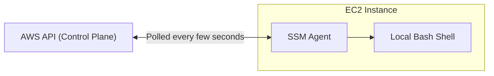
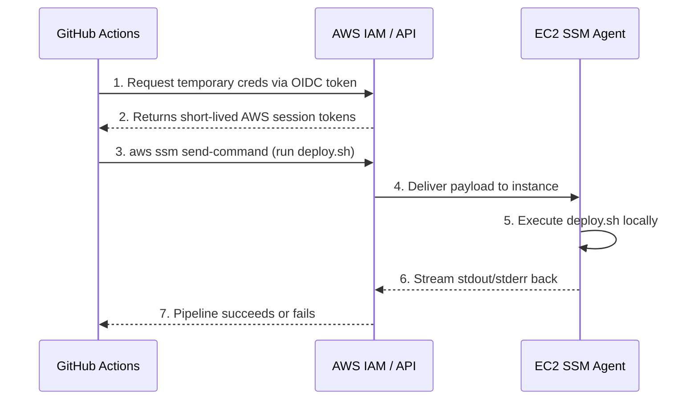

# AWS Systems Manager (SSM) — The Replacement for SSH

## Overview

In traditional server management and deployment pipelines, Secure Shell (SSH) is the standard mechanism for accessing servers and executing remote deployment scripts. However, SSH introduces significant security risks, operational overhead, and network complexities.

For Fitmate's infrastructure, we explicitly ban traditional SSH and replace it entirely with **AWS Systems Manager (SSM)**. This document details what SSM is, what legacy systems it replaces, why it is structurally more secure, and exactly how it fits into our CI/CD pipeline.

---

## Table of Contents

1. [What is SSH and How Would We Have Used It?](#1-what-is-ssh-and-how-would-we-have-used-it)
2. [What is AWS SSM?](#2-what-is-aws-ssm)
3. [What SSM Replaces](#3-what-ssm-replaces)
4. [Why SSM Was Needed (The Problems with SSH)](#4-why-ssm-was-needed-the-problems-with-ssh)
5. [Where SSM Sits in the CI/CD Pipeline](#5-where-ssm-sits-in-the-cicd-pipeline)
6. [Developer Access (SSM Session Manager)](#6-developer-access-ssm-session-manager)
7. [Security and Auditability](#7-security-and-auditability)

---

## 1. What is SSH and How Would We Have Used It?

Secure Shell (SSH) is a cryptographic network protocol for operating network services securely over an unsecured network. It provides a text-based terminal (command line) interface to a remote server.

If we were using traditional SSH for Fitmate, the workflow would look like this:

1. We would generate a public/private key pair (a `.pem` file).
2. We would open **Port 22** on the EC2 instance's Security Group to the public internet.
3. We would store the `.pem` file as a persistent secret inside GitHub Actions.
4. When deploying, GitHub Actions would run an `ssh` command, authenticate with the `.pem` file, connect to the EC2 instance over the internet on Port 22, and run the deployment script.
5. If a developer needed to debug the server, they would need a copy of that `.pem` file on their local laptop to run `ssh -i fitmate.pem ubuntu@ec2-ip-address`.

While this is the classic way of managing servers, it is highly discouraged in modern, secure AWS architectures due to the risks of leaked `.pem` keys and exposed ports.

---

## 2. What is AWS SSM?

AWS Systems Manager (SSM) is an AWS service that allows you to view and control your infrastructure securely. For the context of deployments and terminal access, we rely on two specific SSM features:

1. **SSM Run Command:** Allows us to execute shell scripts on EC2 instances remotely via the AWS API, without needing to log into the server. (Used by GitHub Actions).
2. **SSM Session Manager:** Provides an interactive browser-based or CLI-based bash shell into the EC2 instance. (Used by developers for debugging).

### How It Works Under the Hood



Every modern Amazon Linux or Ubuntu AMI provided by AWS comes with the **SSM Agent** pre-installed. This agent runs as a daemon on the EC2 instance. It constantly polls the AWS API asking, "Are there any commands I should execute?" When a command arrives, the agent executes it locally as `root` (or a specified user) and streams the output back to the AWS API.

---

## 3. What SSM Replaces

By adopting SSM, Fitmate completely eliminates the following legacy components:

- **Port 22 (SSH):** Port 22 is completely blocked in our EC2 Security Groups. The server accepts zero inbound administrative connections.
- **`.pem` Files (SSH Private Keys):** We do not generate, store, or share private keys.
- **Bastion Hosts (Jump Boxes):** In a secure architecture, EC2 instances live in a Private Subnet. Historically, to SSH into them, you had to spin up a public "Bastion Host" just to bounce the SSH connection through. SSM works flawlessly in private subnets via NAT Gateways or VPC Endpoints, eliminating the need for jump boxes.
- **GitHub Secrets containing SSH Keys:** CI/CD pipelines no longer need permanent SSH keys stored in the repository secrets.

---

## 4. Why SSM Was Needed (The Problems with SSH)

Relying on SSH for automated deployments introduces several critical vulnerabilities and pain points that SSM directly solves.

| The SSH Problem                                                                                                                                                                                                                  | The SSM Solution                                                                                                                                                                       |
| -------------------------------------------------------------------------------------------------------------------------------------------------------------------------------------------------------------------------------- | -------------------------------------------------------------------------------------------------------------------------------------------------------------------------------------- |
| **Key Sprawl:** `.pem` files get shared on Slack, lost on old laptops, and are rarely rotated. If an engineer leaves, rotating the server's SSH keys is a manual, error-prone chore.                                     | **IAM Integration:** Access is tied to AWS IAM identities. If an engineer joins, they get an IAM policy. If they leave, you disable their AWS user. Access is revoked instantly. |
| **Inbound Network Exposure:** SSH requires Port 22 to be open. Even if restricted to a VPN, it represents a listening port that can be port-scanned, brute-forced, or exploited via zero-days (e.g., the `xz` backdoor). | **Outbound Only:** The SSM Agent makes an *outbound* HTTPS connection to AWS. The EC2 instance has zero open inbound administrative ports. It cannot be port-scanned.          |
| **Coarse Pipeline Permissions:** If GitHub Actions uses SSH to deploy, it effectively has full terminal access to the server.                                                                                              | **Granular Execution:** With SSM, you can write an IAM policy that says: *"GitHub Actions is ONLY allowed to run the script `/home/fitmate/deploy.sh` and nothing else."*    |
| **Blind Spots:** When someone SSHs into a server as `root` or `ubuntu`, it is difficult to centrally audit exactly what commands they typed.                                                                           | **Full Audit Logging:** Every command sent via SSM Run Command, and every keystroke typed in an SSM Session, is logged to AWS CloudTrail and CloudWatch.                         |

---

## 5. Where SSM Sits in the CI/CD Pipeline

In the Fitmate deployment architecture, SSM is the bridge between GitHub Actions and the EC2 server.



### The Deployment Command

In the `deploy.yml` workflow, GitHub Actions triggers the deployment using the AWS CLI:

```bash

aws ssm send-command \

  --instance-ids "i-0abcd123456789" \

  --document-name "AWS-RunShellScript" \

  --parameters 'commands=["/home/fitmate/deploy.sh <ECR_IMAGE_URI>"]' \

  --output text

```

Because this goes through the AWS API, GitHub never needs network line-of-sight to the EC2
instance. The EC2 instance can be entirely sealed off from the internet, and the deployment will
still succeed.

---

## 6. Developer Access (SSM Session Manager)

Developers still need terminal access to debug issues, check Docker logs, or run manual database
migrations.

Instead of running: `ssh -i key.pem ubuntu@54.12.34.56`

A developer runs:

```bash

aws ssm start-session --target i-0abcd123456789

```

This immediately drops the developer into a fully functional `bash` shell on the instance.
The experience is identical to SSH, but:

1. It required no SSH keys.
2. It authenticated using their local AWS CLI credentials (e.g., via AWS SSO).
3. Every command they type is logged.

---

## 7. Security and Auditability

To make this architecture secure, the EC2 instance must have an IAM Role attached to it (an
Instance Profile) that grants the SSM Agent permission to talk to the SSM API.

**Required AWS Managed Policy for the EC2 Instance:**

- `AmazonSSMManagedInstanceCore`

This policy grants the baseline permissions the agent needs to register with the Systems Manager
service and receive commands.

### The GitHub Actions IAM Policy

To ensure the principle of least privilege, the IAM Role assumed by GitHub Actions should be
restricted so it can only send commands to specific instances.

```json

{

  "Version": "2012-10-17",

  "Statement": [

    {

      "Effect": "Allow",

      "Action": [

        "ssm:SendCommand"

      ],

      "Resource": [

        "arn:aws:ec2:us-east-1:123456789012:instance/i-0abcd123456789",

        "arn:aws:ssm:us-east-1::document/AWS-RunShellScript"

      ]

    },

    {

      "Effect": "Allow",

      "Action": [

        "ssm:GetCommandInvocation"

      ],

      "Resource": "*"

    }

  ]

}

```

With this architecture, Fitmate achieves a deployment pipeline that is immune to stolen SSH keys,
immune to Port 22 brute-forcing, and fully auditable from end to end.
