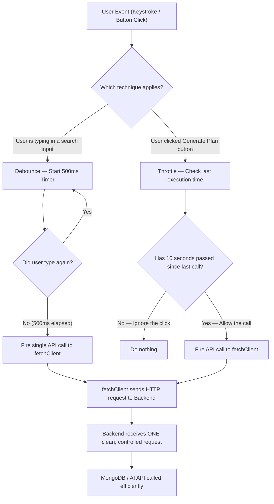

# Throttling and Debouncing — Professional Strategy and Implementation

---

## Table of Contents

1. [What is Debouncing?](#1-what-is-debouncing)
2. [What is Throttling?](#2-what-is-throttling)
3. [Debouncing vs Throttling — When to Use Which](#3-debouncing-vs-throttling--when-to-use-which)
4. [What Gets Debounced and Throttled in Fitmate](#4-what-gets-debounced-and-throttled-in-fitmate)
5. [Implementation Strategy](#5-implementation-strategy)
6. [Debouncing Implementation](#6-debouncing-implementation)
7. [Throttling Implementation](#7-throttling-implementation)
8. [The Full Flow Architecture](#8-the-full-flow-architecture)

---

## 1. What is Debouncing?

**Debouncing** means "wait for a pause before executing." When an event fires repeatedly in quick succession (like a user typing), debouncing delays the function call until the event stops firing for a defined period of time (e.g., 500ms).

### Real-World Analogy

Think of an elevator door. When passengers keep stepping in, the door keeps waiting. The door only closes once no one new enters for a few seconds. Debouncing works exactly the same way.

### Where is it implemented?

- **Frontend:** Debouncing is a user interface concept. It controls what happens before an HTTP request is sent.

### What problems does it solve?

- A user typing "C-H-E-S-T W-O-R-K-O-U-T" in a search bar would fire 12 API calls without debouncing. With debouncing, it fires exactly 1.
- Prevents unnecessary API calls, reduces backend load, and reduces costs for paid AI APIs.

---

## 2. What is Throttling?

**Throttling** means "execute at a maximum steady rate, ignore everything in between." No matter how many times an event fires, the function executes at most once per defined time interval (e.g., once every 3 seconds).

### Real-World Analogy

Think of a highway speed camera. It doesn't matter how fast you drive — it can only photograph one car per second. Any car faster than that window is photographed, the rest are ignored.

### Where is it implemented?

- **Frontend:** Throttling controls how rapidly user interactions trigger actions.

### What problems does it solve?

- A user spam-clicking a "Generate Workout Plan" button 20 times would fire 20 API calls without throttling. With throttling (1 call per 5 seconds), it fires 1.
- Prevents double-submissions on forms.
- Prevents scroll and resize event handlers from firing hundreds of times per second and freezing the browser.

---

## 3. Debouncing vs Throttling — When to Use Which

| Scenario                       | Use Debouncing                      | Use Throttling                   |
| ------------------------------ | ----------------------------------- | -------------------------------- |
| Search input / Autocomplete    | ✅ Wait for user to stop typing     | ❌                               |
| Form submission button         | ❌                                  | ✅ One click per 3 seconds       |
| AI plan generation button      | ❌                                  | ✅ One generation per 10 seconds |
| Window resize event handler    | ✅ Recalculate after user stops     | ❌                               |
| Infinite scroll / lazy loading | ❌                                  | ✅ Check every 300ms max         |
| Real-time chat send button     | ❌                                  | ✅ One message per 500ms         |
| API retry on error             | ✅ Wait for a pause before retrying | ❌                               |

---

## 4. What Gets Debounced and Throttled in Fitmate

| UI Event                             | Applied Technique | Delay      | Reason                                           |
| ------------------------------------ | ----------------- | ---------- | ------------------------------------------------ |
| Search / filter inputs               | Debounce          | 500ms      | Prevents an API call per keystroke               |
| AI Workout Plan generation button    | Throttle          | 10 seconds | AI generation is expensive; prevents spam clicks |
| Chat message send button             | Throttle          | 500ms      | Prevents double-send on fast clicks              |
| Profile form auto-save (if added)    | Debounce          | 1000ms     | Saves only after user stops editing fields       |
| Scroll-triggered data loading        | Throttle          | 300ms      | Prevents firing scroll handler 60 times/sec      |
| Window resize for responsive layouts | Debounce          | 200ms      | Recalculates layout only after resize stops      |

---

## 5. Implementation Strategy

In a professional codebase, debounce and throttle logic is never copy-pasted into every component. Instead, two reusable approaches are used:

1. **Custom Hook Approach:** Create reusable `useDebounce` and `useThrottle` React hooks that any component can import. This keeps components clean.
2. **Utility Library:** Use a well-tested utility library like `lodash` (`_.debounce`, `_.throttle`) for event handler throttling in non-React contexts.

---

## 6. Debouncing Implementation

### The Reusable `useDebounce` Hook

```typescript

// frontend/src/hooks/useDebounce.ts

import { useState, useEffect } from 'react';

// Returns a debounced version of the value that only updates after 'delay' ms of inactivity

export function useDebounce<T>(value: T, delay: number = 500): T {

  const [debouncedValue, setDebouncedValue] = useState<T>(value);

  useEffect(() => {

    // Set a timer to update the debounced value after the delay

    const timerId = setTimeout(() => {

      setDebouncedValue(value);

    }, delay);

    // Cleanup: cancel the timer if value changes before delay completes

    return () => {

      clearTimeout(timerId);

    };

  }, [value, delay]);

  return debouncedValue;

}
```

### Using `useDebounce` in a Search Component

```typescript

// frontend/src/components/WorkoutSearch.tsx

import { useState, useEffect } from 'react';

import { useDebounce } from '../hooks/useDebounce';

import { WorkoutService } from '../services/api';

const WorkoutSearch = () => {

  const [query, setQuery] = useState('');

  // Only updates 500ms after the user stops typing

  const debouncedQuery = useDebounce(query, 500);

  useEffect(() => {

    // This effect only runs when debouncedQuery changes (i.e., after user pauses)

    if (debouncedQuery.length > 2) {

      WorkoutService.search(debouncedQuery);

    }

  }, [debouncedQuery]);

  return (

    <input

      type="text"

      placeholder="Search workouts..."

      onChange={(e) => setQuery(e.target.value)}

    />

  );

};

export default WorkoutSearch;
```

---

## 7. Throttling Implementation

### The Reusable `useThrottle` Hook

```typescript

// frontend/src/hooks/useThrottle.ts

import { useRef, useCallback } from 'react';

// Returns a throttled version of the function that can only fire once per 'delay' ms

export function useThrottle<T extends (...args: any[]) => any>(

  fn: T,

  delay: number

): T {

  // useRef stores the last call time without causing a re-render

  const lastCallRef = useRef<number>(0);

  const throttledFn = useCallback((...args: Parameters<T>) => {

    const now = Date.now();

    // Only execute if enough time has passed since the last call

    if (now - lastCallRef.current >= delay) {

      lastCallRef.current = now;

      fn(...args);

    }

  }, [fn, delay]);

  return throttledFn as T;

}
```

### Using `useThrottle` on an AI Generation Button

```typescript

// frontend/src/pages/Workout.tsx

import { useThrottle } from '../hooks/useThrottle';

import { WorkoutService } from '../services/api';

const WorkoutPage = () => {

  const handleGenerate = async () => {

    // Calls the expensive AI endpoint

    await WorkoutService.generatePlan();

  };

  // This function can fire at most once every 10 seconds

  const throttledGenerate = useThrottle(handleGenerate, 10000);

  return (

    <button onClick={throttledGenerate}>

      Generate AI Workout Plan

    </button>

  );

};
```

---

## 8. The Full Flow Architecture


