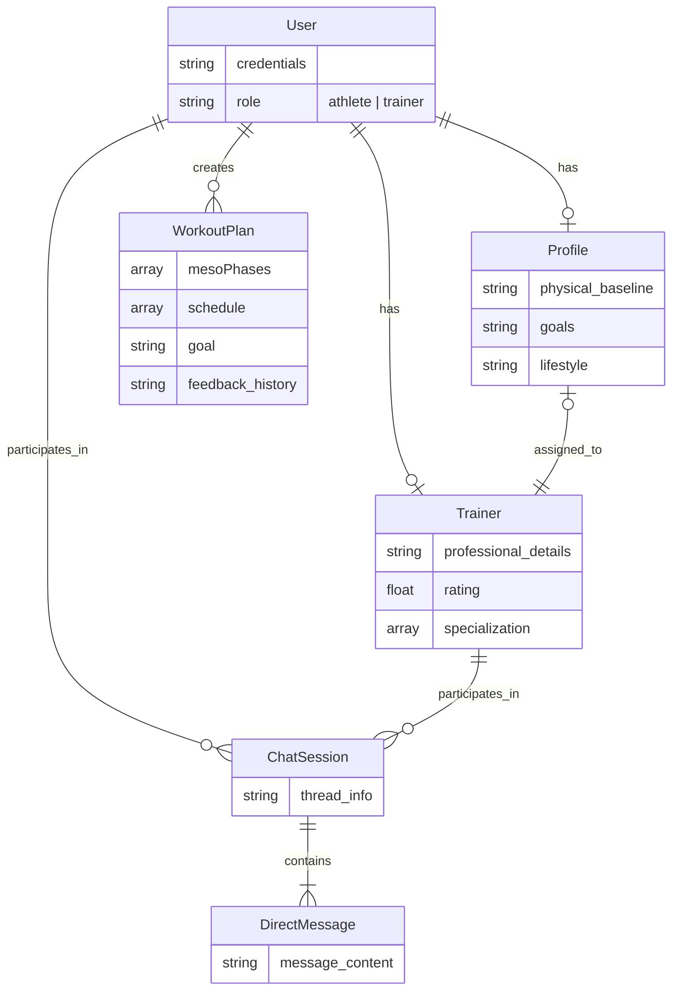
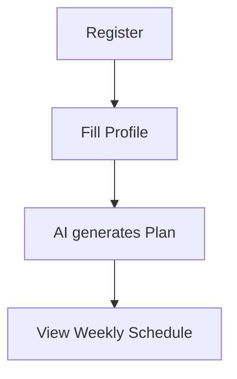
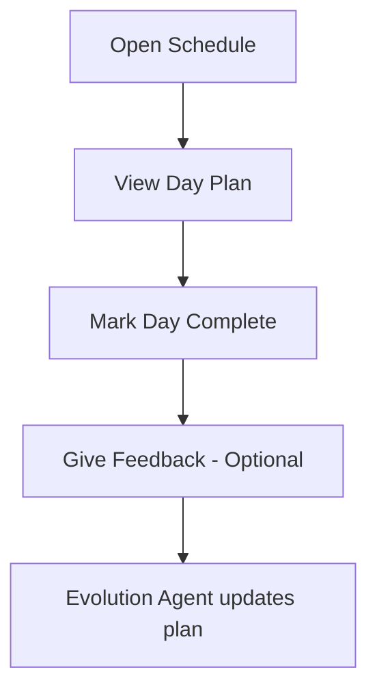
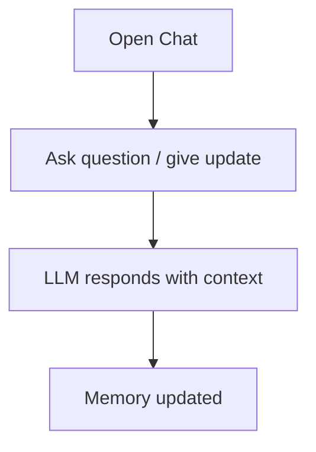
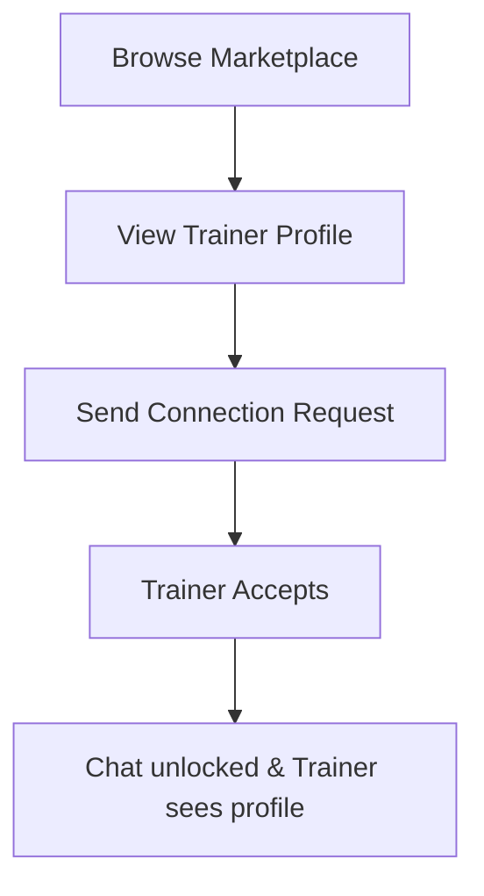
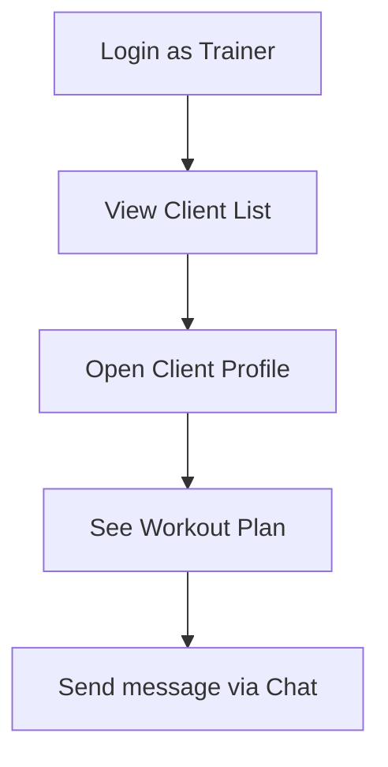

# FitMate — Product Requirements Document (PRD)

**Version:** 1.0
**Date:** July 2026
**Status:** Active Development
**Branch:** `feature/docs`

---

## 1. Executive Summary

FitMate is a full-stack fitness management platform that combines AI-powered workout generation, workout logging, and a professional trainer marketplace into a single cohesive product. The goal is to democratize elite-level personal training by giving every user an adaptive AI coach while also enabling real human coaches to manage their client base digitally.

---

## 2. Problem Statement

| Pain Point                 | Current Reality                                                           | FitMate Solution                                                       |
| -------------------------- | ------------------------------------------------------------------------- | ---------------------------------------------------------------------- |
| Generic workout plans      | Cookie-cutter programs ignore individual history, injuries, and lifestyle | AI generates personalized plans from a full physical/lifestyle profile |
| No adaptive feedback loop  | Static PDFs don't evolve when the user improves or gets injured           | Evolution Agent re-generates plans from user feedback in real time     |
| Trainer–client disconnect | WhatsApp/spreadsheets used to manage clients                              | In-app real-time messaging and trainer dashboards                      |
| No workout memory          | Users forget what they did last week                                      | Every plan and completed day is persisted in a structured log          |

---

## 3. Target Users

### 3.1 Primary — Fitness Enthusiast (Athlete)

- Age: 18–45
- Has a fitness goal (muscle gain, fat loss, endurance, etc.)
- Wants structured, evolving training with minimal cognitive overhead
- May or may not have prior gym experience

### 3.2 Secondary — Professional Trainer (Coach)

- Certified personal trainer looking to scale their client management
- Wants a digital dashboard to track client baselines and communicate
- Needs a marketplace presence to attract new clients

---

## 4. Product Goals & Success Metrics

| Goal                    | Key Metric                                      | Target                        |
| ----------------------- | ----------------------------------------------- | ----------------------------- |
| Drive user engagement   | Avg. workout sessions logged per user / week    | ≥ 3                          |
| AI plan quality         | User-reported plan satisfaction (in-app rating) | ≥ 4.2 / 5                    |
| Trainer adoption        | Active trainers on the platform                 | 50+ within 6 months of launch |
| Retention               | 30-day user retention rate                      | ≥ 40%                        |
| Real-time communication | Message delivery latency                        | < 200 ms (p95)                |

---

## 5. Core Feature Requirements

### 5.1 User Authentication & Profiles

**Must Have**

- Email / password registration and login with JWT authentication
- Secure password hashing (bcrypt)
- Role-based access: `athlete` | `trainer`
- Physical profile creation capturing:
  - Age, gender, weight, height
  - Primary fitness goal (e.g., "Muscle Gain", "Fat Loss", "Endurance")
  - Training experience level: Beginner / Intermediate / Advanced
  - Available training days per week (3–6) and session duration (30–120 min)
  - Injuries / physical limitations (free text)
  - Lifestyle: sleep quality, stress level, dietary preference

**Should Have**

- Profile photo upload
- Password reset via email OTP

---

### 5.2 AI Workout Generation

**Must Have**

#### 5.2.1 Foundation Flow (First-time Plan)

1. **Strategy Agent** — Reads the user profile and generates a long-term Meso-phase roadmap:
   - Phase name, goal, focus area, duration in weeks, computed start/end dates
2. **Microcycle Generator** — Breaks down the first meso-phase into a concrete 7-day `schedule`:
   - Per day: focus muscle group, daily objective, warmup, exercises (name / sets / reps / intensity / notes), cooldown, rest day flag
3. Plan stored as a `WorkoutPlan` document linked to the user

#### 5.2.2 Evolution Flow (Plan Adaptation)

- **Evolution Agent** triggered when the user provides feedback (e.g., "too hard", "injured my shoulder", "want more cardio")
- Agent reads existing plan + feedback → outputs a modified plan
- Entire plan document replaced atomically in MongoDB

**Must Have — Plan Data Points**

- `goal`, `splitType`, `experienceLevel`
- `overarchingStrategy`, `currentPhase`, `weeklyFrequency`
- `mesoPhases[]` — strategic roadmap
- `schedule[]` — tactical weekly breakdown
- `progressionRule`, `deloadStrategy`, `completedDays`

**Should Have**

- Deload week auto-suggestion after every 4th week
- Injury-aware exercise substitution within the Evolution Agent

---

### 5.3 Workout Logging

**Must Have**

- Mark individual days in the schedule as completed
- Increment `completedDays` counter on the plan
- Persist completion state so it survives page refreshes

**Should Have**

- Per-session notes (user's own observations)
- Weekly progress summary (completed vs. planned days)

**Nice to Have**

- Set-level logging: actual reps/weight lifted vs. prescribed
- Workout streak tracking

---

### 5.4 AI Chat Interface

**Must Have**

- Conversational interface powered by LLM (OpenAI / Anthropic via Model Registry)
- Short-term memory (STM): MongoDB checkpointer preserves conversation state within a session
- Long-term memory (LTM): **Mem0** persists user preferences, history, and coach notes across all sessions
- Context-aware answers covering: workout form, nutrition, recovery, plan interpretation

**Should Have**

- Proactive suggestions ("You haven't logged a workout in 3 days — shall we reschedule?")
- Citations to user's own past logs when relevant

---

### 5.5 Trainer Marketplace

**Must Have**

- Trainer profile creation with:
  - Full name, bio, specializations (`string[]`), certifications (`string[]`)
  - Experience years, hourly rate, rating, total clients
  - Social links (Instagram, LinkedIn, Twitter)
- Public trainer listing page (browse all active trainers)
- Trainer detail page

**Should Have**

- Athlete can request to connect with a trainer (sets `trainerId` on the athlete's `Profile`)
- Trainer can accept/decline connection requests
- Rating & review system

**Nice to Have**

- Trainer search / filter by specialization or price range
- Trainer can view assigned athletes' profiles and workout plans

---

### 5.6 Real-Time Trainer ↔ Athlete Messaging

**Must Have**

- 1-to-1 real-time direct messaging between athlete and their assigned trainer
- Powered by **Socket.IO** over WebSockets
- Messages persisted to MongoDB (`DirectMessage` collection)
- Conversation threads managed via `ChatSession` documents

**Should Have**

- Unread message badge / notification
- Message history loaded on conversation open
- Online presence indicator (trainer is online / offline)

**Nice to Have**

- File / image attachment support
- Read receipts

---

## 6. Non-Functional Requirements

| Dimension               | Requirement                                                                                               |
| ----------------------- | --------------------------------------------------------------------------------------------------------- |
| **Performance**   | API response time < 500 ms for non-AI routes (p95)                                                        |
| **AI Latency**    | Plan generation < 30 s; chat response < 8 s                                                               |
| **Security**      | JWT with short expiry + refresh token rotation; bcrypt password hashing; CORS restricted to known origins |
| **Scalability**   | Stateless API behind a load balancer; Socket.IO with Redis adapter for horizontal scaling                 |
| **Reliability**   | 99.5% uptime target; graceful error handling on AI timeouts                                               |
| **Accessibility** | WCAG 2.1 AA compliance on all frontend UI components                                                      |
| **Testability**   | E2E tests via Cypress covering critical flows (auth, plan generation, messaging)                          |

---

## 7. Technical Stack

### Frontend

| Layer            | Technology                                 |
| ---------------- | ------------------------------------------ |
| Framework        | React 19 (Vite)                            |
| Styling          | Tailwind CSS 4.0 + Shadcn/UI               |
| State & Routing  | React Router 7 + custom`useAppFlow` hook |
| Real-time client | Socket.IO client                           |

### Backend

| Layer         | Technology                  |
| ------------- | --------------------------- |
| Runtime       | Node.js + TypeScript        |
| API Framework | Express.js                  |
| Database      | MongoDB (Mongoose ODM)      |
| Auth          | JWT (jsonwebtoken) + bcrypt |
| Real-time     | Socket.IO                   |

### AI Layer

| Layer             | Technology                                 |
| ----------------- | ------------------------------------------ |
| Orchestration     | LangGraph (stateful multi-agent workflows) |
| Long-term Memory  | Mem0                                       |
| Short-term Memory | MongoDB Checkpointer (LangGraph)           |
| Model Registry    | Supports OpenAI, Anthropic (swappable)     |

### DevOps

| Layer            | Technology              |
| ---------------- | ----------------------- |
| Containerization | Docker + Docker Compose |
| Reverse Proxy    | Nginx                   |
| E2E Testing      | Cypress                 |

---

## 8. Data Models (Summary)

---

## 9. User Flows

### 9.1 Athlete Onboarding

### 9.2 Workout Loop

### 9.3 AI Chat

### 9.4 Trainer Connection

### 9.5 Trainer Dashboard

---

# 11. Risks & Mitigations

| Risk                              | Likelihood | Impact | Mitigation                                                         |
| --------------------------------- | ---------- | ------ | ------------------------------------------------------------------ |
| AI hallucination in workout plans | Medium     | High   | Zod schema validation on all AI outputs; fallback to safe defaults |
| LLM API rate limits during peak   | Medium     | Medium | Exponential backoff + request queuing                              |
| WebSocket scalability under load  | Low        | High   | Redis adapter for Socket.IO; horizontal scaling ready              |
| Data privacy of health info       | Medium     | High   | Encrypt sensitive fields at rest; GDPR-aligned data deletion flow  |

---

## 12. Open Questions

- [X] Will v1 support paid trainer subscriptions, or is the marketplace free?
- [X] Should the Evolution Agent auto-run on a weekly cadence, or only on explicit user feedback?
- [ ] Is Mem0 self-hosted or using the Mem0 cloud API?
  we are gonna replace mem) with RAG based memory
- [ ] What LLM model is the default ? Groq free tier
- [ ] Define the exact trainer–athlete connection acceptance flow (push notification, in-app only?)

---

*Document maintained in `/docs2/PRD.md` on the `feature/docs` branch.*
