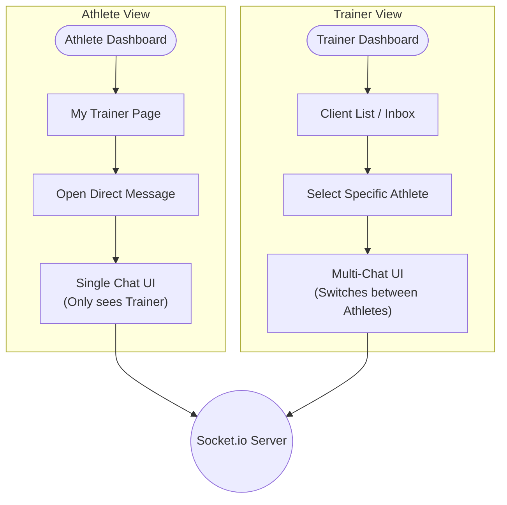
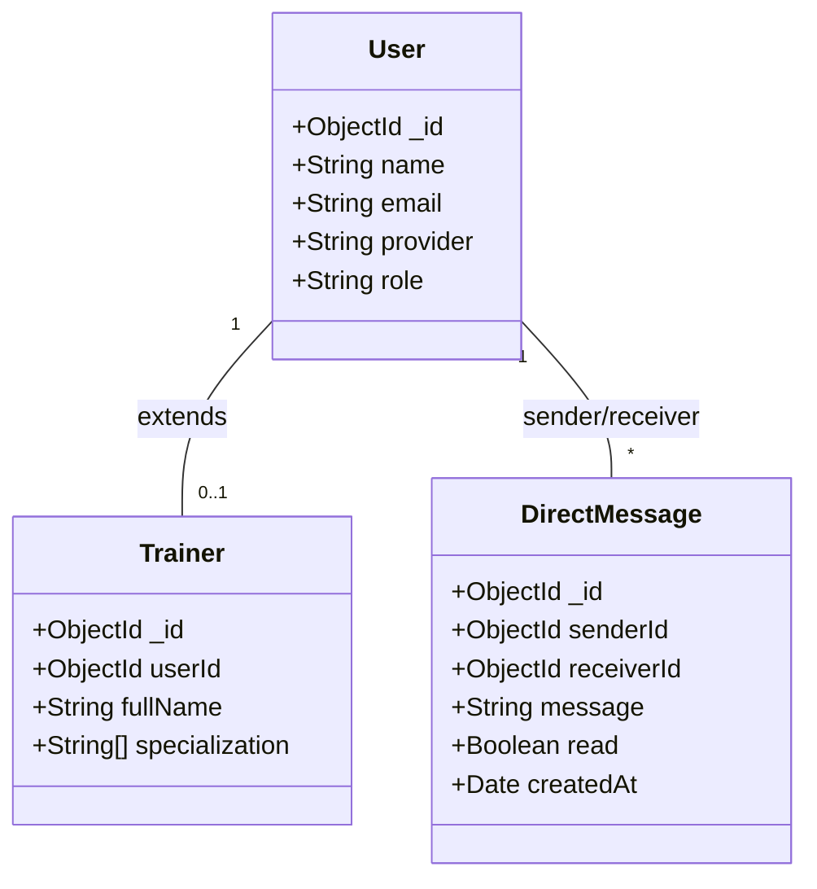
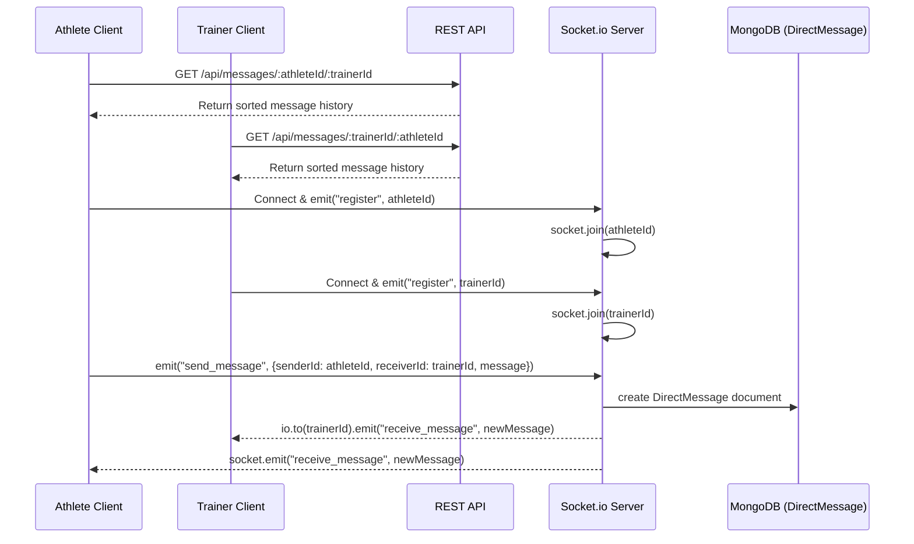

# FitMate Chat System Architecture

**Version:** 1.1
**Date:** July 2026
**Status:** Active Development

This document details the architecture of FitMate's **Real-time Human Chat** system, specifically focusing on the asymmetric experience between Athletes (Learners) and Trainers.

---

## 1. Chat Flow Diagram (Athlete vs. Trainer)

The chat experience differs significantly based on the user's role. 
- **Athletes** have a focused, 1-on-1 experience with their assigned Trainer.
- **Trainers** manage multiple clients and require a "Client List" or inbox view to switch between different Athlete conversations.

---

## 2. Class / Data Model Diagram

This diagram shows the MongoDB schemas used to persist chat data.

---

## 3. Sequence Diagrams & Technical Deep Dive

### Real-Time Human Chat (Socket.io)

Human chat requires instant, bidirectional communication with low latency. We achieve this using **Socket.io**.

#### Sequence Diagram

#### How the Asymmetric UX is Managed:

1. **History Retrieval:** 
   - When the **Athlete** opens the chat, the frontend automatically knows the `trainerId` (from the Athlete's profile/assignment) and fetches the history `GET /api/messages/:athleteId/:trainerId`.
   - When the **Trainer** opens their chat inbox, they first fetch a list of their assigned clients. Upon clicking a specific client, the frontend fetches the history for that specific relationship `GET /api/messages/:trainerId/:athleteId`.
2. **WebSocket Connection & Room Registration:** Regardless of role, every client establishes a Socket.io connection and emits a `register` event with their own `userId`. The Socket server calls `socket.join(userId)`, placing the user in a unique, isolated room.
3. **Sending a Message:** 
   - The Athlete's UI is hardcoded to always send messages where `receiverId` is their Trainer.
   - The Trainer's UI dynamically sets the `receiverId` based on which Athlete's chat tab they currently have open.
4. **Message Delivery:** After saving to the database, the server uses `io.to(receiverId).emit("receive_message")` to push the message directly to the recipient's room. 
   - If the Trainer receives a message from Athlete A while looking at Athlete B's chat, the frontend can use the incoming message's `senderId` to show an unread badge next to Athlete A's name in the Client List.
