# FitMate — Complete Database Reference

> Deep-dive documentation of every MongoDB collection, every field, every constraint, every relationship, and every data flow in the system.

---

## Diagram

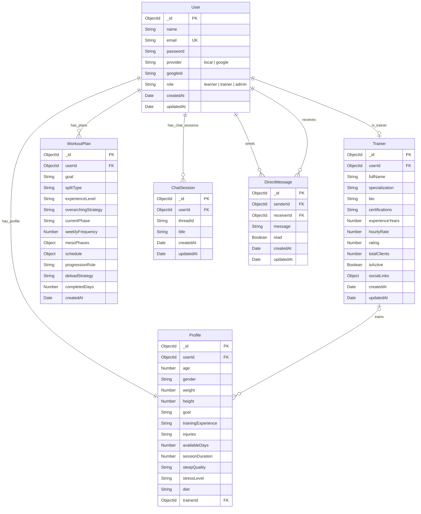

---

## Collection 1 — `User`

The **root identity document** for every person on the platform. It is the anchor for authentication and the foreign key source for every other collection. Nothing else in the database exists without a `User`.

### Fields

- **`_id`** (`ObjectId`, Auto, Unique): MongoDB primary key. Auto-generated.
- **`name`** (`String`, Optional): Display name of the user.
- **`email`** (`String`, Required, Unique): Login identifier; must be globally unique. Valid email format.
- **`password`** (`String`, Optional): Only set for `provider: "local"` users. Google users have no password. Stored as a Bcrypt hash.
- **`provider`** (`String`, Required): Identifies the auth strategy used to create this account. Enum: `"local"` or `"google"`. Default is `"local"`.
- **`googleId`** (`String`, Optional): Google's unique `sub` identifier; only set when `provider: "google"`.
- **`role`** (`String`, Required): Governs access to features. Enum: `"learner"`, `"trainer"`, `"admin"`. Default is `"learner"`.
  - *When is this selected?* For standard email/password signups, the user selects this on the registration form. For Google OAuth signups, they are automatically assigned `"learner"` since Google doesn't ask for a role.
  - *Promotion:* Any `"learner"` is automatically upgraded to `"trainer"` the moment they create a Trainer profile.
- **`createdAt`** (`Date`, Auto): Timestamp of creation. Auto-set by Mongoose `timestamps: true`.
- **`updatedAt`** (`Date`, Auto): Timestamp of last update. Auto-updated by Mongoose `timestamps: true`.

### Code Implementation (`backend/src/models/User.ts`)

```typescript
export interface IUser extends Document {
  
  name?: string;
  email: string;
  password?: string;
  
  /** 'local' or 'google' - helps differentiate auth methods */
  
  provider: "local" | "google";
  googleId?: string;
  role: "learner" | "trainer" | "admin";
}

const UserSchema: Schema = new Schema(
  {
    name: {
      type: String,
    },
    email: {
      type: String,
      required: true,
      unique: true,
    },
    password: {
      type: String,
    },
    provider: {
      type: String,
      enum: ["local", "google"],
      default: "local",
    },
    googleId: {
      type: String,
    },
    role: {
      type: String,
      enum: ["learner", "trainer", "admin"],
      default: "learner",
    },
  },
  { timestamps: true }
);
```

### Key Behaviours

- **Local signup**: `email`, `password` (hashed with bcrypt salt 10), `name`, and their explicitly chosen `role` (from the signup form) are stored. `googleId` is absent.
- **Google signup**: `email`, `name`, `googleId` are stored from the Google token payload. `password` is never set. `provider` is set to `"google"`. Because Google does not prompt for custom fields, the `role` defaults to `"learner"`. (If they are actually a trainer, they just fill out the Trainer profile later to get promoted).
- **Role promotion**: When a user fills out a Trainer profile, the system runs `User.findByIdAndUpdate(userId, { role: "trainer" })` automatically — the user does not set their own role.

---

## Collection 2 — `Profile`

The **physical and lifestyle baseline** of a learner (athlete). It is the primary input context fed to the AI Strategy Agent to generate a personalized workout plan. Without a Profile, the AI cannot generate any plans.

### Fields

- **`_id`** (`ObjectId`, Auto): MongoDB primary key.
- **`userId`** (`ObjectId`, Required, Ref: `User`): Links this profile to exactly one user. Used as the primary lookup key.
- **`age`** (`Number`, Optional): User's age in years. Input for AI plan periodization.
- **`gender`** (`String`, Optional): Biological sex / gender identity. Used for baseline metabolic context.
- **`weight`** (`Number`, Optional): Current body weight in kilograms. Used to calibrate training load and nutrition context.
- **`height`** (`Number`, Optional): Body height in centimeters for BMI/baseline reference.
- **`goal`** (`String`, Optional): The single most critical AI input (e.g. "Muscle Gain", "Fat Loss"). Defines the entire strategic direction of the plan.
- **`trainingExperience`** (`String`, Optional): Defines the athlete's training age (`"Beginner"`, `"Intermediate"`, `"Advanced"`). Determines exercise complexity and volume in generated plans.
- **`injuries`** (`String`, Optional): Self-reported physical limitations (free text). The Evolution Agent reads this to substitute or avoid exercises.
- **`availableDays`** (`Number`, Optional): Training days per week (Integer, `3` to `6`). Directly sets the number of workout days in the schedule.
- **`sessionDuration`** (`Number`, Optional): Session length constraint in minutes (Integer, `30` to `120`). AI fits exercises within this time window.
- **`sleepQuality`** (`String`, Optional): Recovery proxy (`"Good"`, `"Average"`, `"Poor"`). Influences deload frequency in plan generation.
- **`stressLevel`** (`String`, Optional): Secondary recovery proxy (`"Low"`, `"Moderate"`, `"High"`). High stress = more conservative programming.
- **`diet`** (`String`, Optional): Dietary context used for nutrition advice in the AI chat interface (`"Vegetarian"`, `"Vegan"`, `"Standard"`, etc.).
- **`trainerId`** (`ObjectId`, Optional, Ref: `Trainer`): Set when the athlete selects a human trainer from the marketplace. Enables trainer-client link.

### Code Implementation (`backend/src/models/Profile.ts`)

```typescript
export interface IProfile extends Document {
  userId: mongoose.Types.ObjectId;

  // Physical baseline
  age: number;
  gender: string;
  weight: number;
  height: number;

  // Goal definition (most critical variable)
  goal: string;

  // Training background (training age)
  trainingExperience: string;   // Beginner (<1yr) / Intermediate (1-3yr) / Advanced (3+yr)

  // Injury / limitations
  injuries: string;            // free text, optional

  // Lifestyle constraints
  availableDays: number;       // training days per week (3-6)
  sessionDuration: number;     // minutes per session (30-120)
  sleepQuality: string;        // Good / Average / Poor
  stressLevel: string;         // Low / Moderate / High

  // Nutrition baseline
  diet: string;                // Vegetarian / Vegan / Standard / etc.

  // Assignment
  trainerId?: mongoose.Types.ObjectId;
}

const ProfileSchema: Schema = new Schema({
  userId: {
    type: mongoose.Schema.Types.ObjectId,
    ref: "User",
    required: true,
  },
  age: Number,
  gender: String,
  weight: Number,
  height: Number,
  goal: String,
  trainingExperience: String,
  injuries: String,
  availableDays: Number,
  sessionDuration: Number,
  sleepQuality: String,
  stressLevel: String,
  diet: String,
  trainerId: {
    type: mongoose.Schema.Types.ObjectId,
    ref: "Trainer",
  },
});
```

### Key Behaviours

- **Upsert pattern**: The `profileController` checks if a profile already exists for the `userId`. If yes, it updates. If no, it creates. This means a user always has at most one profile.
- **Auto-triggers Strategy Agent**: Every time a profile is saved (created or updated), the `runStrategyAgent` is called with the profile data. This generates or regenerates the `WorkoutPlan`.
- **Syncs to Mem0**: Profile updates are pushed to Mem0 (long-term AI memory) as a summary string so the AI chat agent is always aware of the latest user context.
- **Trainer assignment**: `POST /api/profile/select-trainer/:trainerId` sets `trainerId` on the profile, creating the athlete–trainer connection.

---

## Collection 3 — `Trainer`

The **professional identity document** for users who operate as coaches on the platform. A user can only have one `Trainer` document. Creating this document also promotes the user's `role` to `"trainer"`.

### Fields

- **`_id`** (`ObjectId`, Auto, Unique): MongoDB primary key.
- **`userId`** (`ObjectId`, Required, Unique, Ref: `User`): Links to the parent User. Unique constraint ensures one trainer profile per user.
- **`fullName`** (`String`, Required): Public-facing display name for the trainer's marketplace listing.
- **`specialization`** (`String[]`, Optional): Areas of expertise (e.g. `["Strength Training", "HIIT", "Yoga"]`). Displayed on their marketplace card. Default is `[]`.
- **`bio`** (`String`, Optional): Long-form description of the trainer's background and philosophy.
- **`certifications`** (`String[]`, Optional): Professional certifications (e.g. `["NASM CPT", "CrossFit L2"]`). Displayed for credibility. Default is `[]`.
- **`experienceYears`** (`Number`, Optional): Years of professional training experience. Default is `0`.
- **`hourlyRate`** (`Number`, Optional): Trainer's rate in local currency. Displayed on the marketplace for athlete comparison.
- **`rating`** (`Number`, Optional): Aggregate rating score (Float 0.0–5.0). Updated externally by a review system. Default is `0`.
- **`totalClients`** (`Number`, Optional): Count of athletes currently assigned to this trainer. Default is `0`.
- **`isActive`** (`Boolean`, Optional): Controls visibility on the marketplace. Inactive trainers are hidden from discovery. Default is `true`.
- **`socialLinks`** (`Object`, Optional): Nested sub-document containing optional `instagram`, `linkedin`, and `twitter` URL strings. All three are optional.
- **`createdAt`** (`Date`, Auto): Auto-set by Mongoose `timestamps: true`.
- **`updatedAt`** (`Date`, Auto): Auto-updated by Mongoose `timestamps: true`.

### Code Implementation (`backend/src/models/Trainer.ts`)

```typescript
export interface ITrainer extends Document {
  userId: mongoose.Types.ObjectId;
  fullName: string;
  specialization: string[];
  bio: string;
  certifications: string[];
  experienceYears: number;
  hourlyRate?: number;
  rating: number;
  totalClients: number;
  isActive: boolean;
  socialLinks?: {
    instagram?: string;
    linkedin?: string;
    twitter?: string;
  };
}

const TrainerSchema: Schema = new Schema(
  {
    userId: {
      type: mongoose.Schema.Types.ObjectId,
      ref: "User",
      required: true,
      unique: true,
      index: true,
    },
    fullName: {
      type: String,
      required: true,
    },
    specialization: {
      type: [String],
      default: [],
    },
    bio: {
      type: String,
      default: "",
    },
    certifications: {
      type: [String],
      default: [],
    },
    experienceYears: {
      type: Number,
      default: 0,
    },
    hourlyRate: {
      type: Number,
    },
    rating: {
      type: Number,
      default: 0,
    },
    totalClients: {
      type: Number,
      default: 0,
    },
    isActive: {
      type: Boolean,
      default: true,
    },
    socialLinks: {
      instagram: String,
      linkedin: String,
      twitter: String,
    },
  },
  { timestamps: true }
);
```

### Key Behaviours

- **Upsert pattern**: `POST /api/trainer/profile` uses `findOneAndUpdate` with `{ upsert: true }` — creating the document on first call, updating on subsequent calls.
- **Role promotion side-effect**: After creating/updating the Trainer document, the controller immediately calls `User.findByIdAndUpdate(userId, { role: "trainer" })`. The user's global role is promoted.
- **Client retrieval**: `GET /api/trainer/clients` queries `Profile.find({ trainerId: trainer._id })` and populates `userId` to get the athlete's name and email.
- **Discovery filter**: `GET /api/trainer/discovery` only returns trainers where `isActive: true`.

---

## Collection 4 — `WorkoutPlan`

The **AI-generated fitness program** for an athlete. It is a rich document containing both a strategic multi-phase roadmap (`mesoPhases`) and a tactical day-by-day schedule (`schedule`). It is the most complex document in the system.

### Top-Level Fields

- **`_id`** (`ObjectId`, Auto): MongoDB primary key.
- **`userId`** (`ObjectId`, Required, Ref: `User`): Links the plan to the owning athlete.
- **`goal`** (`String`, Optional): High-level goal string echoed from the Profile (e.g. "Muscle Gain").
- **`splitType`** (`String`, Optional): The training split (e.g. "Push/Pull/Legs", "Upper/Lower", "Full Body").
- **`experienceLevel`** (`String`, Optional): Echoed from the Profile. Used by the AI to calibrate exercise selection.
- **`overarchingStrategy`** (`String`, Optional): A plain-language summary of the AI's strategic rationale for the overall plan.
- **`currentPhase`** (`String`, Optional): The name of the active meso-phase (e.g. "Phase 1: Foundation").
- **`weeklyFrequency`** (`Number`, Optional): Number of training days per week in the current cycle.
- **`progressionRule`** (`String`, Optional): The AI-defined overload principle (e.g. "Add 2.5kg per week on primary lifts").
- **`deloadStrategy`** (`String`, Optional): Instructions for the deload week (e.g. "Reduce volume by 40% every 4th week").
- **`completedDays`** (`Number`, Optional): Incremented each time the user marks a day as complete. Tracks workout logging progress. Default is `0`.
- **`createdAt`** (`Date`, Auto): Timestamp of plan creation. Reset on each full plan regeneration. Default is `Date.now`.

### Nested: `mesoPhases[]` (Strategic Roadmap)

Each element of the `mesoPhases` array is a phase object representing a block of training over several weeks.

- **`name`** (`String`): Phase label (e.g. "Phase 1: Hypertrophy")
- **`goal`** (`String`): Specific goal for this phase (e.g. "Build muscle mass and establish movement patterns")
- **`focus`** (`String`): Primary training focus (e.g. "Volume accumulation, compound lifts")
- **`durationWeeks`** (`Number`): Number of weeks this phase lasts
- **`startDate`** (`Date`): Computed and injected by the controller, not the AI
- **`endDate`** (`Date`): Computed and injected by the controller, not the AI

### Nested: `schedule[]` (Tactical Weekly Plan)

Each element of the `schedule` array is a full day plan.

- **`day`** (`String`): Day name (e.g. "Monday", "Day 1")
- **`date`** (`Date`): Exact calendar date; injected by the controller
- **`focus`** (`String`): Muscle group focus (e.g. "Chest & Triceps")
- **`isRestDay`** (`Boolean`): If `true`, no exercises are listed; the schedule renders this as a rest day
- **`dailyObjective`** (`String`): One-line summary of today's training intent
- **`warmup`** (`String[]`): Array of warmup activity descriptions
- **`exercises`** (`Object[]`): Array of individual exercise objects (see below)
- **`cooldown`** (`String[]`): Array of cooldown/stretching descriptions

### Nested: `schedule[].exercises[]` (Individual Exercises)

- **`name`** (`String`): Exercise name (e.g. "Barbell Back Squat")
- **`sets`** (`Number`): Number of sets to perform
- **`reps`** (`String`): Rep scheme as string (e.g. "8-10", "AMRAP", "30 sec")
- **`intensity`** (`String`): Load or effort descriptor (e.g. "75% 1RM", "RPE 8")
- **`notes`** (`String`): Coaching notes for form or execution

### Code Implementation (`backend/src/models/WorkoutPlan.ts`)

```typescript
export interface IExercise {
  name: string;
  sets: number;
  reps: string;
  intensity?: string;
  notes?: string;
}

export interface IDayPlan {
  day: string;
  date: Date;           // injected by controller, not by AI
  focus: string;
  isRestDay: boolean;
  dailyObjective?: string;
  warmup?: string[];
  exercises: IExercise[];
  cooldown?: string[];
}

export interface IMesoPhase {
  name: string;
  goal: string;
  focus: string;
  durationWeeks: number;
  startDate: Date;      // injected by controller
  endDate: Date;        // injected by controller
}

export interface IWorkoutPlan extends Document {
  userId: mongoose.Types.ObjectId;
  goal: string;
  splitType: string;
  experienceLevel: string;
  overarchingStrategy: string;
  currentPhase: string;
  weeklyFrequency: number;
  mesoPhases: IMesoPhase[];
  schedule: IDayPlan[];
  progressionRule: string;
  deloadStrategy: string;
  completedDays: number;
  createdAt: Date;
}

const WorkoutPlanSchema: Schema = new Schema({
  userId: { type: Schema.Types.ObjectId, ref: "User", required: true },
  goal: { type: String },
  splitType: { type: String },
  experienceLevel: { type: String },
  overarchingStrategy: { type: String },
  currentPhase: { type: String },
  weeklyFrequency: { type: Number },
  mesoPhases: [
    {
      _id: false,
      name: { type: String },
      goal: { type: String },
      focus: { type: String },
      durationWeeks: { type: Number },
      startDate: { type: Date },
      endDate: { type: Date },
    }
  ],
  schedule: [
    {
      _id: false,
      day: { type: String },
      date: { type: Date },
      focus: { type: String },
      isRestDay: { type: Boolean },
      dailyObjective: { type: String },
      warmup: [{ type: String }],
      exercises: [
        {
          _id: false,
          name: { type: String },
          sets: { type: Number },
          reps: { type: String },
          intensity: { type: String },
          notes: { type: String },
        },
      ],
      cooldown: [{ type: String }],
    },
  ],
  progressionRule: { type: String },
  deloadStrategy: { type: String },
  completedDays: { type: Number, default: 0 },
  createdAt: { type: Date, default: Date.now },
});
```

### Key Behaviours

- **Foundation Flow**: On first profile save, `runStrategyAgent` → `generateMicrocycle` → plan is upserted with the full roadmap and first week's schedule.
- **Evolution Flow**: User sends feedback to `POST /api/workout`. If a plan exists, `runEvolutionAgent` is called. It reads the existing plan + user feedback and outputs a modified plan which entirely replaces the existing document.
- **Zod Validation**: All AI outputs are validated against Zod schemas before being saved to MongoDB. The Mongoose schema itself is intentionally permissive — Zod is the hard validation layer.

---

## Collection 5 — `ChatSession`

Tracks **AI chat thread sessions** for a user. Each session corresponds to a unique conversation thread in the LangGraph memory system. This is the AI chat, not the human trainer DMs.

### Fields

- **`_id`** (`ObjectId`, Auto): MongoDB primary key.
- **`userId`** (`ObjectId`, Required, Ref: `User`): Links the session to the owning user.
- **`threadId`** (`String`, Required): The unique thread identifier used by LangGraph (`"thread_" + UUID`). This is the key passed to the LangGraph checkpointer to restore memory.
- **`title`** (`String`, Required): Auto-generated from the first 30 characters of the user's first message. Displayed in the sessions list. Default is `"New Chat"`.
- **`createdAt`** (`Date`, Auto): Auto-set by Mongoose `timestamps: true`.
- **`updatedAt`** (`Date`, Auto): Auto-updated whenever a new message is sent to this thread. Used for sorting sessions by most recent.

### Code Implementation (`backend/src/models/ChatSession.ts`)

```typescript
export interface IChatSession extends Document {
  userId: mongoose.Types.ObjectId;
  threadId: string;
  title: string;
  updatedAt: Date;
}

const ChatSessionSchema: Schema = new Schema({
  userId: { type: mongoose.Schema.Types.ObjectId, ref: "User", required: true },
  threadId: { type: String, required: true },
  title: { type: String, required: true, default: "New Chat" },
}, { timestamps: true });
```

### Key Behaviours

- **New thread auto-creation**: If `POST /api/chat` is called without a `threadId`, a new `ChatSession` is created with a UUID-based `threadId` and a title from the first message.
- **Thread continuation**: If a `threadId` is provided, only `updatedAt` is refreshed on the existing `ChatSession`. No duplicate is created.
- **History ownership check**: `GET /api/chat/history/:threadId` first verifies that the `ChatSession` belongs to the requesting user before loading history from LangGraph. Prevents cross-user data leakage.
- **LangGraph STM**: The `threadId` from this document is passed directly into the LangGraph streaming agent as `config.configurable.thread_id`, which restores the in-session conversation state.
- **Mem0 LTM**: After every chat response, the full user + assistant exchange is pushed to Mem0 using `addInteraction`. This persists facts across all sessions long-term.

---

## Collection 6 — `DirectMessage`

Individual **real-time messages** exchanged between a human athlete and their assigned human trainer. Entirely separate from the AI chat system.

### Fields

- **`_id`** (`ObjectId`, Auto): MongoDB primary key.
- **`senderId`** (`ObjectId`, Required, Ref: `User`): The user who sent the message.
- **`receiverId`** (`ObjectId`, Required, Ref: `User`): The user who should receive the message.
- **`message`** (`String`, Required): The text content of the message. Cannot be empty.
- **`read`** (`Boolean`, Optional): Whether the receiver has read the message. Used for unread badge counts. Default is `false`.
- **`createdAt`** (`Date`, Auto): Auto-set by Mongoose `timestamps: true`.
- **`updatedAt`** (`Date`, Auto): Auto-updated by Mongoose `timestamps: true`.

### Code Implementation (`backend/src/models/DirectMessage.ts`)

```typescript
export interface IDirectMessage extends Document {
  senderId: mongoose.Types.ObjectId;
  receiverId: mongoose.Types.ObjectId;
  message: string;
  read: boolean;
  createdAt: Date;
}

const DirectMessageSchema: Schema = new Schema(
  {
    senderId: { type: mongoose.Schema.Types.ObjectId, ref: "User", required: true },
    receiverId: { type: mongoose.Schema.Types.ObjectId, ref: "User", required: true },
    message: { type: String, required: true },
    read: { type: Boolean, default: false },
  },
  { timestamps: true }
);
```

### Key Behaviours

- **Written via Socket.IO**: Messages are not created via a REST endpoint. The `socket.on("send_message")` handler in `socket.ts` calls `DirectMessage.create(...)` directly.
- **Delivered in real-time**: After saving to MongoDB, the message is emitted to the receiver's personal Socket.IO room (`io.to(receiverId).emit("receive_message", newMessage)`) and echoed back to the sender.
- **Read via REST**: `GET /api/messages/:userId1/:userId2` fetches all messages between two users using a bidirectional `$or` query and sorts them oldest-first by `createdAt`.

---

## Relationships in Detail

### `User` → `Profile` (One-to-One)

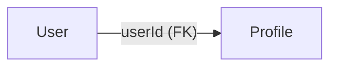

- **Cardinality**: Exactly one Profile per User (enforced by upsert logic).
- **Direction**: Profile stores `userId`. User document has no reference to Profile.
- **Lookup**: `Profile.findOne({ userId: user._id })`
- **Cascade**: Deleting a User should cascade-delete their Profile (not yet implemented, manual responsibility).

---

### `User` → `Trainer` (One-to-Zero-or-One)

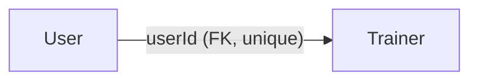

- **Cardinality**: A User may have zero or one Trainer document. The `userId` field on Trainer has a unique index enforcing this.
- **Direction**: Trainer stores `userId`. User document has no reference to Trainer.
- **Role Promotion**: Creating a Trainer document triggers `User.role = "trainer"`.
- **Lookup**: `Trainer.findOne({ userId: user._id })`

---

### `Profile` → `Trainer` (Many-to-One — Athlete assigned to Trainer)

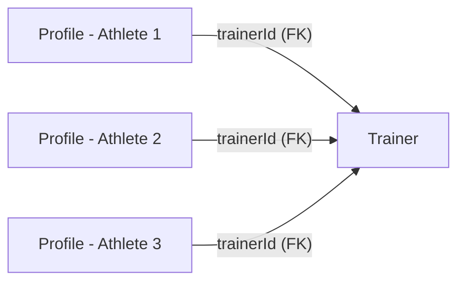

- **Cardinality**: Many Athletes can be assigned to one Trainer. Each Profile has at most one `trainerId`.
- **Direction**: Profile stores `trainerId` (which is the `Trainer._id`, not the trainer's `userId`).
- **Assignment**: `POST /api/profile/select-trainer/:trainerId` sets this field.
- **Trainer client lookup**: `Profile.find({ trainerId: trainer._id }).populate("userId", "email name")` — this is how a trainer sees their client list.

---

### `User` → `WorkoutPlan` (One-to-Many)

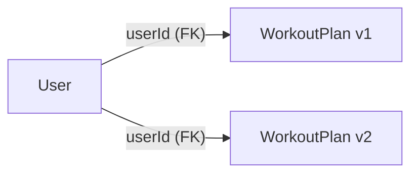

- **Cardinality**: One User can have multiple WorkoutPlan documents over time.
- **Active plan**: The system always fetches the **most recent** plan via `.sort({ createdAt: -1 })`.
- **Direction**: WorkoutPlan stores `userId`.

---

### `User` → `ChatSession` (One-to-Many)

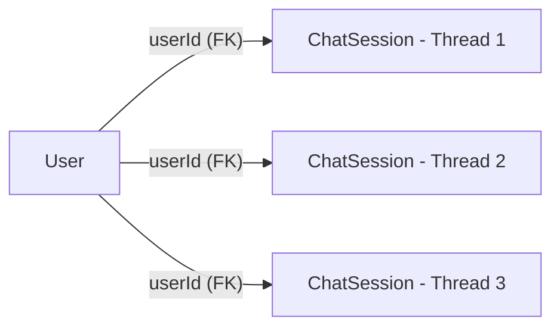

- **Cardinality**: One User can have many chat sessions (one per conversation thread).
- **Sorted by**: `updatedAt -1` (most recently active thread shown first).
- **LangGraph link**: Each ChatSession's `threadId` is the key to restoring the conversation in LangGraph's MongoDB checkpointer.

---

### `User` → `DirectMessage` (Bidirectional One-to-Many)

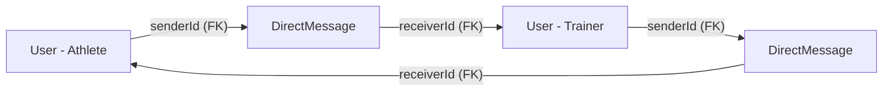

- **Cardinality**: A User appears in DirectMessage both as `senderId` and as `receiverId`.
- **Bidirectional fetch**: `$or: [{ senderId: A, receiverId: B }, { senderId: B, receiverId: A }]`

---

## Complete Data Flows

### Flow 1 — Local Signup & Onboarding

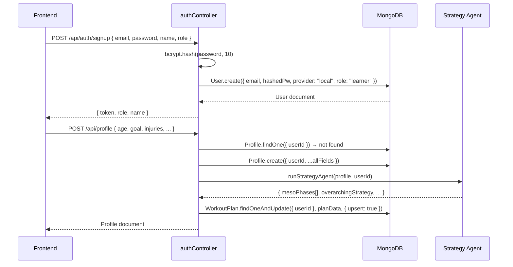

---

### Flow 2 — Google OAuth Login

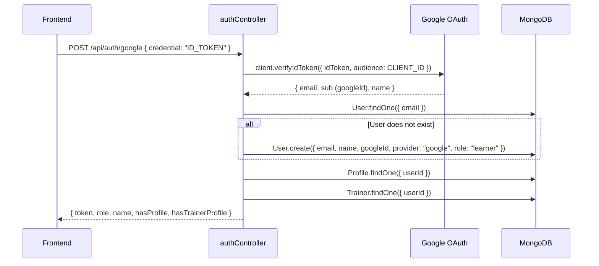

---

### Flow 3 — AI Workout Plan Generation (Foundation Flow)

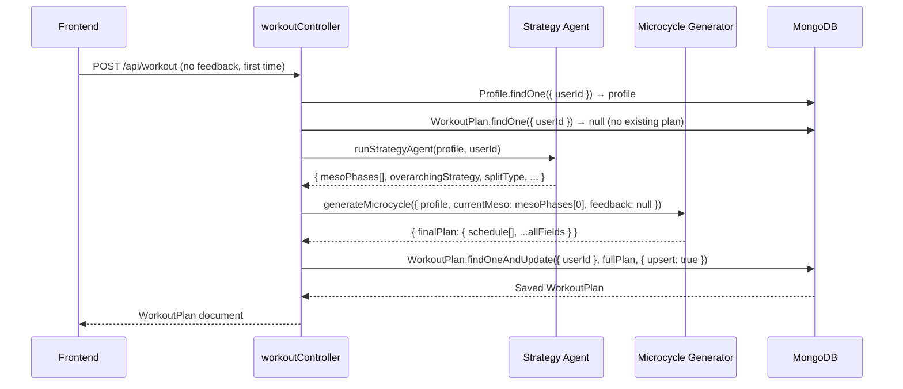

---

### Flow 4 — AI Workout Plan Evolution (Feedback Loop)

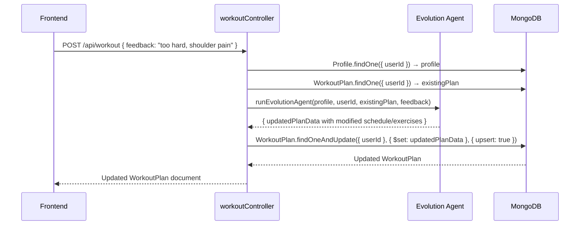

---

### Flow 5 — AI Chat with Streaming & Memory

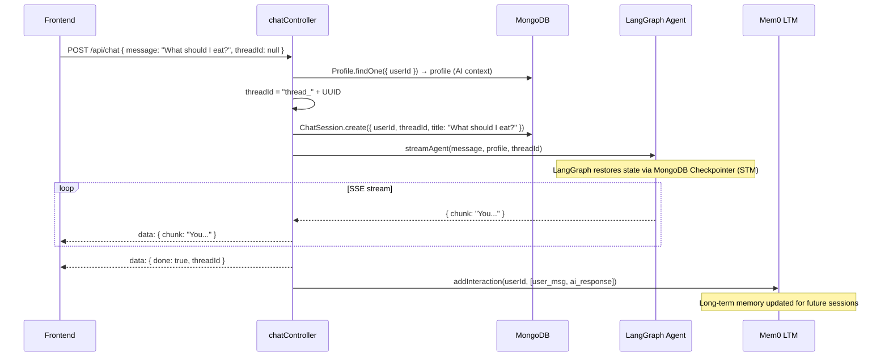

---

### Flow 6 — Real-Time Trainer ↔ Athlete Messaging

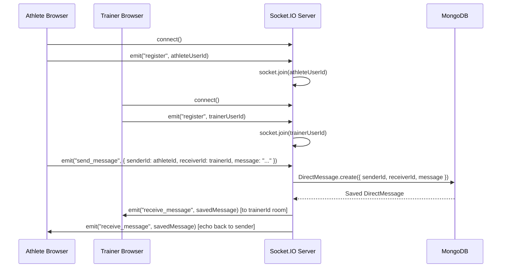

---

### Flow 7 — Trainer Connects to a Client

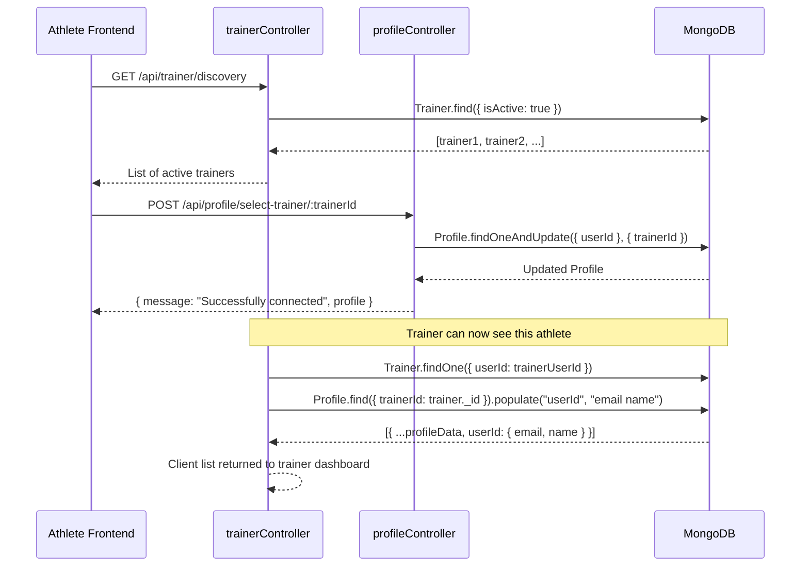

---
