# FitMate — User Flow

**Version:** 1.0
**Date:** July 2026
**Status:** Active Development
**Audience:** Product, Design, Engineering

---

## Overview

This document maps every major user journey within FitMate v1 for both user roles: **Athlete** and **Trainer**. Each flow is broken into sequential steps, branching decision points, and the system actions triggered behind the scenes.

---

## Role Index

| Role    | How role is assigned                                     | Core Flows                                                          |
| ------- | -------------------------------------------------------- | ------------------------------------------------------------------- |
| Learner | Default on registration (email/password or Google OAuth) | Auth, Onboarding, AI Plan Generation, Workout Logging, Chat         |
| Trainer | Promoted from`learner` when Trainer Profile is created | Trainer Profile Setup, Marketplace Listing, Client Management, Chat |

> **Note:** There is no role selection during registration. Every new user starts as `learner`. A user becomes a `trainer` only by explicitly creating a Trainer Profile (`POST /api/trainer/profile`).

---

## Flow 1 — Authentication

### 1.1 Registration

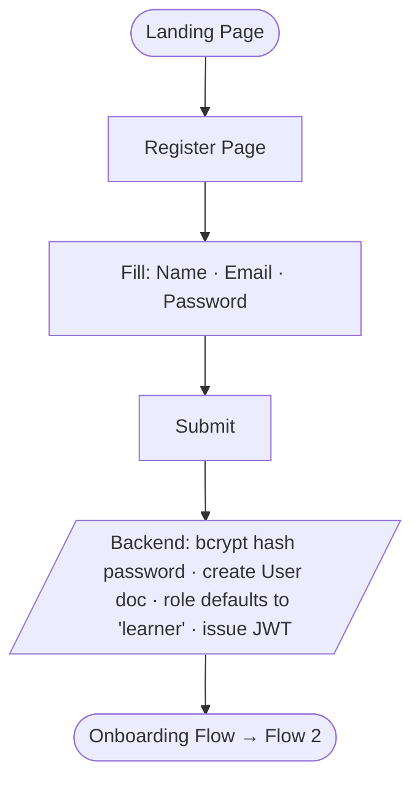

### 1.2 Google OAuth

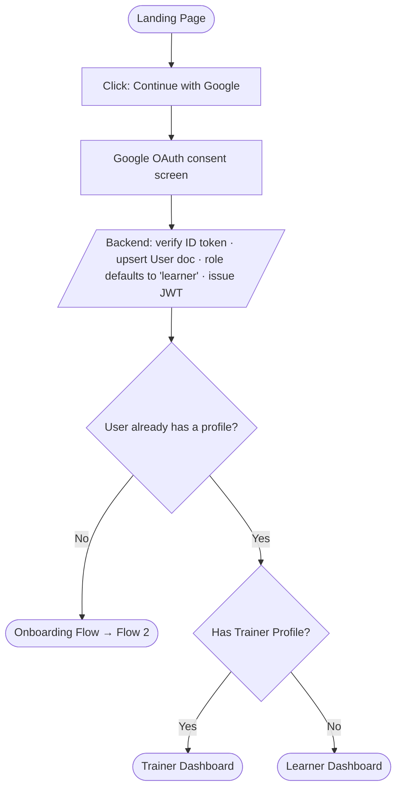

### 1.3 Login

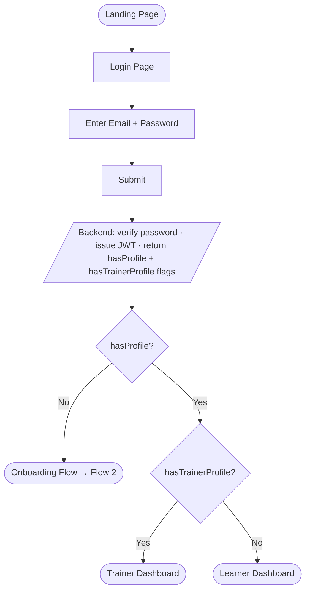

---

## Flow 2 — Onboarding (Physical Profile Setup)

*Triggered for every new user (role: `learner`) who does not yet have a PhysicalProfile. Detected via the `hasProfile: false` flag returned by login/Google auth.*

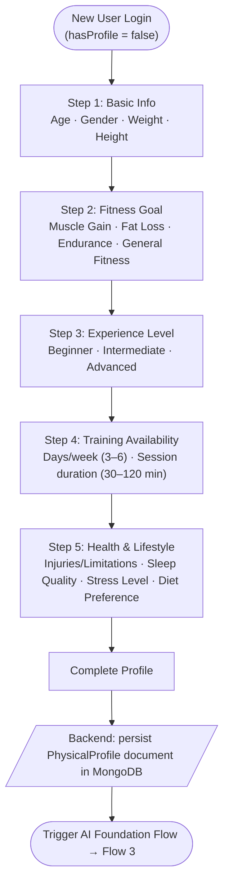

---

## Flow 3 — AI Workout Plan Generation

### 3.1 Foundation Flow (First-Time Plan)

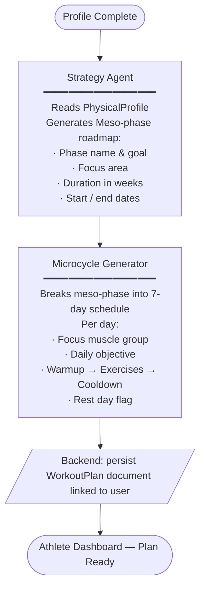

### 3.2 Evolution Flow (Plan Adaptation)

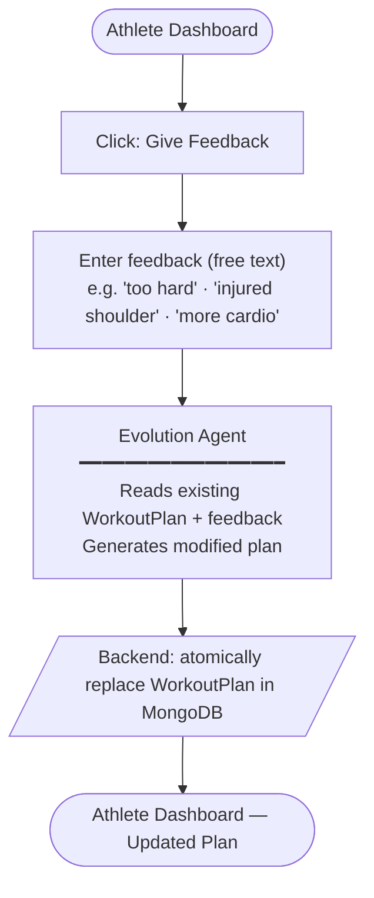

---

## Flow 4 — Workout Logging

*Daily interaction loop for the Athlete.*

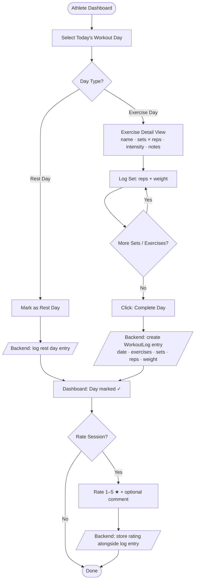

---

## Flow 5 — Trainer Marketplace & Client Management

### 5.1 Becoming a Trainer (Role Promotion)

*Any learner can opt in to become a trainer by creating a Trainer Profile. This is the **only** way the role changes from `learner` to `trainer`.*

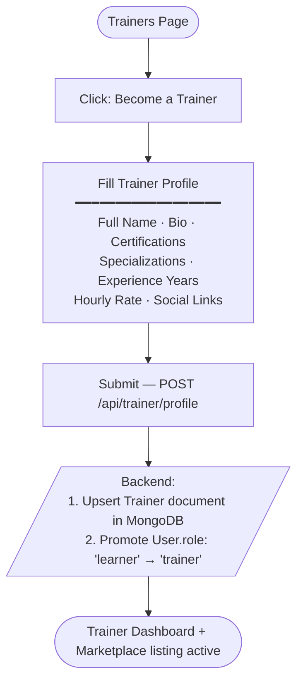

### 5.2 Athlete Discovers & Contacts Trainer

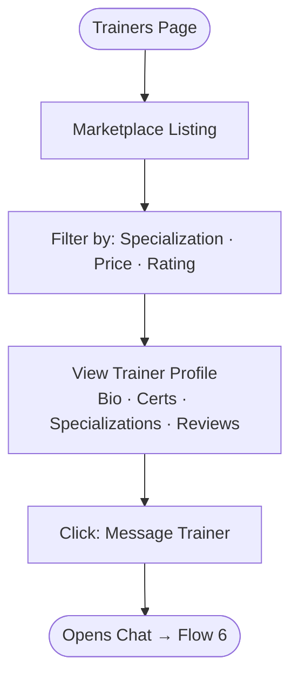

### 5.3 Trainer Client Management

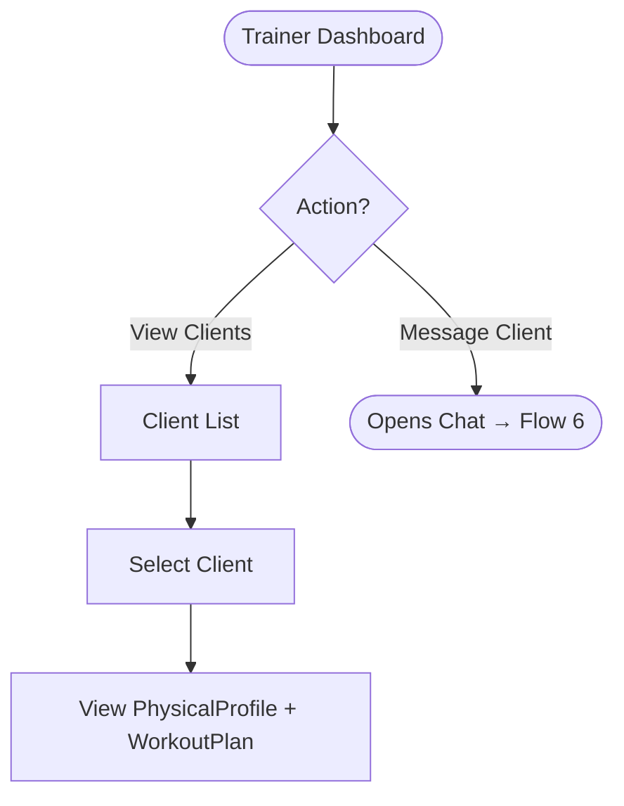

---

## Flow 6 — Real-Time Messaging

*Available between Athlete ↔ Trainer pairs.*

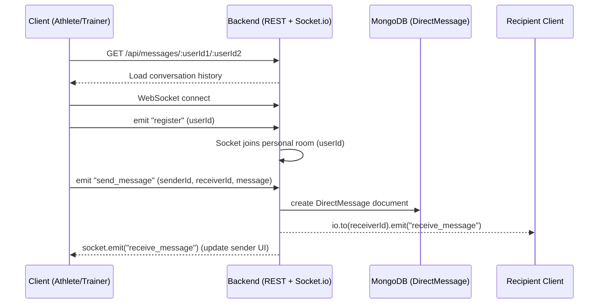

---

## Flow 7 — AI Chat (Athlete ↔ AI Coach)

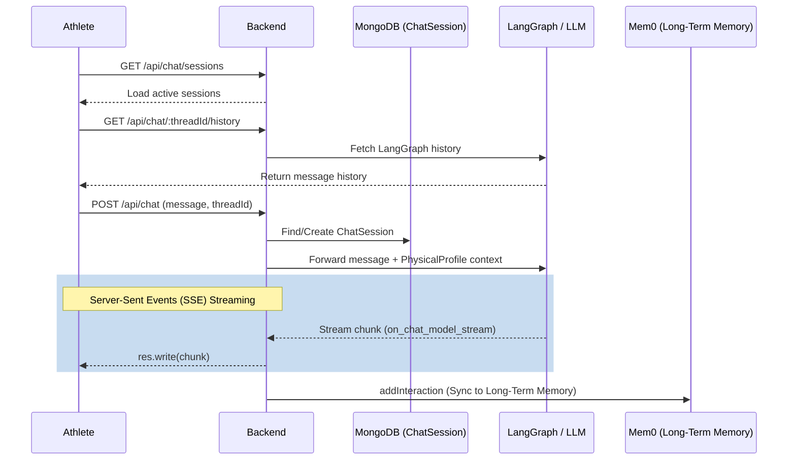

---

## Flow 8 — Profile & Settings Management

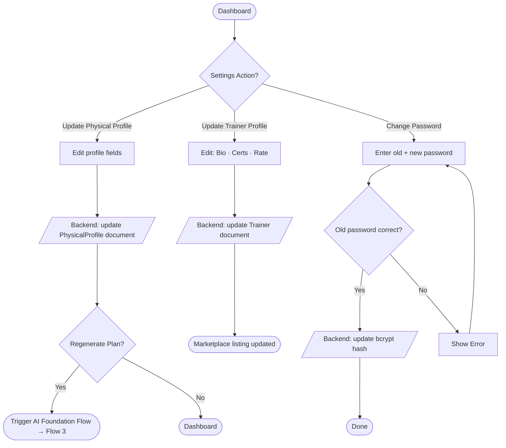

---

## Decision Points Summary

| Decision                             | Outcome A                                                    | Outcome B                        |
| ------------------------------------ | ------------------------------------------------------------ | -------------------------------- |
| `hasProfile` flag on login?        | `false` → Force Onboarding (Flow 2)                       | `true` → Proceed to dashboard |
| `hasTrainerProfile` flag on login? | `true` → Trainer Dashboard                                | `false` → Learner Dashboard   |
| Plan exists after onboarding?        | No → Trigger Foundation Flow                                | Yes → Show existing plan        |
| User submits feedback on plan?       | Yes → Trigger Evolution Flow                                | No → Plan unchanged             |
| Day type in workout plan?            | Exercise Day → Log sets                                     | Rest Day → Mark complete        |
| Messaging partner?                   | Human Trainer → WebSocket chat                              | AI → LLM chat session           |
| Learner opts in to become a trainer? | Yes → Create Trainer Profile → role promoted to`trainer` | No → Stays as`learner`        |

---

## System Touchpoints

| Flow               | Key System Actions                                                      |
| ------------------ | ----------------------------------------------------------------------- |
| Auth               | JWT issuance, bcrypt hashing, role-based redirect                       |
| Onboarding         | PhysicalProfile document creation in MongoDB                            |
| AI Plan Generation | Strategy Agent + Microcycle Generator → WorkoutPlan stored in MongoDB  |
| Workout Logging    | WorkoutLog entry per day, session rating persisted                      |
| Marketplace        | Trainer document indexed for listing, athlete ↔ trainer linking        |
| Real-time Chat     | Socket.io WebSocket rooms, `DirectMessage` documents in MongoDB         |
| AI Chat            | SSE streaming, LangGraph history, `ChatSession` in MongoDB, Mem0 memory |

---

*Last updated: July 2026 — FitMate v1.0*
