# AuthModal.tsx — Deep Dive

> **File:** `frontend/src/components/auth/AuthModal.tsx`
> This document explains the design decisions, component architecture, state management, and both authentication flows handled by the `AuthModal` component.

---

## Table of Contents

1. [What is AuthModal?](#1-what-is-authmodal)
2. [Props Interface](#2-props-interface)
3. [Component State](#3-component-state)
4. [Rendering Logic](#4-rendering-logic)
5. [Signup Flow (Local Auth)](#5-signup-flow-local-auth)
6. [Login Flow (Local Auth)](#6-login-flow-local-auth)
7. [Google OAuth Flow](#7-google-oauth-flow)
8. [View Toggle (Login ↔ Signup)](#8-view-toggle-login--signup)
9. [Full Component State Machine](#9-full-component-state-machine)
10. [Design Decisions &amp; Trade-offs](#10-design-decisions--trade-offs)

---

## 1. What is AuthModal?

`AuthModal` is the **single unified component** that handles all user authentication in FitMate. It handles:

- **Local Signup** — `name, email, password` → `POST /api/auth/signup`
- **Local Login** — `email, password` → `POST /api/auth/login`
- **Google OAuth** — Google ID Token → `POST /api/auth/google`

It is a **modal** (overlay dialog) that can be opened from anywhere in the app. It is designed to be completely **reusable** — it doesn't hardcode navigation or know about the app's routing. Instead it calls an `onSuccess` callback provided by the parent.

> **Key fact:** The modal only ever asks for **Name, Email, Password**. There is no role selection. All users sign up as `"learner"` — trainers upgrade their account separately after authentication.

### Why is it being used?

The `AuthModal` is used to provide a seamless, non-disruptive authentication experience. Instead of redirecting users to a dedicated login or signup page, the modal allows them to authenticate in the context of their current flow. This reduces friction and prevents users from losing their place in the application, which is especially important for actions that require immediate authentication (e.g., trying to book a trainer while browsing).

### Our Current Strategy and Where It Fits

Our current strategy revolves around **contextual authentication** and **progressive profiling**.
- **Contextual Authentication:** By using a modal, we can prompt for authentication exactly when it's needed (e.g., clicking a restricted action) without navigating away. This fits perfectly into a conversion-optimized flow where keeping the user engaged is paramount.
- **Unified Entry Point:** It consolidates all authentication methods (Local, OAuth) into a single, maintainable UI component.
- **Role Deferral:** As part of our progressive profiling strategy, everyone signs up as a "learner" by default. The modal fits this by keeping the initial signup incredibly lightweight, deferring complex role-specific onboarding (like Trainer setup) to a later stage.

---

## 2. Props Interface

```typescript
interface AuthModalProps {
  
  isOpen: boolean;
  
  onClose: () => void;
  
  initialView?: 'login' | 'signup';
  
  onSuccess: (hasProfile: boolean) => void;
  
}
```

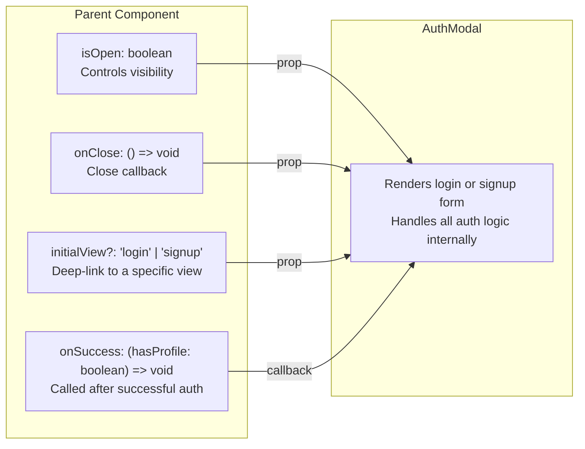

**Props Explanation:**

| Prop            | Type                              | Purpose                                   | Design Decision                                                                                                            |
| :-------------- | :-------------------------------- | :---------------------------------------- | :------------------------------------------------------------------------------------------------------------------------- |
| `isOpen`      | `boolean`                       | Controls whether the modal renders at all | When`false`, `return null` — no DOM presence, no trapped focus                                                        |
| `onClose`     | `() => void`                    | Called when the X button is clicked       | Modal never closes itself — parent controls visibility state                                                              |
| `initialView` | `'login' \| 'signup'`            | Which tab to show first                   | Optional — defaults to`'login'`. Allows parent to deep-link to signup (e.g. "Get Started" button opens signup directly) |
| `onSuccess`   | `(hasProfile: boolean) => void` | Called after any successful auth          | **Key design decision:** Modal delegates ALL routing to the parent. This keeps it reusable.                          |

---

## 3. Component State

```typescript
const [view, setView]         = useState<'login' | 'signup'>(initialView);
const [authData, setAuthData] = useState({ name: '', email: '', password: '' });
const [error, setError]       = useState('');
const [loading, setLoading]   = useState(false);
```

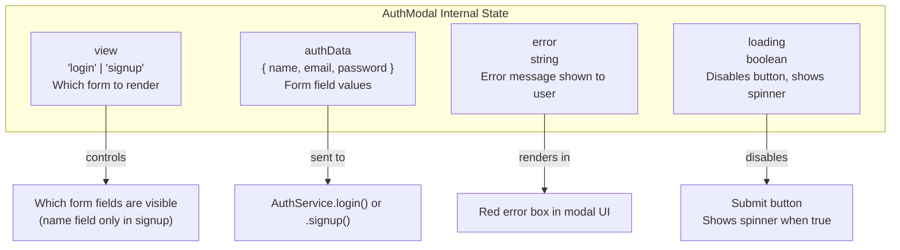

**State Explanation:**

| State        | Initial Value                             | When it changes                                       | Why it matters                                                                 |
| :----------- | :---------------------------------------- | :---------------------------------------------------- | :----------------------------------------------------------------------------- |
| `view`     | `initialView` (default `'login'`)     | User clicks "Sign up" / "Log in" toggle               | Determines which form fields render and which API to call                      |
| `authData` | `{ name: '', email: '', password: '' }` | Every keystroke in any input                          | Single object reset — easier to wipe on modal open than 3 separate state vars |
| `error`    | `''`                                    | Set on API failure, cleared on new submit             | Empty string = no error box shown. Any string = error box renders              |
| `loading`  | `false`                                 | Set`true` before API call, `false` in `finally` | Prevents double-submission. The button is disabled while`loading === true`   |

**Reset on modal open:**

```typescript
useEffect(() => {
  if (isOpen) {
    setView(initialView);
    setError('');
    setAuthData({ name: '', email: '', password: '' });
  }
}, [isOpen, initialView]);
```

> **Why this exists:** If a user fills in wrong credentials, closes the modal, then opens it again — stale values and error messages shouldn't persist. The `useEffect` wipes state every time `isOpen` becomes `true`.

---

## 4. Rendering Logic

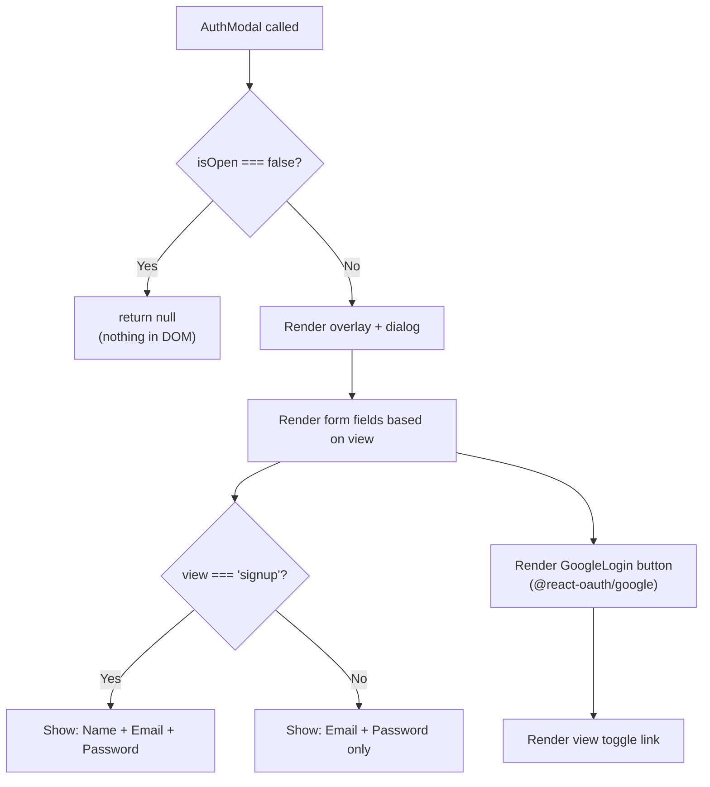

**Diagram Explanation:**

| Step                 | What happens                                                  | Technical detail                                                    |
| :------------------- | :------------------------------------------------------------ | :------------------------------------------------------------------ |
| `isOpen === false` | Returns`null` immediately                                   | No DOM node attached — prevents focus trap and unnecessary renders |
| Overlay rendered     | Full-screen semi-transparent backdrop                         | `fixed inset-0 z-[100]` — sits above all other content           |
| Form fields          | Conditionally shows`Name` field                             | `{view === 'signup' && <div>Name field</div>}`                    |
| Google button        | Always visible                                                | Uses`GoogleLogin` from `@react-oauth/google`                    |
| View toggle          | "Don't have an account? Sign up" / "Already a member? Log in" | Calls`setView(...)` — no navigation                              |

---

## 5. Signup Flow (Local Auth)

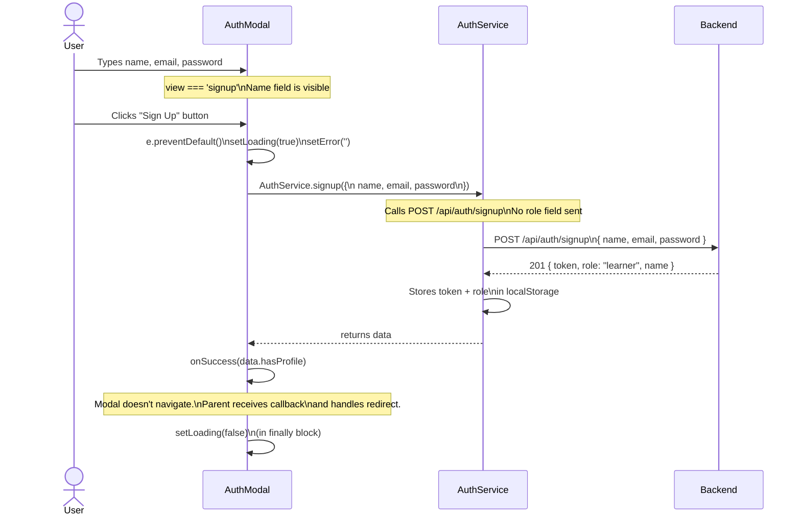

**Diagram Explanation:**

| Step                                 | Code                                    | Interview Talking Point                                              |
| :----------------------------------- | :-------------------------------------- | :------------------------------------------------------------------- |
| `e.preventDefault()`               | Stops page reload on form submit        | Standard React form pattern                                          |
| `setLoading(true)`                 | Disables button immediately             | Prevents double-click / duplicate API calls                          |
| `setError('')`                     | Clears previous error                   | Fresh attempt shouldn't show stale errors                            |
| `AuthService.signup(authData)`     | Only sends`{ name, email, password }` | **No role sent** — backend defaults to `"learner"`          |
| `onSuccess(data.hasProfile)`       | Callback to parent                      | Modal doesn't know about routing — parent decides where to redirect |
| `setLoading(false)` in `finally` | Always runs — success or failure       | Guarantees button is re-enabled even if API throws                   |

---

## 6. Login Flow (Local Auth)

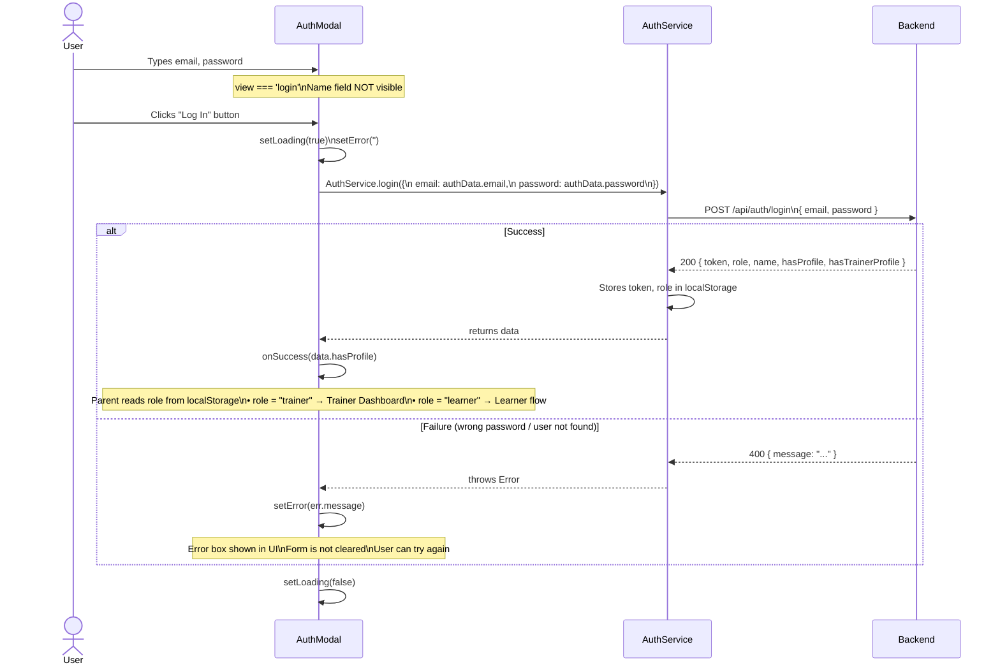

**Diagram Explanation:**

| Step                                       | Code                                       | Interview Talking Point                                                |
| :----------------------------------------- | :----------------------------------------- | :--------------------------------------------------------------------- |
| Name field hidden                          | `view !== 'signup'` conditional          | Same`authData` object — `name` is just ignored on login           |
| `AuthService.login({ email, password })` | Destructures from`authData`              | Note:`name` is in `authData` too but we only pass what login needs |
| `onSuccess(data.hasProfile)`             | Parent reads`userRole` from localStorage | Role-based redirect is the parent's responsibility — modal is unaware |
| `setError(err.message)` in `catch`     | Shown in the red error box                 | Form values are preserved — user can correct and retry                |

---

## 7. Google OAuth Flow

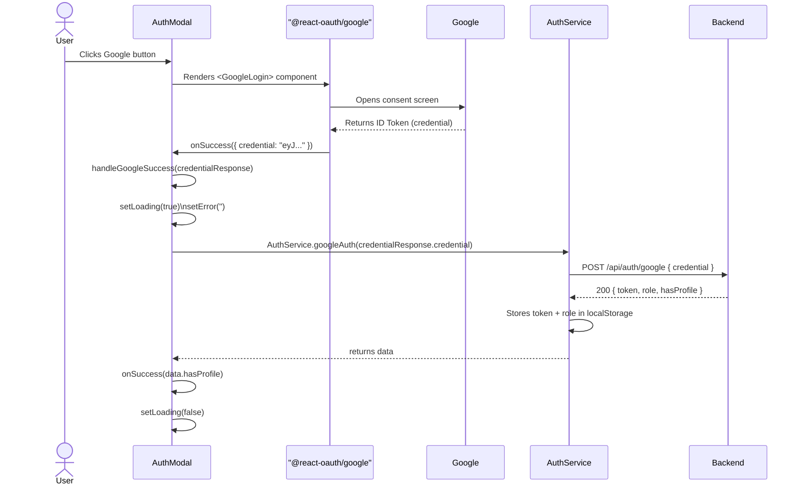

**Diagram Explanation:**

| Step                                                | Code                              | Interview Talking Point                                                         |
| :-------------------------------------------------- | :-------------------------------- | :------------------------------------------------------------------------------ |
| `<GoogleLogin onSuccess={handleGoogleSuccess}>`   | From`@react-oauth/google`       | We use Google's official button — not building OAuth redirect manually         |
| `credentialResponse.credential`                   | The Google ID Token (a JWT)       | This is OpenID Connect — NOT an OAuth2 access token                            |
| `AuthService.googleAuth(credential)`              | Passes the token to our backend   | Backend verifies the token signature against Google's public keys               |
| Same`onSuccess(data.hasProfile)` callback         | Merges into the same success path | Google auth and local auth converge at the same callback — consistent behavior |
| `onError={() => setError('Google Login Failed')}` | Google SDK error handler          | Handles consent cancellation, blocked popups, etc.                              |

---

## 8. View Toggle (Login ↔ Signup)

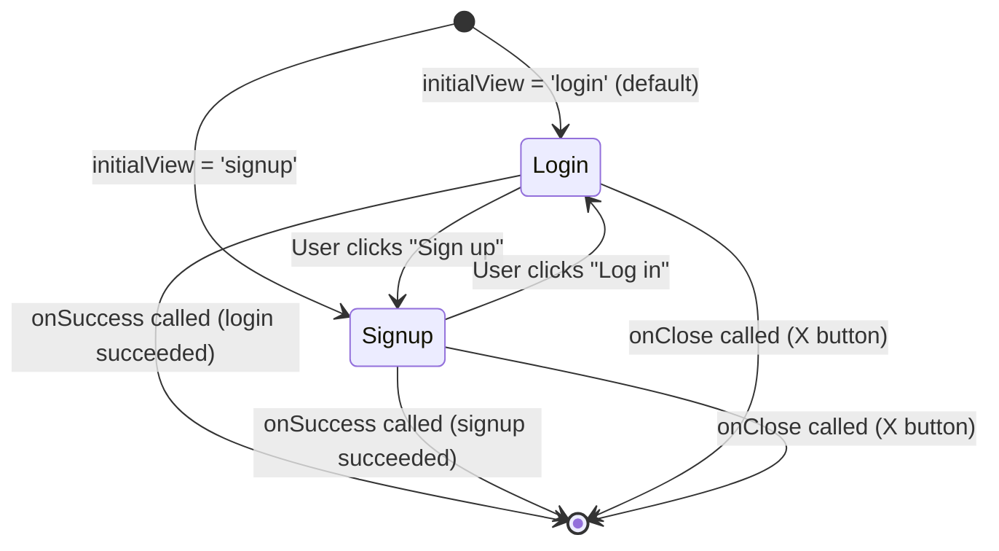

**What changes when view toggles:**

| Element            | Login view                                | Signup view                                 |
| :----------------- | :---------------------------------------- | :------------------------------------------ |
| Modal title        | "Log In"                                  | "Create Account"                            |
| Subtitle           | "Log in to your FitCoach Pro account..."  | "Join the next generation of AI-powered..." |
| Name field         | Hidden                                    | Visible                                     |
| Submit button text | "Log In"                                  | "Sign Up"                                   |
| API called         | `AuthService.login()`                   | `AuthService.signup()`                    |
| Toggle link text   | "Don't have an account?**Sign up**" | "Already a member?**Log in**"         |

---

## 9. Full Component State Machine

This diagram shows every possible state the `AuthModal` can be in:

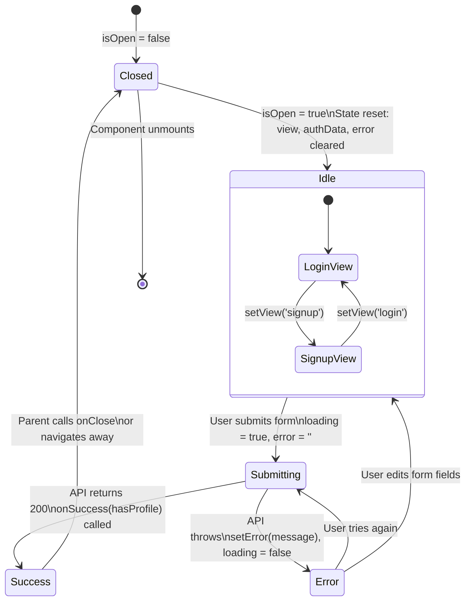

**State Explanation:**

| State          | What the user sees               | What the component is doing             |
| :------------- | :------------------------------- | :-------------------------------------- |
| `Closed`     | Nothing                          | `return null` — zero DOM presence    |
| `Idle`       | Form ready to fill               | No pending operations                   |
| `Submitting` | Button disabled, spinner visible | API call in-flight                      |
| `Success`    | Modal closes / app navigates     | `onSuccess` callback fired to parent  |
| `Error`      | Red error box, form still filled | Error message displayed, user can retry |

---

## 10. Design Decisions & Trade-offs

### Decision 1: No Role Selection at Signup

**Current:** The modal collects only `name, email, password`. No role field. Everyone starts as `"learner"`.

**Why:** Trainers are a minority of users. Adding a role selector to the signup form adds friction for the majority (learners). Trainers upgrade their account after authenticating by filling out their trainer profile (`POST /api/trainer/profile`).

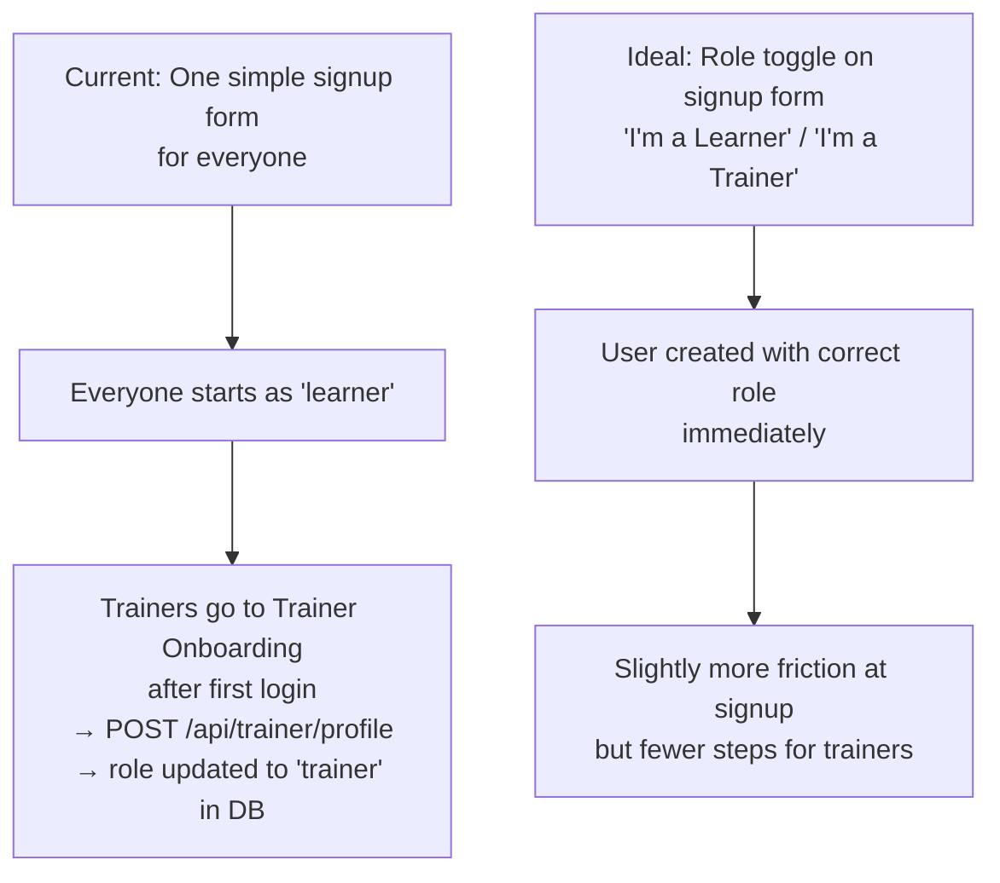

| Option                                   | Pro                      | Con                                                   |
| :--------------------------------------- | :----------------------- | :---------------------------------------------------- |
| **Current: Default to 'learner'**  | Minimal signup friction  | Trainer needs a second step                           |
| **Ideal: Role selector at signup** | Correct role immediately | Extra UI complexity, friction for majority (learners) |

---

### Decision 2: `onSuccess` Callback Instead of Internal Navigation

**Current:** After successful auth, `AuthModal` calls `onSuccess(hasProfile)`. The **parent** decides where to navigate.

**Why not use `useNavigate()` inside the modal?**

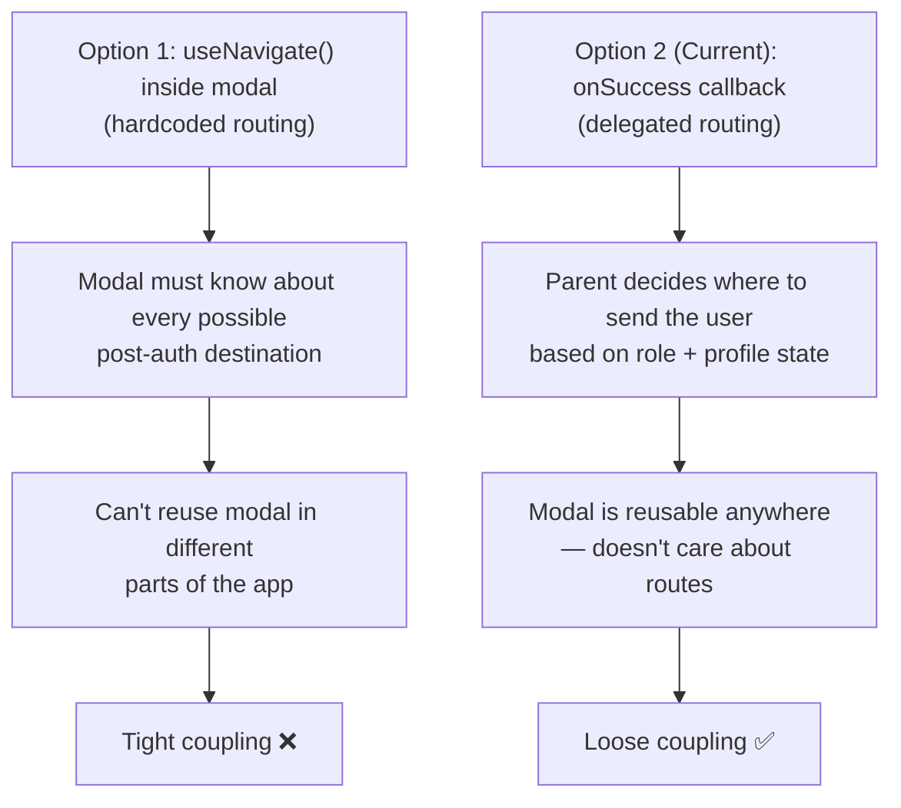

| Option                                     | Pro                                        | Con                                                                       |
| :----------------------------------------- | :----------------------------------------- | :------------------------------------------------------------------------ |
| **`useNavigate()` inside modal**   | Simpler                                    | Tight coupling — can't reuse modal without changing its navigation logic |
| **`onSuccess` callback (current)** | Fully decoupled — parent controls routing | Parent must handle the redirect logic                                     |

---

### Decision 3: Single Unified `handleSubmit` for Login + Signup

**Current:** One `handleSubmit` function handles both flows, branching on `view`:

```typescript
if (view === 'signup') {
  data = await AuthService.signup(authData);
} else {
  data = await AuthService.login({ email: authData.email, password: authData.password });
}
```

**Why not two separate handlers?**

| Option                             | Pro                                               | Con                                                            |
| :--------------------------------- | :------------------------------------------------ | :------------------------------------------------------------- |
| **Single handler (current)** | Shared`loading` + `error` + `finally` logic | Requires a branch condition                                    |
| **Two separate handlers**    | Each handler is pure                              | Duplicate`setLoading`, `setError`, `finally` boilerplate |

---

### Decision 4: HTML5 Validation vs. Schema Validation

**Current:** The form uses HTML5 `required` and `type="email"` attributes for validation.

**Ideal:** A library like `zod` + `react-hook-form` would provide:

- Password strength enforcement
- Real-time field-level error messages
- Uncontrolled inputs (better performance)

**Why current is acceptable:**

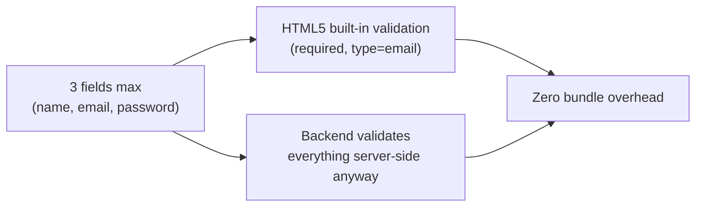

> The form is simple enough that a validation library would add more overhead than value at this stage.
