# Authentication (AuthN) in FitMate

> **"Who are you?"**
> This document covers exactly how FitMate verifies user identity — the two flows implemented, how JWTs are generated, and the real challenges that came up.

---

## Table of Contents

1. [What is Authentication?](#1-what-is-authentication)
2. [System Overview — Auth Only](#2-system-overview--auth-only)
3. [Flow 1: Local Auth (Email + Password)](#3-flow-1-local-auth-email--password)
   - [Signup](#31-signup)
   - [Login &amp; Role-Based Redirect](#32-login--role-based-redirect)
4. [Flow 2: Google OAuth (Social Login)](#4-flow-2-google-oauth-social-login)
5. [The Trainer Registration Flow (Post-Auth)](#5-the-trainer-registration-flow-post-auth)
6. [JWT Token Lifecycle](#6-jwt-token-lifecycle)
7. [The Provider Field: Account Takeover Prevention](#7-the-provider-field-account-takeover-prevention)
8. [Frontend Authentication Flow (AuthModal)](#8-frontend-authentication-flow-authmodal)
9. [Challenges &amp; Trade-offs](#9-challenges--trade-offs)

---

## 1. What is Authentication?

Authentication answers the question: **"Who are you?"**
It verifies that the person making a request is who they claim to be, before any permissions are checked.

In FitMate, a user is considered authenticated once they receive a **JWT token** — signed by the server using `JWT_SECRET`.

---

## 2. System Overview — Auth Only

This diagram shows only the authentication layer (login, signup, Google OAuth). Authorization is a separate concern.

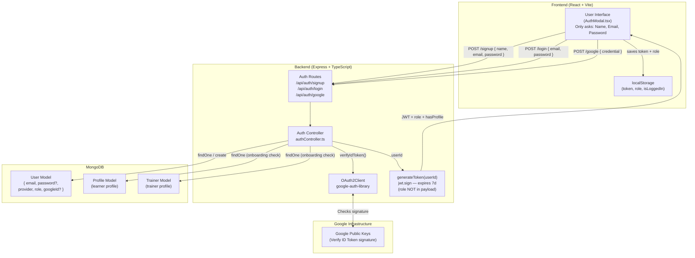

**Diagram Explanation:**

| Component / Step                | Description                            | Technical Implementation in FitMate                                              | Why it matters for Interviews                                   |
| :------------------------------ | :------------------------------------- | :------------------------------------------------------------------------------- | :-------------------------------------------------------------- |
| **Frontend (AuthModal)**  | Single modal for login + signup        | Only collects Name, Email, Password —**never asks for role**              | Shows you understand low-friction UX and separation of concerns |
| **Auth Routes**           | Entry points for identity verification | Express router exposing`/signup`, `/login`, `/google`                      | Demonstrates RESTful API design knowledge                       |
| **Auth Controller**       | Core logic handler                     | Orchestrates DB calls, Google verification, JWT signing                          | Proves MVC pattern understanding                                |
| **generateToken()**       | JWT factory                            | Signs`{ userId }` only — role excluded deliberately                           | Role excluded = no stale permission problem                     |
| **MongoDB Models**        | Storage layer                          | `User` (identity+role), `Profile` (learner data), `Trainer` (trainer data) | Shows normalization and separation of concerns                  |
| **Google Infrastructure** | Third-party identity provider          | Google's OAuth servers for token verification                                    | Demonstrates OpenID Connect knowledge                           |

---

## 3. Flow 1: Local Auth (Email + Password)

### 3.1 Signup

> **Key fact:** The signup form (`AuthModal.tsx`) asks for **Name, Email, Password only**. There is **no role selection**. Every new user — whether they intend to be a trainer or learner — starts as `"learner"`. Trainer registration is a separate, post-auth step.

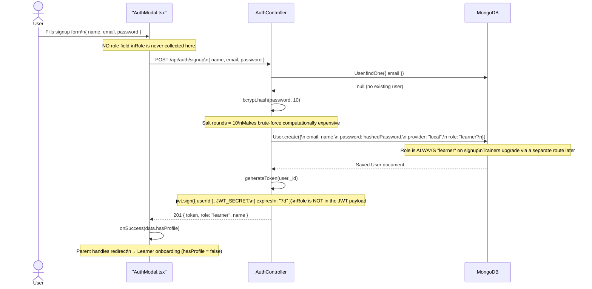

**Diagram Explanation:**

| Step        | Action                 | Technical Detail                         | Interview Talking Point                                                                      |
| :---------- | :--------------------- | :--------------------------------------- | :------------------------------------------------------------------------------------------- |
| **1** | User fills signup form | `{ name, email, password }` — no role | "I keep signup friction low — everyone starts as a learner. Trainers upgrade separately."   |
| **2** | Check existence        | `User.findOne({ email })`              | Prevents duplicate accounts                                                                  |
| **3** | Hash Password          | `bcrypt.hash(password, 10)`            | Never store plaintext. Salt rounds of 10 = industry-standard security/speed balance          |
| **4** | Save to DB             | `role: "learner"` always               | Even future trainers start here. The`provider: "local"` flag prevents Google-auth takeover |
| **5** | Generate JWT           | `jwt.sign({ userId })` — 7d expiry    | Stateless. Role NOT in token — fetched from DB per request                                  |
| **6** | Success callback       | `onSuccess(data.hasProfile)`           | Modal delegates routing to parent — keeps it reusable                                       |

### 3.2 Login & Role-Based Redirect

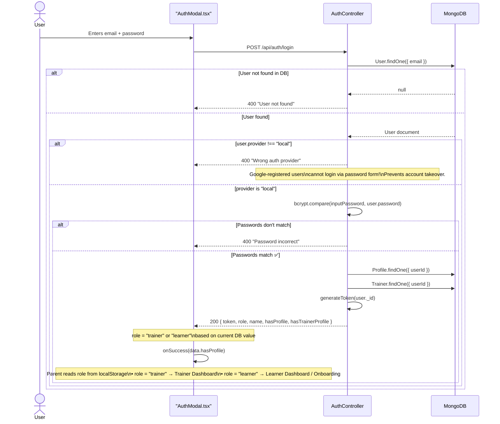

**Diagram Explanation:**

| Step        | Action                      | Technical Detail                              | Interview Talking Point                                                                                        |
| :---------- | :-------------------------- | :-------------------------------------------- | :------------------------------------------------------------------------------------------------------------- |
| **1** | `User.findOne({ email })` | Lookup by email                               | Generic error message — never confirm whether email exists (prevents email enumeration)                       |
| **2** | Provider check              | `user.provider !== "local"` → reject       | **Security critical:** A Google-registered account has no password. This check prevents brute-forcing it |
| **3** | `bcrypt.compare()`        | Compares input against stored hash            | Cryptographically safe, timing-safe comparison                                                                 |
| **4** | Onboarding check            | `Profile.findOne()` + `Trainer.findOne()` | Backend tells frontend exactly what state the user is in                                                       |
| **5** | Role-based redirect         | `role` returned → frontend redirects       | If`role === "trainer"` → Trainer Dashboard. If `"learner"` → learner flow                                |

**Post-login redirect logic:**

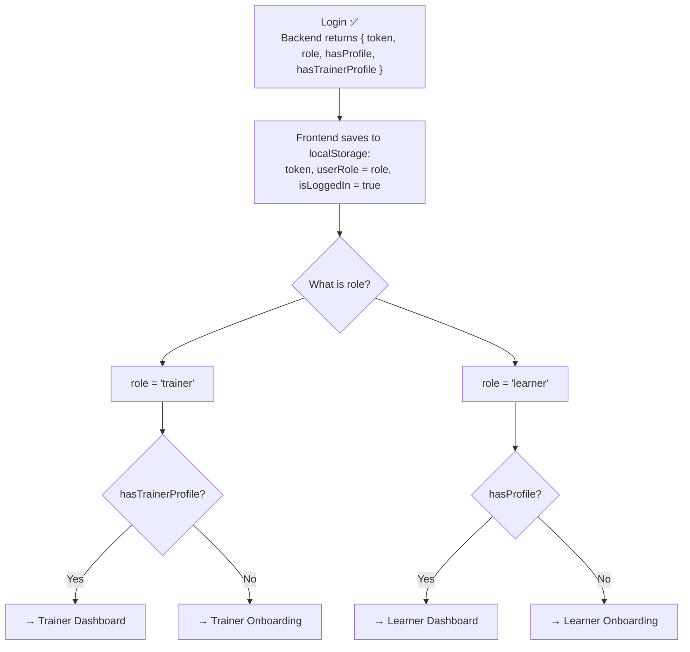

---

## 4. Flow 2: Google OAuth (Social Login)

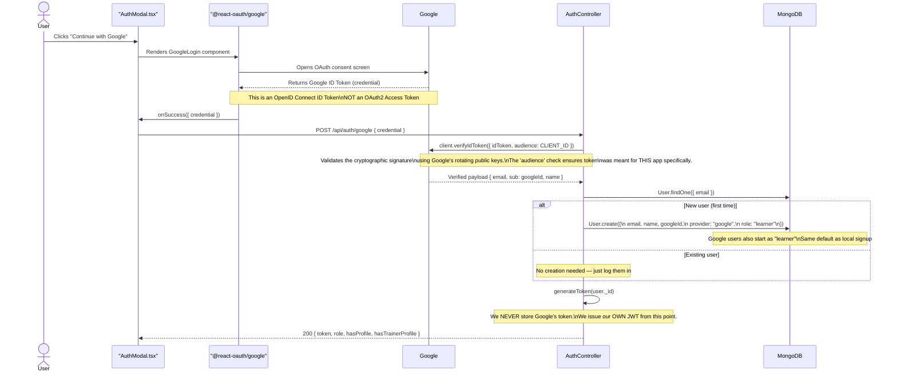

**Diagram Explanation:**

| Step        | Action             | Technical Detail                                | Interview Talking Point                                                     |
| :---------- | :----------------- | :---------------------------------------------- | :-------------------------------------------------------------------------- |
| **1** | Consent Screen     | `@react-oauth/google` SDK renders the button  | We use Google's official SDK — not building OAuth redirect manually        |
| **2** | Receive Credential | Google returns an ID Token (JWT)                | OpenID Connect (identity), not OAuth 2.0 (authorization)                    |
| **3** | Verify Token       | `client.verifyIdToken({ idToken, audience })` | We verify the signature server-side — never trust the client blindly       |
| **4** | Handle User in DB  | Find or create with`role: "learner"`          | Google users default to learner — identical to local signup                |
| **5** | Issue Custom JWT   | `generateToken(user._id)`                     | We discard Google's token. We issue our own — we control expiry and claims |

---

## 5. The Trainer Registration Flow (Post-Auth)

> This is **NOT** part of auth. A user must already be logged in as a `"learner"` to do this. This is how a learner becomes a trainer.

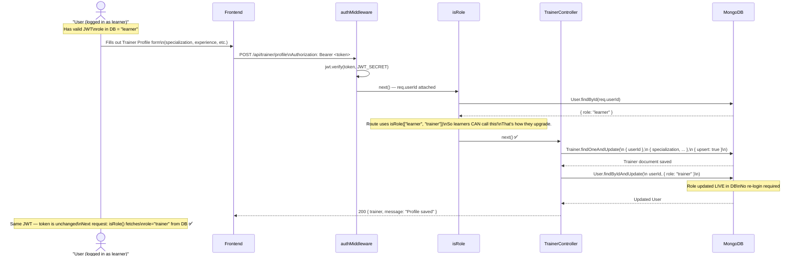

**Diagram Explanation:**

| Step        | Action                                          | Technical Detail                           | Interview Talking Point                                                     |
| :---------- | :---------------------------------------------- | :----------------------------------------- | :-------------------------------------------------------------------------- |
| **1** | Already logged in as learner                    | Has a valid JWT,`role = "learner"` in DB | Trainers sign up identically to learners — no separate signup form         |
| **2** | `isRole(["learner", "trainer"])`              | Learner role passes!                       | Deliberately designed so learners can call this route to promote themselves |
| **3** | `Trainer.findOneAndUpdate(upsert)`            | Creates the trainer profile document       | Upsert = idempotent — calling it again just updates, doesn't duplicate     |
| **4** | `User.findByIdAndUpdate({ role: "trainer" })` | Updates role in DB                         | JWT doesn't change, but`isRole()` fetches fresh from DB on next request   |
| **5** | Seamless access                                 | Next request to trainer routes just works  | This is why role is NOT in the JWT — so role changes are instant           |

---

## 6. JWT Token Lifecycle

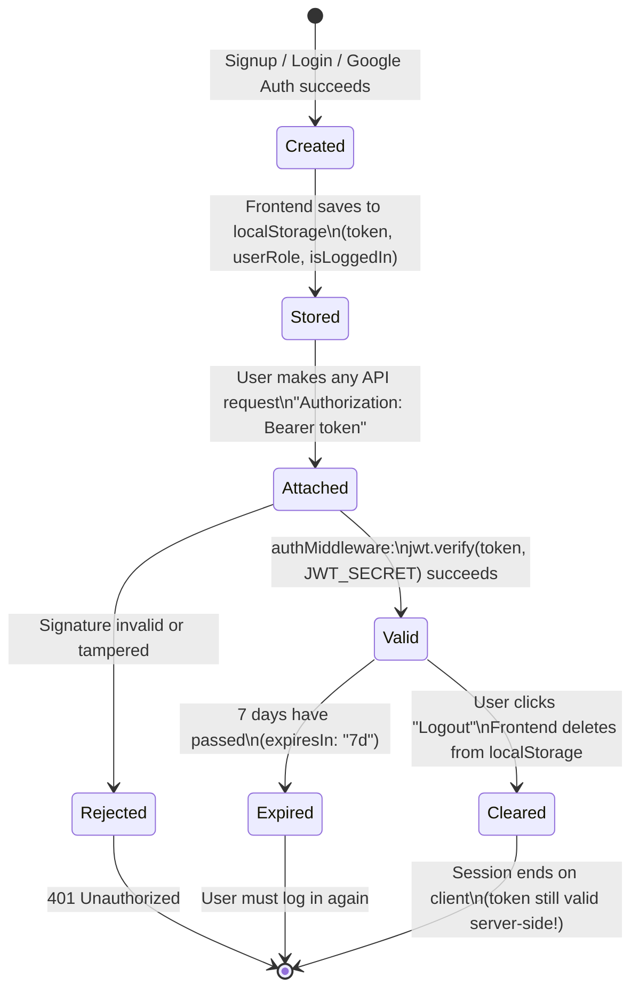

**What the JWT actually contains in FitMate:**

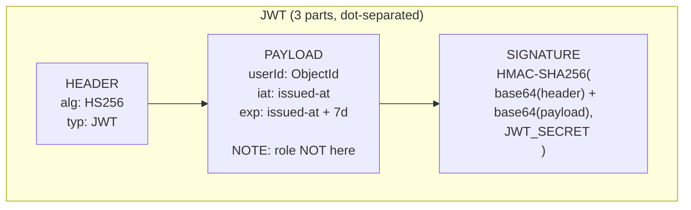

**Diagram Explanation (Lifecycle & Structure):**

| State / Component            | Description                                                        | Why it matters for Interviews                                                |
| :--------------------------- | :----------------------------------------------------------------- | :--------------------------------------------------------------------------- |
| **Created → Stored**  | Token generated by server, stored in`localStorage`               | Discuss HttpOnly cookies as XSS-safe alternative                             |
| **Header**             | Specifies algorithm (`HS256`)                                    | Symmetric — same secret for sign and verify                                 |
| **Payload**            | Contains`userId`, `iat`, `exp` — **role is excluded** | Role excluded = no stale permission problem when user is promoted to trainer |
| **Signature**          | `HMAC-SHA256(header + payload, SECRET)`                          | Cryptographic guarantee token hasn't been tampered with                      |
| **Cleared ≠ Revoked** | Logout removes from browser, token still server-valid              | Core trade-off of stateless JWTs — see Challenge 1                          |

> **Key decision:** Only `userId` is in the payload. Role is NOT stored in the token — it is fetched fresh from MongoDB on every protected request via `isRole()`. This makes role upgrades (learner → trainer) work instantly without re-login.

---

## 7. The Provider Field: Account Takeover Prevention

The `provider` field (`"local" | "google"`) on the User model is a simple but critical security guard.

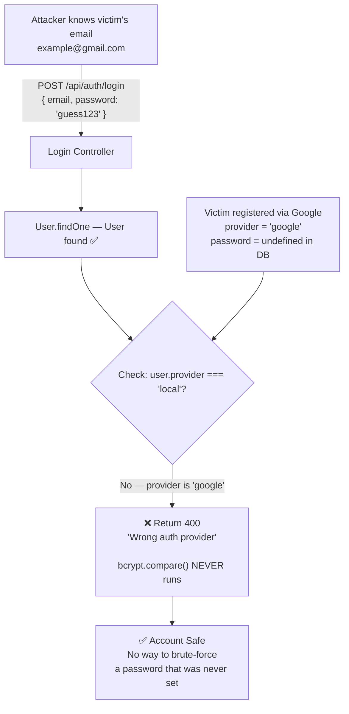

**Diagram Explanation:**

| Step                              | Action                                              | Why it matters                                                                 |
| :-------------------------------- | :-------------------------------------------------- | :----------------------------------------------------------------------------- |
| **Attacker attempts login** | Sends`POST /api/auth/login` with guessed password | Classic credential stuffing / brute-force attack                               |
| **User found in DB**        | `User.findOne()` returns the user                 | Finding the user is not the risk                                               |
| **Provider check**          | `user.provider !== "local"` → early 400          | `bcrypt.compare()` is never called — there's no password to compare against |
| **Account stays safe**      | No password was ever set for this Google user       | The`provider` field is the only thing protecting the account                 |

---

## 8. Frontend Authentication Flow (AuthModal)

### 8.1 Current Implementation (AuthModal.tsx)

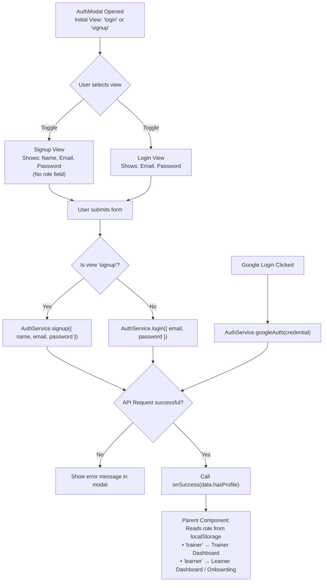

**Diagram Explanation:**

| Step        | Action           | Technical Detail                                 | Interview Talking Point                                                             |
| :---------- | :--------------- | :----------------------------------------------- | :---------------------------------------------------------------------------------- |
| **1** | Initialize Modal | State`view` set to `'login'` or `'signup'` | Centralized auth component — no duplicated forms across the app                    |
| **2** | Signup form      | Only`name, email, password` — no role field   | Low friction. Every user starts as learner regardless of intent                     |
| **3** | Handle Submit    | Unified handler branches by`view` state        | Single`handleSubmit` for both flows reduces code duplication                      |
| **4** | Handle Google    | Uses`@react-oauth/google` SDK                  | Social login path merges back into the same success callback                        |
| **5** | Error Handling   | Renders`error` string in modal UI              | Provides clear feedback without wiping the form                                     |
| **6** | Success Callback | `onSuccess(data.hasProfile)`                   | Modal**delegates routing to parent** — makes it reusable anywhere in the app |

### 8.2 Ideal Frontend Code vs Current

| Feature                    | Current Implementation (FitMate)                  | Ideal Implementation (Best Practice)                        | Why current is acceptable                                                 |
| :------------------------- | :------------------------------------------------ | :---------------------------------------------------------- | :------------------------------------------------------------------------ |
| **Role Selection**   | No role field. Everyone defaults to`"learner"`. | Signup modal shows "I'm a Trainer" / "I'm a Learner" toggle | Reduces signup friction. Trainer registration is a deliberate second step |
| **Form Validation**  | HTML5`required` + `type="email"`              | Schema validation with`zod` or `yup`                    | HTML5 validation is sufficient for an MVP with 3-field forms              |
| **State Management** | Local`useState` for form fields                 | `react-hook-form` for performance + complex validation    | The form is simple enough that a full library adds unnecessary overhead   |

> **Interview Tip:** The current `AuthModal` is designed for **reusability** (parent receives `onSuccess` callback, handles routing itself) and **low friction** (no role selection at signup — trainers register in a second step after authenticating).

---

## 9. Challenges & Trade-offs

### Challenge 1: Logout Doesn't Truly Invalidate the JWT

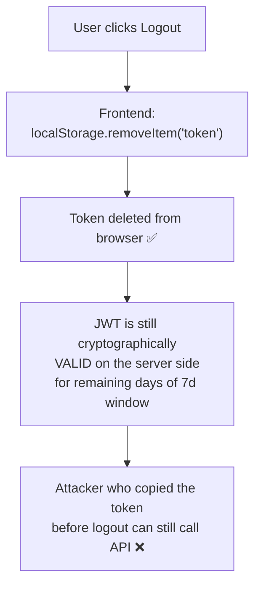

| Fix Option                                     | Pro                        | Con                                               |
| ---------------------------------------------- | -------------------------- | ------------------------------------------------- |
| **Current: Delete from localStorage**    | Zero infrastructure needed | Token remains valid server-side                   |
| **Short expiry (15min) + Refresh Token** | Small attack window        | Needs refresh endpoint + rotation logic           |
| **Token Blacklist (Redis)**              | Instant revocation         | Adds stateful infrastructure, defeats scalability |

> **Current stance (MVP):** Acceptable. Next step would be short-lived tokens + HTTP-only cookie storage to protect against XSS.

---

### Challenge 2: Role Stored in DB, Not JWT — Extra DB Query

**Why it's needed:** When a learner becomes a trainer (via `POST /api/trainer/profile`), their role updates in MongoDB. If role were in the JWT, they'd need to re-login to get a new token.

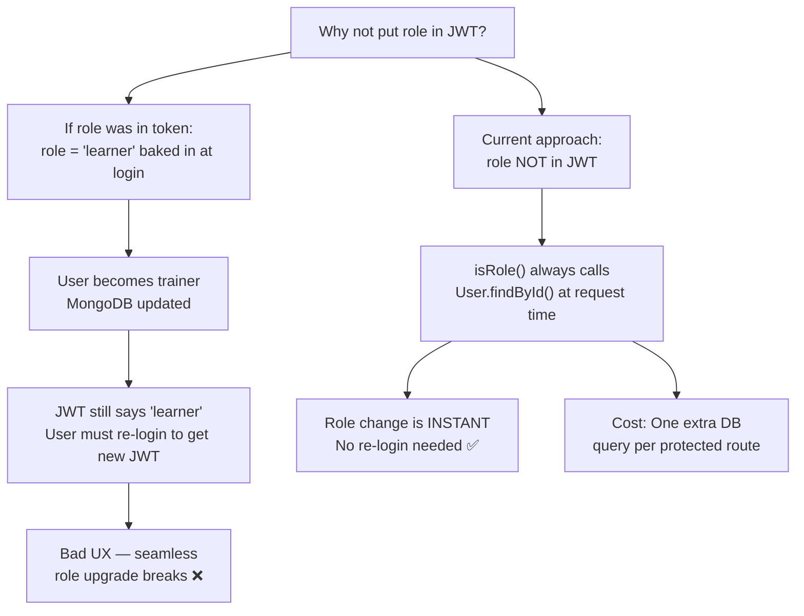

| Option                                            | Pro                                   | Con                                                 |
| ------------------------------------------------- | ------------------------------------- | --------------------------------------------------- |
| **Current: Role fetched from DB each time** | Instant role changes, always accurate | Extra DB query per request                          |
| **Role embedded in JWT**                    | No DB query for role                  | Role changes require re-login or token refresh flow |

> **Decision:** DB query is correct. The cost is one MongoDB `findById` which is indexed and fast. The alternative creates stale permission state — a promoted trainer would have to log out and back in.

---

### Challenge 3: No Role Selection at Signup

Currently, `AuthModal.tsx` only collects `name, email, password`. All users start as `"learner"`.

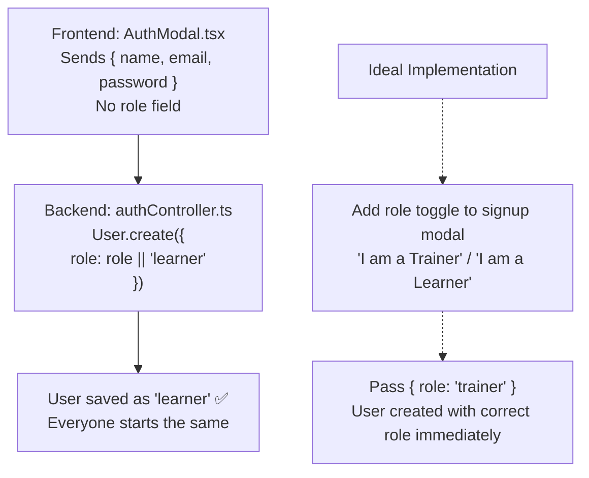

**Diagram Explanation:**

| Step / Option | Action       | Technical Detail                                          | Interview Talking Point                                                                                   |
| :------------ | :----------- | :-------------------------------------------------------- | :-------------------------------------------------------------------------------------------------------- |
| **1**   | Current Flow | Frontend omits`role`, backend defaults to `"learner"` | Frictionless signup — one form for everyone                                                              |
| **2**   | Ideal Flow   | Frontend passes`{ role: "trainer" }` to backend         | User gets correct dashboard immediately, no second step                                                   |
| **3**   | Trade-off    | Accept current flow as MVP                                | Trainers are minority of users — keeping signup simple for learners (majority) is the right product call |

| Option                                                 | Pro                                   | Con                                                               |
| ------------------------------------------------------ | ------------------------------------- | ----------------------------------------------------------------- |
| **Current: Default to 'learner', upgrade later** | Minimal signup friction, simpler form | Trainer needs a separate onboarding step to register              |
| **Ideal: Role selection at signup**              | User gets right dashboard immediately | Extra field; trainers are rarer — adds friction for the majority |

> **Current stance (MVP):** Acceptable. Users start as learners and upgrade via `POST /api/trainer/profile`.

---

### Challenge 4: Google Auth — Provider Collision

What happens when the same email has been used for both local and Google signup?

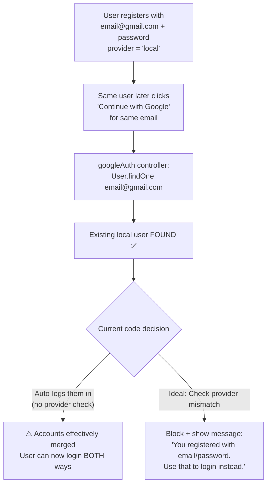

| Option                                | Pro                 | Con                                   |
| ------------------------------------- | ------------------- | ------------------------------------- |
| **Current: Auto-merge**         | Smooth UX           | Minor security risk on shared devices |
| **Block cross-provider logins** | Strict security     | Frustrating for the real user         |
| **Account linking flow**        | Best of both worlds | Complex implementation                |

> **Current stance (MVP):** Auto-merge accepted. Production would require an explicit account-linking confirmation step.
