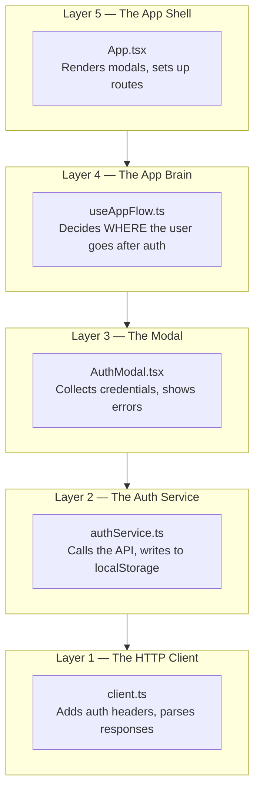
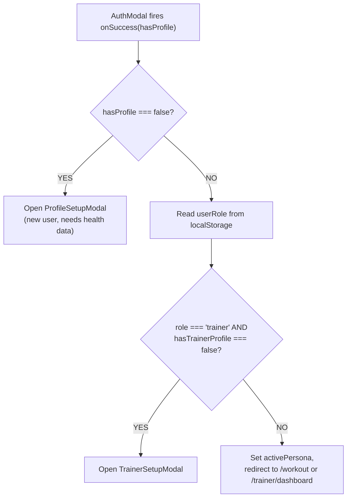
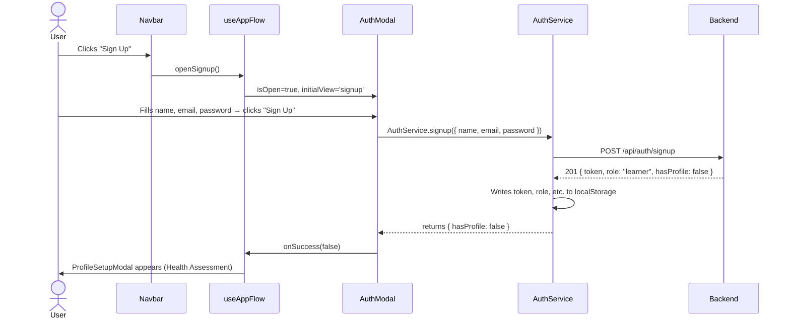
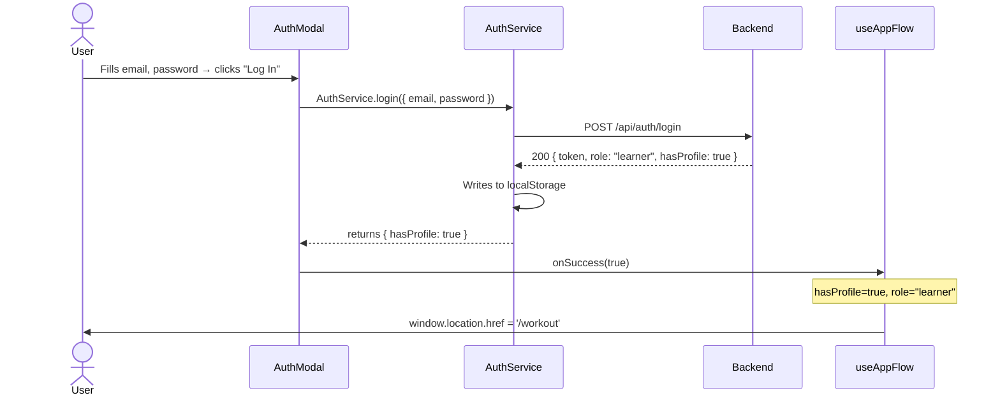
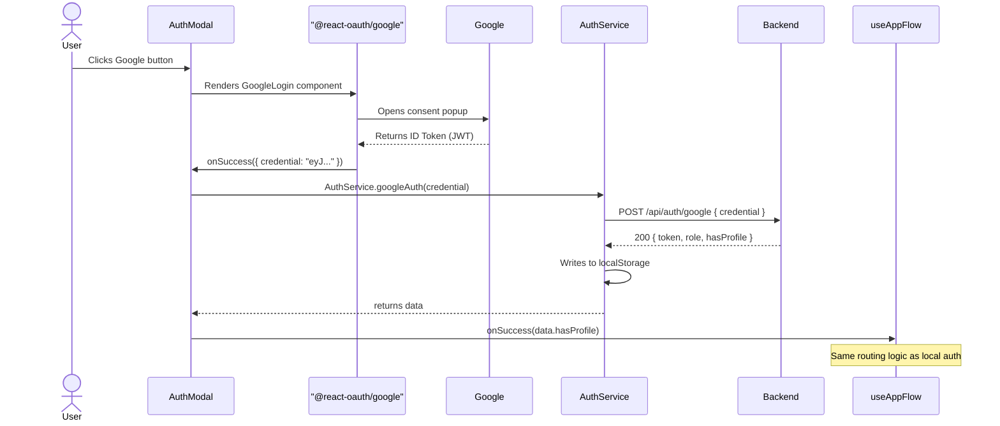

# Frontend Authentication Flow

> **Scope:** This document covers everything the **frontend** does to authenticate a user — from the user clicking "Log In" to landing on their dashboard. Backend internals (JWT signing, password hashing, etc.) are out of scope.

---

## Table of Contents

1. [Layers at a Glance](#1-layers-at-a-glance)
2. [Layer 1 — The HTTP Client (`client.ts`)](#2-layer-1--the-http-client-clientts)
3. [Layer 2 — The Auth Service (`authService.ts`)](#3-layer-2--the-auth-service-authservicets)
4. [Layer 3 — The Modal (`AuthModal.tsx`)](#4-layer-3--the-modal-authmodaltsx)
5. [Layer 4 — The App Brain (`useAppFlow.ts`)](#5-layer-4--the-app-brain-useappflowts)
6. [Layer 5 — The App Shell (`App.tsx`)](#6-layer-5--the-app-shell-apptsx)
7. [End-to-End Flow Diagrams](#7-end-to-end-flow-diagrams)
8. [Session Storage Strategy](#8-session-storage-strategy)
9. [How Auth State Guards Pages](#9-how-auth-state-guards-pages)

---

## 1. Layers at a Glance

The frontend auth system is split into five clearly separated layers. Each layer has **one job** and talks only to the layer below it.



| File               | Role                                     | Knows about routing? |
| :----------------- | :--------------------------------------- | :------------------- |
| `client.ts`      | Raw HTTP — adds`Authorization` header | No                   |
| `authService.ts` | Auth API calls + localStorage writes     | No                   |
| `AuthModal.tsx`  | UI form + UX state                       | No                   |
| `useAppFlow.ts`  | Decision logic post-auth                 | **Yes**        |
| `App.tsx`        | Wires everything together                | **Yes**        |

---

## 2. Layer 1 — The HTTP Client (`client.ts`)

**File:** `frontend/src/services/client.ts`

This is the lowest-level building block. Every API call in the app goes through `fetchClient`.

```typescript
export async function fetchClient(endpoint: string, options:
                                
RequestInit = {}) {
  
  const token = localStorage.getItem('token');
  
  const headers = {
  
    'Content-Type': 'application/json',
  
    ...(token ? { Authorization: `Bearer ${token}` } : {}),
  
    ...options.headers,
  };
  // ...
}
```

**What it does for auth:**

| Behaviour                            | Detail                                                                                          |
| :----------------------------------- | :---------------------------------------------------------------------------------------------- |
| **Auto-injects the JWT**       | Reads`token` from `localStorage` on every call. No need to pass it manually anywhere.       |
| **Throws on non-OK responses** | Parses the JSON body and throws`new Error(data.message)` so callers can catch a plain string. |
| **Handles 404 separately**     | Returns`{ status: 404 }` instead of throwing, so missing resources don't crash the app.       |

> **Why this pattern?** Centralising the header injection here means every future service (chat, workout, trainer) gets authentication for free — no `Authorization` boilerplate anywhere else.

---

## 3. Layer 2 — The Auth Service (`authService.ts`)

**File:** `frontend/src/services/authService.ts`

This is the **only place** that knows how to call the auth endpoints. It also owns all `localStorage` writes for session data.

### 3.1 Methods

| Method           | Endpoint              | Payload                              |
| :--------------- | :-------------------- | :----------------------------------- |
| `login()`      | `POST /auth/login`  | `{ email, password }`              |
| `signup()`     | `POST /auth/signup` | `{ name, email, password }`        |
| `googleAuth()` | `POST /auth/google` | `{ credential }` (Google ID Token) |
| `logout()`     | — (local only)       | Clears localStorage                  |

### 3.2 What Gets Written to localStorage

After any successful auth call, the service writes these keys:

```
token              — JWT for all subsequent API requests
isLoggedIn         — "true" | "false" quick UI check flag
userEmail          — Display in UI
userName           — Display in UI
userRole           — "learner" | "trainer" | "admin"
hasProfile         — "true" | "false" — has the user done health assessment?
hasTrainerProfile  — "true" | "false" — has the trainer completed their bio?
```

> **Why localStorage and not cookies?** This is a common trade-off. localStorage is simpler to set up in a React SPA and does not require cookie configuration across environments. The downside is that it is vulnerable to XSS. The ideal upgrade would be `httpOnly` cookies set by the server.

### 3.3 Logout

```typescript
logout: () => {
  localStorage.removeItem('token');
  localStorage.removeItem('isLoggedIn');
  localStorage.removeItem('userEmail');
  localStorage.removeItem('userRole');
  localStorage.removeItem('hasProfile');
  localStorage.removeItem('hasTrainerProfile');
}
```

A full wipe. No server-side token invalidation currently — the JWT simply expires on its own.

---

## 4. Layer 3 — The Modal (`AuthModal.tsx`)

**File:** `frontend/src/components/auth/AuthModal.tsx`

This is the **only auth UI** in the app. It handles login, signup, and Google OAuth in one component.

### 4.1 Props

```typescript
interface AuthModalProps {
  isOpen: boolean;                          // Controls visibility
  onClose: () => void;                      // Close without auth
  initialView?: 'login' | 'signup';         // Which tab to start on
  onSuccess: (hasProfile: boolean) => void; // Called after successful auth
}
```

> **Key design choice:** `onSuccess` instead of `useNavigate()` inside the modal. The modal does not know (or care) where the user should go — it just fires the callback. The parent (`useAppFlow`) decides the destination. This makes the modal fully reusable.

### 4.2 Internal State

| State        | Purpose                                                              |
| :----------- | :------------------------------------------------------------------- |
| `view`     | `'login'` or `'signup'` — controls which form fields appear     |
| `authData` | `{ name, email, password }` — single object, reset on modal open  |
| `error`    | String shown in the red error box; empty string = no box             |
| `loading`  | Disables submit button and shows spinner while API call is in-flight |

**State is always wiped when the modal opens:**

```typescript
useEffect(() => {
  if (isOpen) {
    setView(initialView);
    setError('');
    setAuthData({ name: '', email: '', password: '' });
  }
}, [isOpen, initialView]);
```

This prevents stale credentials or old errors from persisting across separate openings.

### 4.3 Submit Handler (Login + Signup)

One `handleSubmit` function covers both flows, branching on `view`:

```typescript
const handleSubmit = async (e: React.FormEvent) => {
  e.preventDefault();
  try {
    setLoading(true);
    setError('');

    let data;
    if (view === 'signup') {
      data = await AuthService.signup(authData);
    } else {
      data = await AuthService.login({ email: authData.email, password: authData.password });
    }

    onSuccess(data.hasProfile); // Hand off to parent
  } catch (err: any) {
    setError(err.message || 'Something went wrong. Please try again.');
  } finally {
    setLoading(false); // Always re-enable button
  }
};
```

### 4.4 Google OAuth Handler

```typescript
const handleGoogleSuccess = async (credentialResponse: any) => {
  try {
    setLoading(true);
    setError('');
    const data = await AuthService.googleAuth(credentialResponse.credential);
    onSuccess(data.hasProfile); // Same callback as local auth
  } catch (err: any) {
    setError(err.message || 'Google Auth failed');
  } finally {
    setLoading(false);
  }
};
```

Both local and Google auth converge at the same `onSuccess(data.hasProfile)` call — the parent does not need to handle them differently.

---

## 5. Layer 4 — The App Brain (`useAppFlow.ts`)

**File:** `frontend/src/hooks/useAppFlow.ts`

This custom hook is **the decision-maker**. It owns modal open/close state and contains the post-auth routing logic.

### 5.1 State it Manages

| State                  | Type                 | Purpose                                     |
| :--------------------- | :------------------- | :------------------------------------------ |
| `authModal`          | `{ isOpen, view }` | Controls AuthModal visibility and which tab |
| `isProfileSetupOpen` | `boolean`          | Controls health assessment modal            |
| `isTrainerSetupOpen` | `boolean`          | Controls trainer onboarding modal           |

### 5.2 `handleAuthSuccess` — The Core Decision Tree

This is called by `AuthModal` via the `onSuccess` prop the moment auth succeeds:



### 5.3 `handleSetupSuccess` — After Setup Wizards Complete

| Type          | Action                                                                                    |
| :------------ | :---------------------------------------------------------------------------------------- |
| `'profile'` | Close ProfileSetupModal → redirect to`/workout` (or `/trainer/dashboard` if trainer) |
| `'trainer'` | Close TrainerSetupModal → redirect to`/trainer/dashboard`                              |

### 5.4 Exported API

```typescript
return {
  // State
  authModal, isProfileSetupOpen, isTrainerSetupOpen,
  // Modal controls (used by Navbar, Landing page)
  openLogin, openSignup, closeAuth, openTrainerSetup, closeTrainerSetup,
  // Logic handlers (used by modals)
  handleAuthSuccess, handleSetupSuccess,
};
```

---

## 6. Layer 5 — The App Shell (`App.tsx`)

**File:** `frontend/src/App.tsx`

`App.tsx` is deliberately thin — it is the "Map", not the "Brain". It just wires the hook state to the modal props.

```tsx
const { authModal, handleAuthSuccess, openLogin, openSignup, ... } = useAppFlow();

// Routes
<Route path="/" element={<MainLanding onGetStarted={openSignup} />} />
<Route path="/trainers" element={<Trainers onLoginClick={openLogin} onSignupClick={openSignup} />} />

// Global modals (always in the tree, shown/hidden by isOpen)
<AuthModal
  isOpen={authModal.isOpen}
  initialView={authModal.view}
  onClose={closeAuth}
  onSuccess={handleAuthSuccess}
/>
<ProfileSetupModal isOpen={isProfileSetupOpen} onSuccess={() => handleSetupSuccess('profile')} />
<TrainerSetupModal isOpen={isTrainerSetupOpen} onClose={closeTrainerSetup} onSuccess={() => handleSetupSuccess('trainer')} />
```

**Why global modals here?** If the modals were placed inside individual page components, you would need to pass `openLogin` through many layers of props. Placing them at the top level means any page can trigger them by calling `openLogin()` or `openSignup()` — both passed down as simple callback props.

---

## 7. End-to-End Flow Diagrams

### 7.1 New User Signup



### 7.2 Returning Learner Login



### 7.3 Google OAuth Flow



---

## 8. Session Storage Strategy

All session data lives in `localStorage`. Here is a map of every key and who reads it:

| Key                   | Written by      | Read by                                 | Purpose                                      |
| :-------------------- | :-------------- | :-------------------------------------- | :------------------------------------------- |
| `token`             | `AuthService` | `client.ts` (every request)           | JWT for API authorization                    |
| `isLoggedIn`        | `AuthService` | `Navbar`, page guards                 | Quick boolean for UI checks                  |
| `userEmail`         | `AuthService` | `Profile` page                        | Display only                                 |
| `userName`          | `AuthService` | `Navbar`, `Profile` page            | Display only                                 |
| `userRole`          | `AuthService` | `useAppFlow`, `Navbar`, page guards | Routing decisions, role-gated UI             |
| `hasProfile`        | `AuthService` | `useAppFlow`                          | Decides if onboarding is needed              |
| `hasTrainerProfile` | `AuthService` | `useAppFlow`                          | Decides if trainer setup is needed           |
| `activePersona`     | `useAppFlow`  | `Navbar`                              | Switches Navbar between learner/trainer view |

**On logout**, `AuthService.logout()` removes all of the above. The `activePersona` key is wiped too, resetting the Navbar to its unauthenticated state.

---

## 9. How Auth State Guards Pages

There is no React Router `<PrivateRoute>` wrapper currently. Instead, each protected page (e.g. `Chatbot`, `Workout`) reads `localStorage.getItem('isLoggedIn')` or `localStorage.getItem('token')` on mount and redirects or shows an unauthenticated state if the user is not logged in.

The `AuthModal` can be triggered from any page — by passing `openLogin` down as a prop — so the user can authenticate in-context without losing their current page.

> **Ideal upgrade:** A `<ProtectedRoute>` HOC that wraps `<Route>` elements and checks the token, redirecting to `/` if unauthenticated. This would centralise the guard logic instead of repeating it in each page component.
