# Interview Assessment: Authentication & Authorization in FitMate

> This document is based on **exactly what was implemented** in the FitMate codebase.
> Every diagram, challenge, and trade-off refers to real code and real decisions made during development.

---

## Table of Contents

1. [System Architecture Overview](#1-system-architecture-overview)
2. [The Two Auth Flows Implemented](#2-the-two-auth-flows-implemented)
   - [Local Auth (Email + Password)](#21-local-auth-email--password)
   - [Google OAuth (Social Login)](#22-google-oauth-social-login)
3. [The Trainer Registration Flow](#3-the-trainer-registration-flow)
4. [Login &amp; Role-Based Redirect](#4-login--role-based-redirect)
5. [JWT Token Lifecycle](#5-jwt-token-lifecycle)
6. [Authorization: Role-Based Access Control (RBAC)](#6-authorization-role-based-access-control-rbac)
7. [The Provider Field: A Critical Design Decision](#7-the-provider-field-a-critical-design-decision)
8. [Middleware Chain](#8-middleware-chain)
9. [Challenges &amp; Trade-offs](#9-challenges--trade-offs)
10. [Full Request Lifecycle Sequence Diagram](#10-full-request-lifecycle-sequence-diagram)

---

## 1. System Architecture Overview

This is how Authentication and Authorization fit into the full FitMate system:

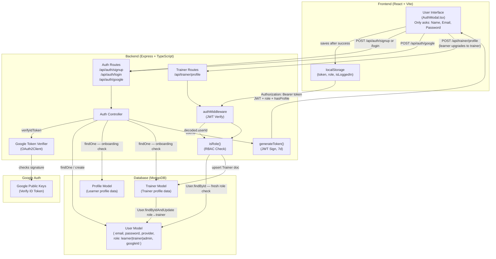

**Diagram Explanation:**

| Component                      | Description                          | What it actually does in FitMate                                                       |
| :----------------------------- | :----------------------------------- | :------------------------------------------------------------------------------------- |
| **AuthModal (Frontend)** | Single modal for both login + signup | Only collects Name, Email, Password —**never asks for role**                    |
| **Auth Routes**          | Entry points for identity            | `/signup`, `/login`, `/google` — all public routes                              |
| **Auth Controller**      | Core login/signup logic              | Hashes passwords, verifies Google tokens, generates JWTs                               |
| **generateToken()**      | JWT factory                          | Signs`{ userId }` with 7-day expiry — role is NOT in the token                      |
| **Trainer Routes**       | Separate from auth routes            | `POST /api/trainer/profile` is where a learner becomes a trainer                     |
| **authMiddleware**       | JWT verification layer               | Reads`Authorization: Bearer <token>`, attaches `req.userId`                        |
| **isRole()**             | RBAC enforcement                     | Queries DB fresh every time — picks up role changes instantly                         |
| **MongoDB models**       | Storage layer                        | `User` for identity+role, `Profile` for learner data, `Trainer` for trainer data |

---

## 2. The Two Auth Flows Implemented

### 2.1 Local Auth (Email + Password)

#### Signup Flow

> **Key fact:** The frontend signup form (`AuthModal.tsx`) asks for **Name, Email, Password only**. There is **no role selection**. Every new user starts as `"learner"` — regardless of whether they intend to be a trainer.

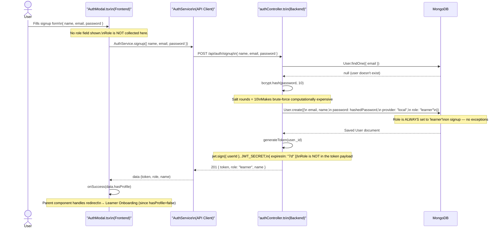

**Diagram Explanation:**

| Step        | Action                        | Technical Detail                                     | Interview Talking Point                                                                      |
| :---------- | :---------------------------- | :--------------------------------------------------- | :------------------------------------------------------------------------------------------- |
| **1** | User fills signup form        | Collects`name, email, password` — no role field   | "I keep the signup friction low — everyone starts as a learner"                             |
| **2** | `User.findOne()`            | Checks for duplicate email before creation           | Prevents constraint violations and confusing UX                                              |
| **3** | `bcrypt.hash(password, 10)` | Salt rounds = 10                                     | Never store plaintext. 10 rounds is the industry-standard balance between speed and security |
| **4** | `User.create(...)`          | Saves with`provider: "local"`, `role: "learner"` | `provider` field is critical — prevents future Google-auth account takeover               |
| **5** | `generateToken(userId)`     | 7-day JWT containing only`userId`                  | Role is deliberately excluded — fetched fresh from DB on every request                      |
| **6** | Parent handles redirect       | `onSuccess(hasProfile)` bubble-up pattern          | The modal delegates navigation to the parent — keeps the component reusable                 |

---

#### Login Flow

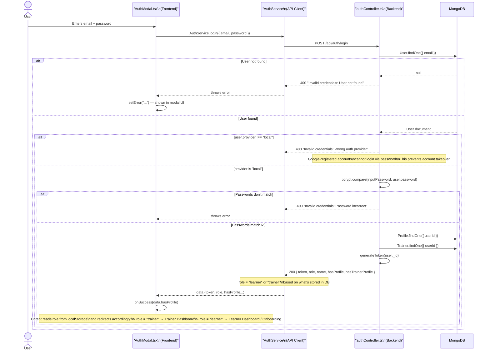

**Diagram Explanation:**

| Step        | Action                      | Technical Detail                                  | Interview Talking Point                                                                                            |
| :---------- | :-------------------------- | :------------------------------------------------ | :----------------------------------------------------------------------------------------------------------------- |
| **1** | `User.findOne({ email })` | Looks up by email first                           | If null → generic error (never confirm whether email exists to prevent enumeration)                               |
| **2** | Provider check              | `user.provider !== "local"` → reject           | **Security critical:** Prevents brute-forcing a password on a Google-registered account that has no password |
| **3** | `bcrypt.compare()`        | Compares plaintext input against stored hash      | Cryptographically safe — timing-safe comparison built into bcrypt                                                 |
| **4** | Onboarding check            | `Profile.findOne()` + `Trainer.findOne()`     | Backend tells the frontend*exactly* what state the user is in                                                    |
| **5** | Role-based redirect         | `role` returned in response, frontend checks it | If`role === "trainer"` → Trainer Dashboard. If `"learner"` → learner flow                                    |

---

### 2.2 Google OAuth (Social Login)

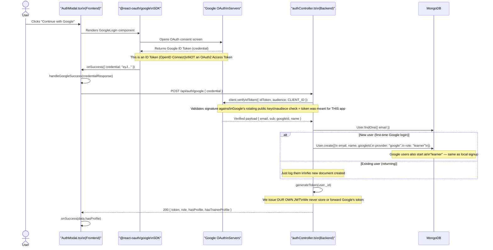

**Diagram Explanation:**

| Step        | Action                      | Technical Detail                                       | Interview Talking Point                                                                       |
| :---------- | :-------------------------- | :----------------------------------------------------- | :-------------------------------------------------------------------------------------------- |
| **1** | `@react-oauth/google` SDK | Renders Google's button natively                       | We use Google's official SDK — don't build the OAuth redirect manually                       |
| **2** | Google returns ID Token     | `credentialResponse.credential` is a JWT from Google | This is OpenID Connect (identity), not OAuth 2.0 (authorization)                              |
| **3** | `verifyIdToken()`         | Validates the JWT signature using Google's public keys | We never trust the token blindly — we verify it server-side                                  |
| **4** | `User.create(...)`        | Sets`provider: "google"`, `role: "learner"`        | Google users also default to learner — same flow as local signup                             |
| **5** | Issue our own JWT           | `generateToken(user._id)`                            | We issue our own token from here. Google's token is discarded — we control expiry and claims |

---

## 3. The Trainer Registration Flow

> This is NOT part of auth. This is a **post-auth** flow. A user must already be logged in as a `learner` to become a trainer.

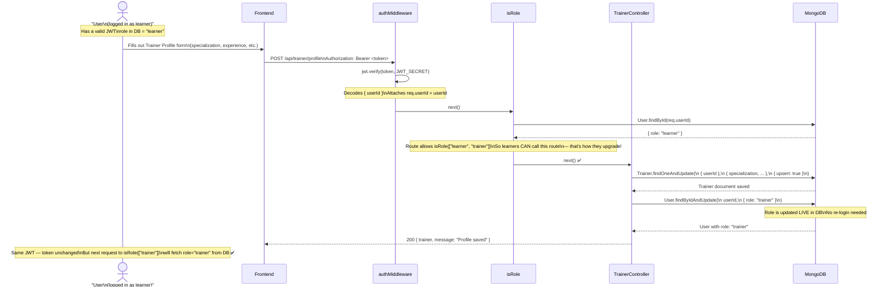

**Diagram Explanation:**

| Step        | Action                                          | Technical Detail                                     | Interview Talking Point                                                                      |
| :---------- | :---------------------------------------------- | :--------------------------------------------------- | :------------------------------------------------------------------------------------------- |
| **1** | User already logged in                          | Has a JWT for`userId`, role is `"learner"` in DB | A trainer starts their life as a learner — same signup form                                 |
| **2** | `authMiddleware` runs                         | Verifies JWT, attaches`req.userId`                 | Standard JWT verification — no changes to the flow                                          |
| **3** | `isRole(["learner", "trainer"])`              | Checks role from DB —`"learner"` passes!          | The route is intentionally open to learners so they CAN promote themselves                   |
| **4** | `Trainer.findOneAndUpdate(upsert)`            | Creates or updates the Trainer document              | Upsert = create if not found, update if found — idempotent operation                        |
| **5** | `User.findByIdAndUpdate({ role: "trainer" })` | Upgrades the role live in MongoDB                    | The JWT doesn't change — but`isRole()` fetches from DB, so next request works immediately |

---

## 4. Login & Role-Based Redirect

This shows exactly what happens after a successful login — how the frontend uses the `role` returned by the backend to decide where to send the user.

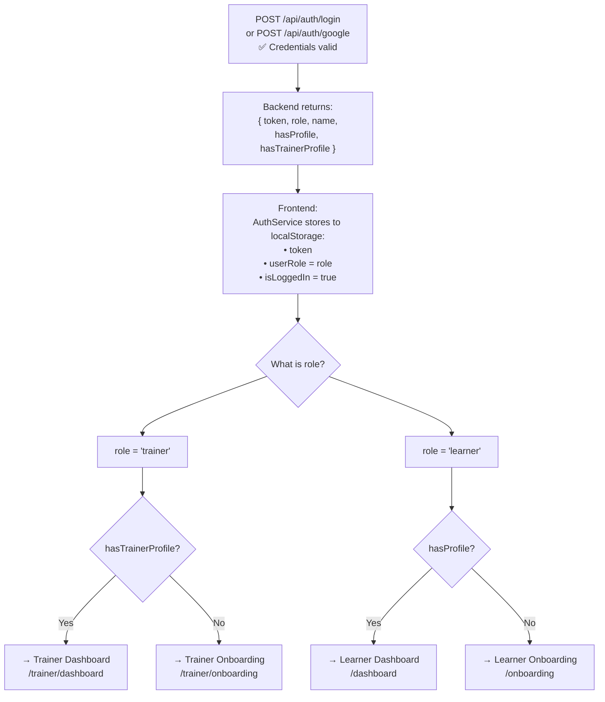

**Diagram Explanation:**

| Step        | Action                          | Technical Detail                                                | Interview Talking Point                                                                 |
| :---------- | :------------------------------ | :-------------------------------------------------------------- | :-------------------------------------------------------------------------------------- |
| **1** | Backend returns`role`         | `role` comes from the MongoDB User document — always current | "Role is not in the JWT, it's fetched from DB at login time and returned to the client" |
| **2** | Frontend stores to localStorage | `token`, `userRole`, `isLoggedIn` saved                   | This is client-side UX state. The real authority is always the server's`isRole()`     |
| **3** | Role-based redirect             | `role === "trainer"` → Trainer Dashboard                     | A trainer who has already registered goes directly to their dashboard on next login     |
| **4** | Profile check                   | `hasProfile` / `hasTrainerProfile` flags                    | These tell us if onboarding is needed — prevents showing a blank dashboard             |

> **Interview Tip:** Emphasize that the client-side role check is **only for UX routing**. The actual API protection is done server-side via `isRole()`. An attacker can edit `localStorage` all they want — the server will still return 403 if they don't have the right role in the DB.

---

## 5. JWT Token Lifecycle

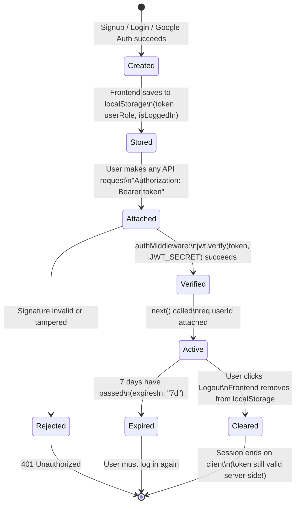

**What's inside the JWT payload in FitMate:**

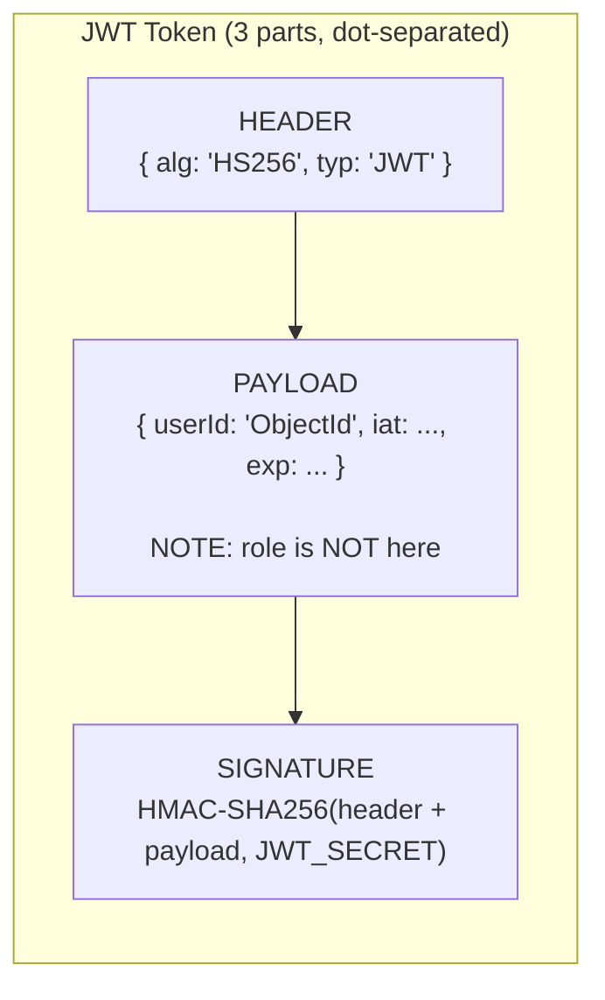

**Diagram Explanation:**

| State / Component            | Description                                                                    | Interview Talking Point                                                                             |
| :--------------------------- | :----------------------------------------------------------------------------- | :-------------------------------------------------------------------------------------------------- |
| **Created → Stored**  | Token generated by server, saved to`localStorage`                            | Discuss HttpOnly cookies as a more secure alternative (XSS protection)                              |
| **Header**             | `alg: HS256`                                                                 | Symmetric algorithm — same secret for sign and verify                                              |
| **Payload**            | Only contains`userId`, `iat`, `exp`                                      | **Role is intentionally excluded** — fetched fresh from DB on every request via `isRole()` |
| **Signature**          | `HMAC-SHA256(header+payload, JWT_SECRET)`                                    | Any tampering breaks the signature — token becomes invalid                                         |
| **Cleared ≠ Revoked** | Logout removes from browser, but server-side token is still valid until`exp` | This is the core trade-off of stateless JWTs — see Challenge 1                                     |

> **Key decision:** The payload only stores `userId`. The `role` is NOT stored in the token — it is fetched fresh from MongoDB on every protected request via `isRole()`. This is a deliberate trade-off (see Section 9).

---

## 6. Authorization: Role-Based Access Control (RBAC)

### The 3 Roles in FitMate

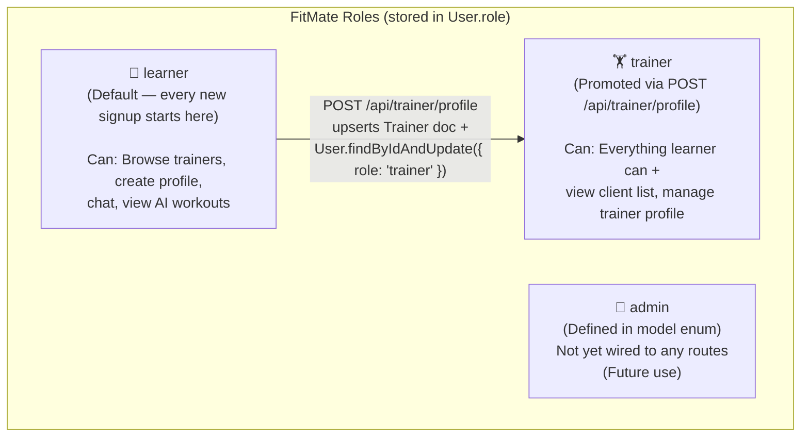

**Diagram Explanation:**

| Role        | Who has it                              | How to get it                                      | Routes it unlocks                                                                      |
| :---------- | :-------------------------------------- | :------------------------------------------------- | :------------------------------------------------------------------------------------- |
| `learner` | Every new user on signup                | Default — assigned automatically                  | Profile routes, chat, AI workouts, browse trainers                                     |
| `trainer` | Users who complete trainer registration | `POST /api/trainer/profile` upgrades the DB role | `GET /api/trainer/clients`, `GET /api/trainer/profile` + everything learner can do |
| `admin`   | Nobody yet                              | Not implemented                                    | Nothing yet — placeholder in the enum                                                 |

### How a protected route works end-to-end

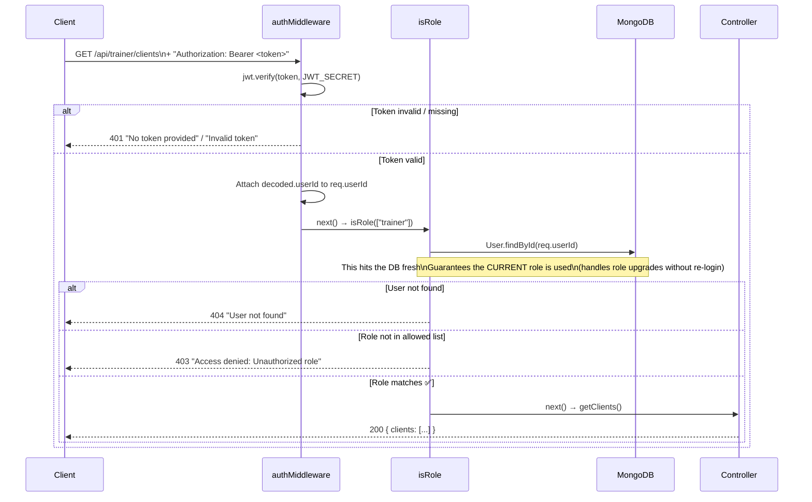

**Diagram Explanation:**

| Step        | Action                  | Technical Detail                                                       | Interview Talking Point                                         |
| :---------- | :---------------------- | :--------------------------------------------------------------------- | :-------------------------------------------------------------- |
| **1** | `authMiddleware` runs | Extracts`Bearer` token, calls `jwt.verify()`                       | If the signature is wrong or expired → 401. Nothing else runs. |
| **2** | `req.userId` attached | Decoded`userId` is attached to the request object                    | This is how the controller knows who is making the request      |
| **3** | `isRole(["trainer"])` | DB lookup:`User.findById(req.userId)`                                | Fresh from DB every time — no stale role issue                 |
| **4** | 403 vs 401              | 401 = "Who are you?", 403 = "I know who you are but you can't do this" | This distinction is important for interviews                    |

### Route Protection Map

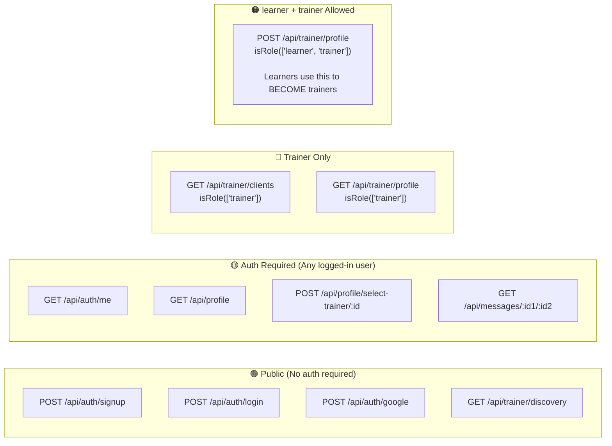

---

## 7. The Provider Field: A Critical Design Decision

The `provider` field on the User model (`"local" | "google"`) is what prevents a major security hole called **Account Takeover**.

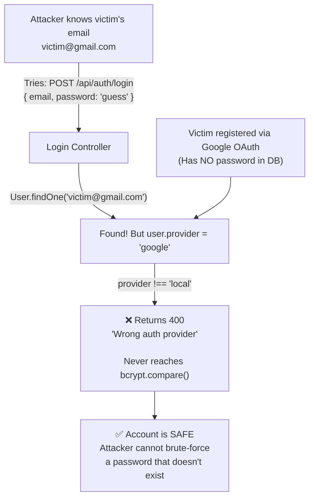

**Diagram Explanation:**

| Step                               | Action                                                      | Why it matters                                                                       |
| :--------------------------------- | :---------------------------------------------------------- | :----------------------------------------------------------------------------------- |
| **Attacker attempts login**  | Sends`POST /api/auth/login` with email + guessed password | Classic brute-force / credential stuffing attack                                     |
| **User found in DB**         | `User.findOne()` returns the user document                | The check doesn't stop here — finding the user is not the risk                      |
| **Provider check blocks it** | `user.provider !== "local"` → early return 400           | `bcrypt.compare()` is **never called** — there's nothing to compare against |
| **Account stays safe**       | No password was ever set for this Google user               | The`provider` field is the gatekeeper                                              |

---

## 8. Middleware Chain

This is exactly how the two middleware functions are chained in `trainerRoutes.ts`:

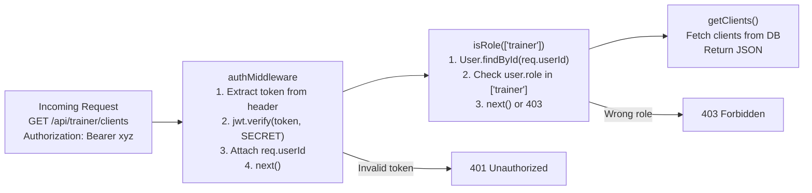

**Diagram Explanation:**

| Middleware         | Responsibility                           | Error returned                      | What it adds to request      |
| :----------------- | :--------------------------------------- | :---------------------------------- | :--------------------------- |
| `authMiddleware` | Verify JWT signature & expiry            | 401 if invalid/missing              | `req.userId`               |
| `isRole()`       | Verify user has correct role (DB lookup) | 403 if wrong role, 404 if user gone | Nothing — just gates access |
| Controller         | Business logic                           | Varies                              | Response data                |

> **The chain is serial** — if `authMiddleware` fails, `isRole()` never runs. If `isRole()` fails, the controller never runs.

---

## 9. Challenges & Trade-offs

### Challenge 1: Stateless JWT vs. Token Revocation

**The Problem:** JWTs in FitMate expire in **7 days**. If a user logs out, the frontend deletes the token from `localStorage` — but the JWT is still cryptographically valid for the remaining 7 days.

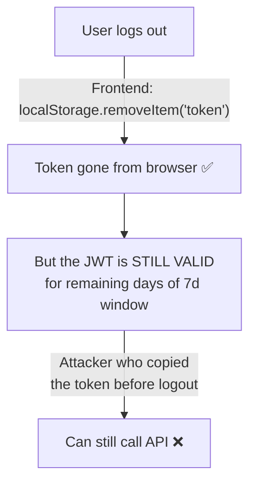

| Option                                                | Pro                     | Con                                                     |
| ----------------------------------------------------- | ----------------------- | ------------------------------------------------------- |
| **Current: Delete from localStorage on logout** | Zero backend complexity | Stolen tokens remain valid until expiry                 |
| **Token Blacklist (Redis)**                     | Instant revocation      | Adds stateful infrastructure, defeats stateless benefit |
| **Short expiry (15min) + Refresh Tokens**       | Small attack window     | Requires refresh token endpoint + rotation logic        |

> **Current stance:** Accepted for MVP. The next step would be implementing **HTTP-only cookies** + **short-lived access tokens with refresh tokens**.

---

### Challenge 2: Role Stored in DB, Not JWT

**The Problem:** When a learner becomes a trainer (by calling `POST /api/trainer/profile`), their role updates in MongoDB. But their old JWT still has no role info in it.

**Why it's fine:** The `isRole()` middleware **always re-fetches** the user from the DB on every protected request — so it always sees the current role.

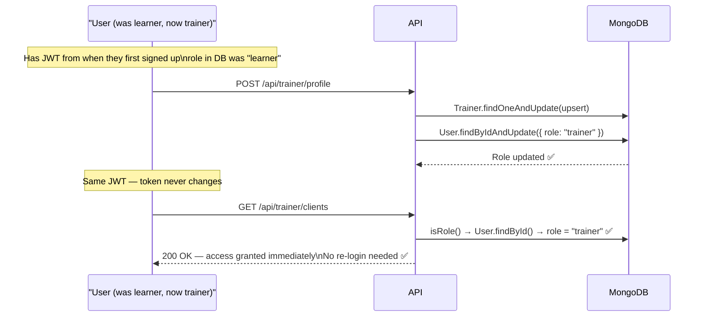

| Option                                             | Pro                                            | Con                                                              |
| -------------------------------------------------- | ---------------------------------------------- | ---------------------------------------------------------------- |
| **Current: Role in DB, fetched per request** | Role changes are instant — no re-login needed | One extra DB query on every protected route                      |
| **Role in JWT payload**                      | No DB query for role check                     | Role change requires user to re-login or implement token refresh |

> **Current stance:** DB lookup is the right call. The extra query is fast (indexed `_id` lookup). The alternative (stale role in JWT) is a real UX and security problem — a newly promoted trainer would have to log out and log back in.

---

### Challenge 3: No Role Selection at Signup (Current vs. Ideal)

**The Reality:** `AuthModal.tsx` only collects `name, email, password`. The backend defaults every new user to `"learner"`. A trainer must go through a second step to register their trainer profile.

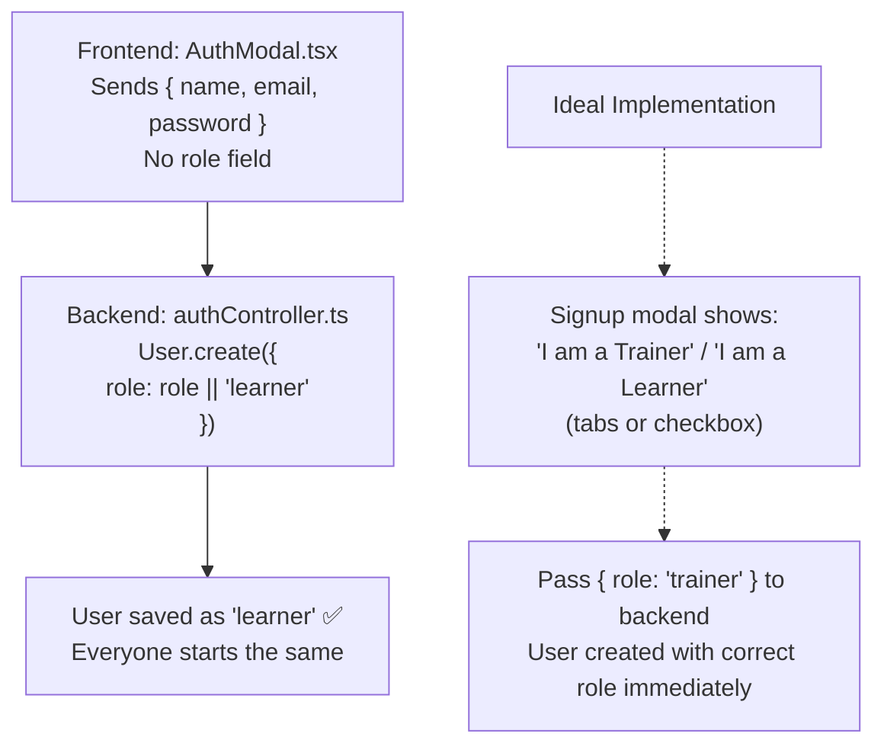

| Option                                           | Pro                                            | Con                                                         |
| ------------------------------------------------ | ---------------------------------------------- | ----------------------------------------------------------- |
| **Current: Default everyone to 'learner'** | Minimal signup friction, one form for everyone | Trainer needs a separate onboarding step to register        |
| **Ideal: Role selection at signup**        | User gets the right dashboard immediately      | Extra field adds friction; trainers are rarer than learners |

> **Current stance:** Acceptable for MVP. Trainers are a minority of users — keeping signup simple for learners (the majority) is the right product decision. Trainer registration is a deliberate second step.

---

### Challenge 4: Google Auth — Provider Mismatch

**The Problem:** What if a user registers with `email/password`, then later tries "Continue with Google" with the same email?

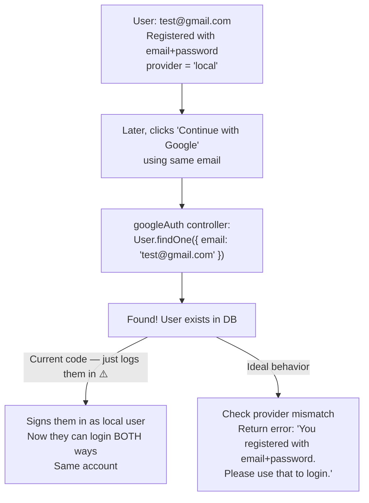

| Option                                                 | Pro                                      | Con                                   |
| ------------------------------------------------------ | ---------------------------------------- | ------------------------------------- |
| **Current: Auto-merge (login if email matches)** | User doesn't get locked out — smooth UX | Minor security risk on shared devices |
| **Block cross-provider logins**                  | Strict security                          | Frustrating UX                        |
| **Account linking flow**                         | Best UX + security                       | Complex to implement                  |

> **Current stance:** Auto-merge is accepted for MVP. Proper account linking would be the production solution.

---

## 10. Full Request Lifecycle Sequence Diagram

This ties everything together — from a fresh browser to an authorized API response for a **trainer** user:

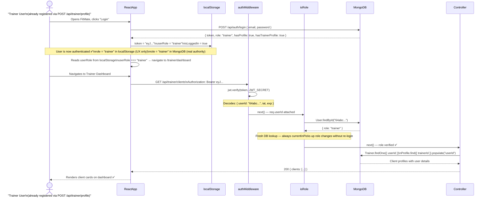

**Diagram Explanation:**

| Step        | Action                          | Technical Detail                                            | Interview Talking Point                                                                 |
| :---------- | :------------------------------ | :---------------------------------------------------------- | :-------------------------------------------------------------------------------------- |
| **1** | Login returns role              | `role: "trainer"` comes from the DB User document         | The JWT itself has no role — the role is returned at login time for UX convenience     |
| **2** | localStorage stores role        | Frontend saves`userRole = "trainer"`                      | This is**only for UX routing** — not a security gate                             |
| **3** | Client-side role check          | `userRole === "trainer"` → navigate to trainer dashboard | An attacker could change localStorage — the server-side check is what actually matters |
| **4** | `authMiddleware` verifies JWT | Extracts`userId` from the verified token                  | Only`userId` is in the JWT — role comes from DB                                      |
| **5** | `isRole()` fetches from DB    | `User.findById()` — gets current role                    | This is the**real security gate** — always accurate, even after role promotion   |
| **6** | Controller runs                 | Fetches actual data                                         | Only reached if both middleware layers pass                                             |
