# Authorization (AuthZ) in FitMate

> **"What are you allowed to do?"**
> This document covers exactly how FitMate enforces permissions after a user has been authenticated — the RBAC system, middleware chain, route protection, and real trade-offs.

---

## Table of Contents
1. [What is Authorization?](#1-what-is-authorization)
2. [System Overview — Authorization Only](#2-system-overview--authorization-only)
3. [The Two Middleware Functions](#3-the-two-middleware-functions)
   - [authMiddleware (JWT Verify)](#31-authmiddleware-jwt-verify)
   - [isRole() (RBAC Check)](#32-isrole-rbac-check)
4. [Role-Based Access Control (RBAC)](#4-role-based-access-control-rbac)
   - [The 3 Roles](#41-the-3-roles)
   - [Role Transition: Learner → Trainer](#42-role-transition-learner--trainer)
5. [Route Protection Map](#5-route-protection-map)
6. [Full Protected Request Sequence](#6-full-protected-request-sequence)
7. [Challenges & Trade-offs](#7-challenges--trade-offs)

---

## 1. What is Authorization?

Authorization answers the question: **"What are you allowed to do?"**
It happens **after** authentication — once we know *who* a user is, we then decide *what* they can access.

In FitMate, authorization is enforced through two Express middleware functions that are chained together on protected routes:
1. **`authMiddleware`** — verifies the JWT token and extracts the `userId`
2. **`isRole()`** — checks the user's role in MongoDB against the allowed roles for that route

---

## 2. System Overview — Authorization Only

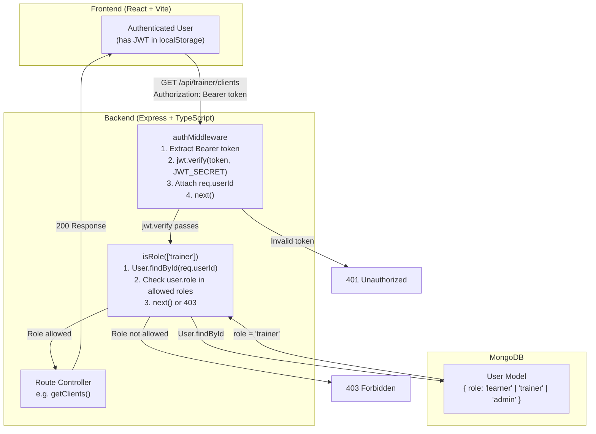

---

## 3. The Two Middleware Functions

### 3.1 authMiddleware (JWT Verify)

> File: `backend/src/middleware/authMiddleware.ts`

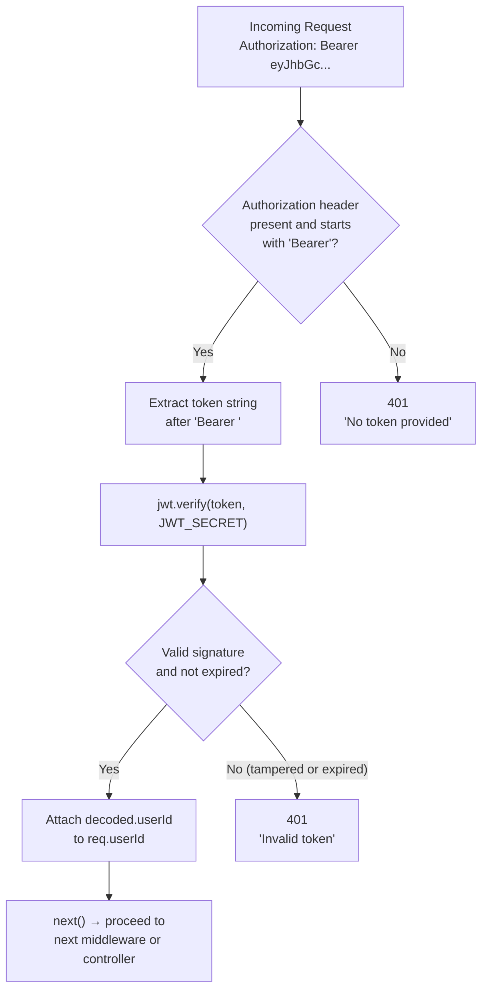

**Diagram Explanation:**

| Step | Action | Technical Detail | Interview Talking Point |
| :--- | :--- | :--- | :--- |
| **1** | Extract Header | Check `req.headers.authorization`. | Expects standard `Bearer <token>` format. |
| **2** | Verify Token | `jwt.verify(token, process.env.JWT_SECRET)`. | Re-hashes the header+payload and compares signatures. If it fails, throws error. |
| **3** | Attach State | `req.userId = decoded.userId`. | Modifies the Express request object so downstream controllers know *who* made the request. |
| **4** | Proceed | `next()`. | Passes control to the next middleware (usually `isRole`). |

### 3.2 isRole() (RBAC Check)

> File: `backend/src/middleware/authMiddleware.ts` — `isRole()` function

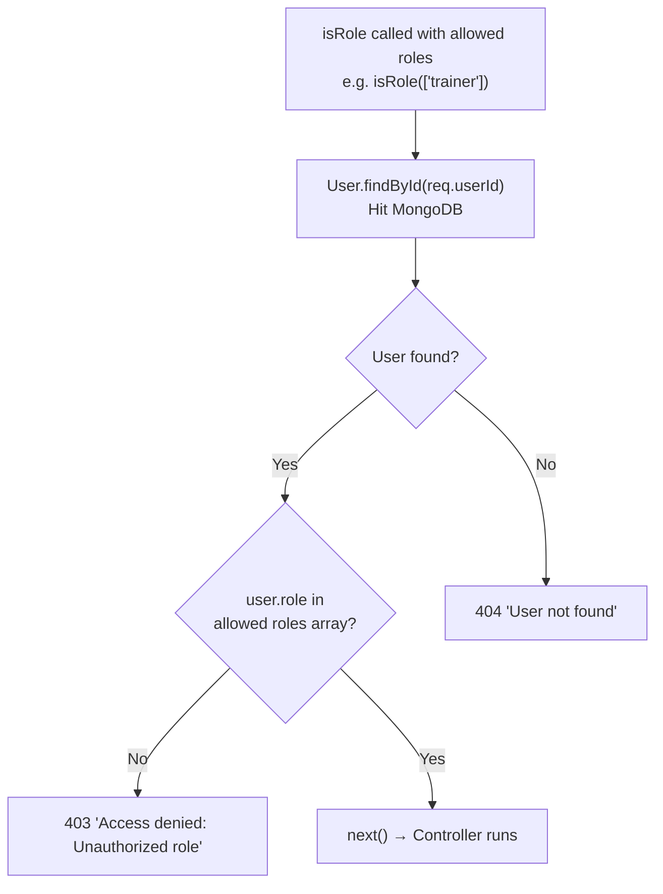

**Diagram Explanation:**

| Step | Action | Technical Detail | Interview Talking Point |
| :--- | :--- | :--- | :--- |
| **1** | Receive Context | Executes after `authMiddleware` finishes. | Relies on `req.userId` being populated. |
| **2** | Fetch User | `User.findById(req.userId)`. | Hits the DB. This guarantees we have the absolute latest role for the user. |
| **3** | Check Permission | `roles.includes(user.role)`. | Compares the user's DB role against the allowed roles passed to the middleware (e.g. `['trainer']`). |
| **4** | Gatekeep | If not in array, return `403 Forbidden`. Else, `next()`. | 403 means "I know who you are (AuthN passed), but you can't do this (AuthZ failed)." |

### The Chain Together

This is exactly how they are wired up in `trainerRoutes.ts`:

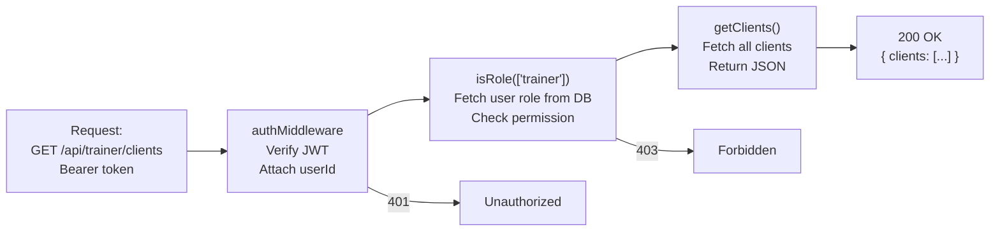

---

## 4. Role-Based Access Control (RBAC)

### 4.1 The 3 Roles

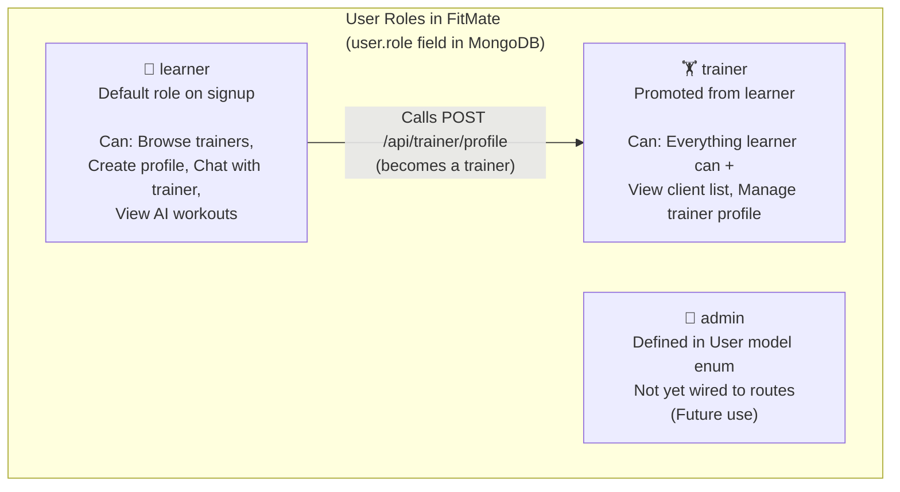

### 4.2 Role Transition: Learner → Trainer

Every user — including future trainers — signs up identically with just `name, email, password` and starts as `"learner"`. After authenticating, a user who wants to be a trainer submits their trainer profile. This upgrades their role live in MongoDB — no re-login required.

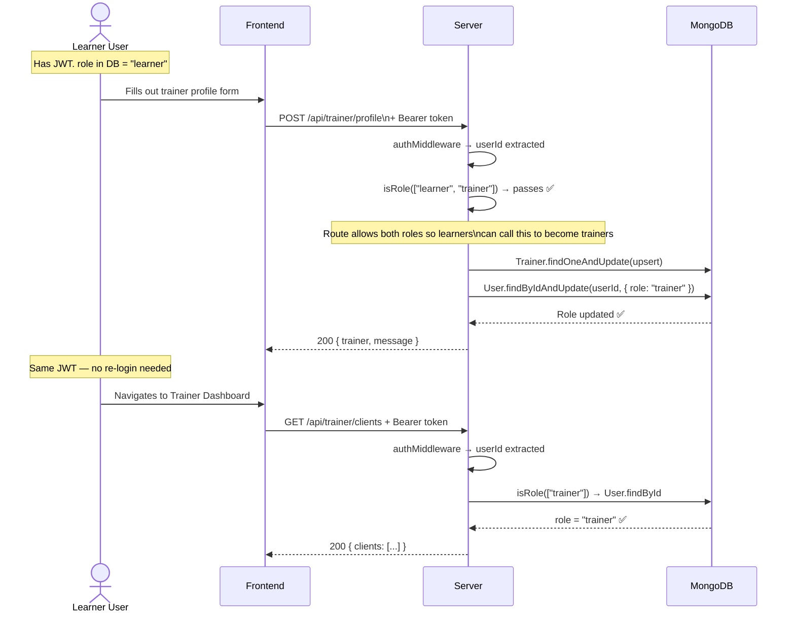

**Diagram Explanation:**

| Step | Action | Technical Detail | Interview Talking Point |
| :--- | :--- | :--- | :--- |
| **1** | Signed up as learner | Every user — trainer or not — signs up identically via `AuthModal.tsx` | No separate trainer signup. The modal only collects `name, email, password`. |
| **2** | Upsert Profile | `Trainer.findOneAndUpdate(..., {upsert: true})`. | Creates the professional profile document. |
| **3** | Update Role | `User.findByIdAndUpdate(userId, { role: "trainer" })`. | Live database update of the user's core identity. |
| **4** | Next Request | User navigates to Trainer Dashboard. | The JWT hasn't changed! |
| **5** | Verification | `isRole(['trainer'])` runs. | Because it fetches from the DB fresh, it sees `"trainer"` and allows access immediately. |

---

## 5. Route Protection Map

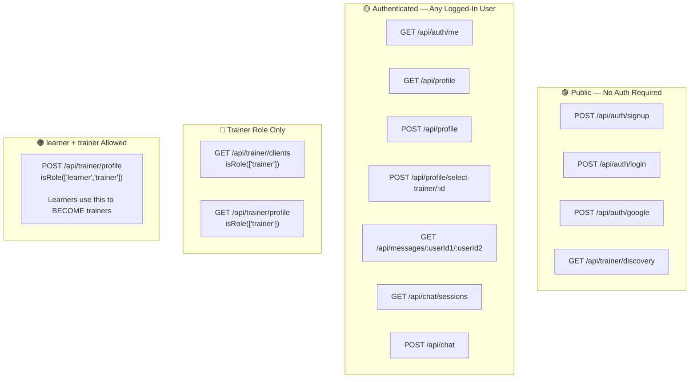

---

## 6. Full Protected Request Sequence

End-to-end: from browser open to authorized data being returned.

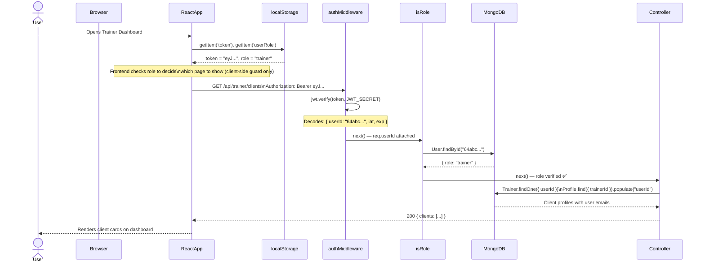

---

## 7. Challenges & Trade-offs

### Challenge 1: Role is Fetched from DB on Every Request

**Why it works this way:**
The JWT payload only contains `userId`. The `role` is NOT baked into the token. Every time `isRole()` runs, it fires a `User.findById()` query.

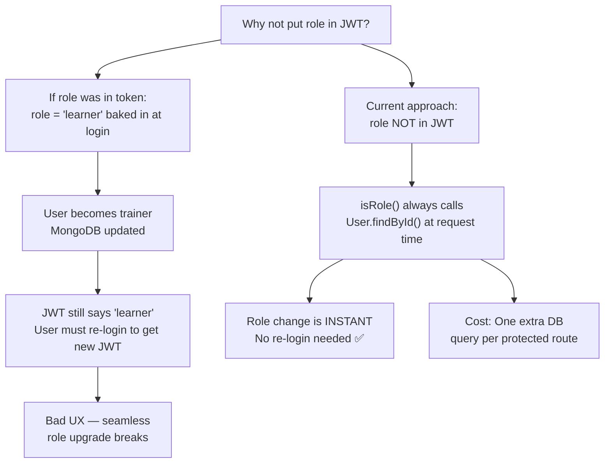

| Option | Pro | Con |
|---|---|---|
| **Current: Role fetched from DB each time** | Instant role changes, always accurate | Extra DB query per request |
| **Role embedded in JWT** | No DB query for role | Role changes require re-login or token refresh flow |

> **Decision:** DB query is correct. The cost is one MongoDB `findById` which is indexed and fast. The alternative creates stale permission state which is a security and UX problem.

---

### Challenge 2: Client-Side Role Guard is Not Enough

The frontend checks `localStorage.getItem('userRole')` to decide which page to render. But this is **not** real security — it is just UX.

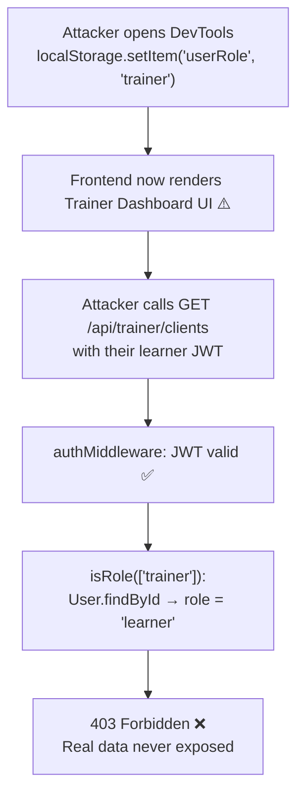

> **Conclusion:** The client-side role check is only for **UX routing**. The server-side `isRole()` middleware is the **real security gate**. Both must exist — frontend for experience, backend for protection.

---

### Challenge 3: The `admin` Role Has No Routes Yet

The User model defines three roles: `learner`, `trainer`, `admin`. The `admin` role exists in the enum but no routes use `isRole(['admin'])` yet.

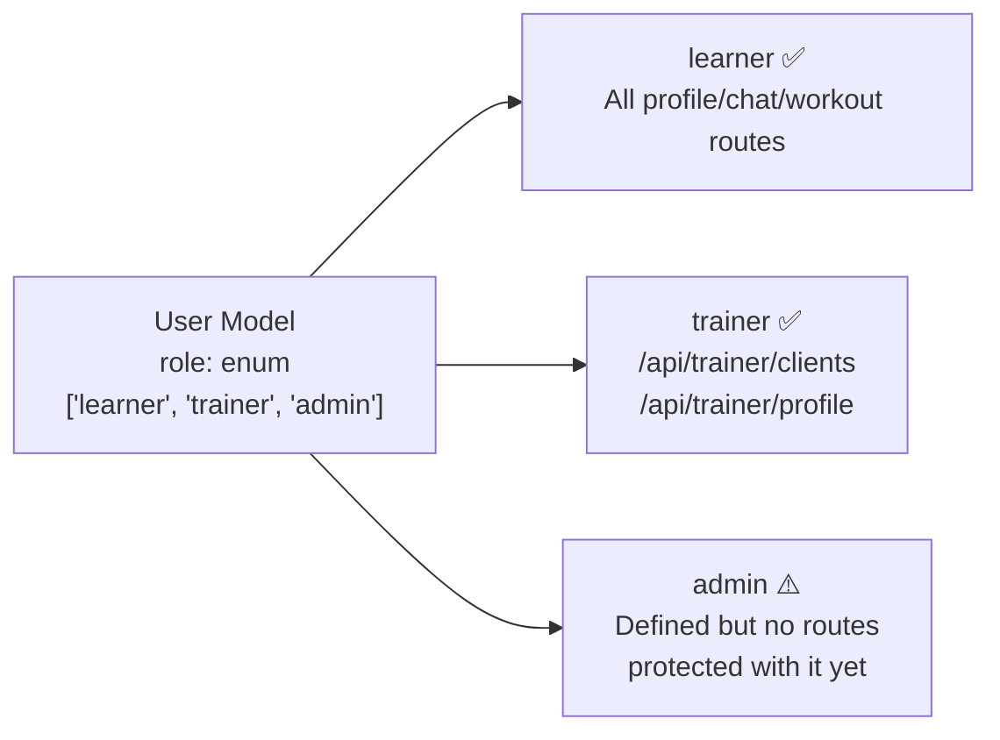

> **Current stance:** Admin functionality is planned but not implemented. When added, `isRole(['admin'])` can be dropped onto any route without changing the middleware system — it is already designed for this.
